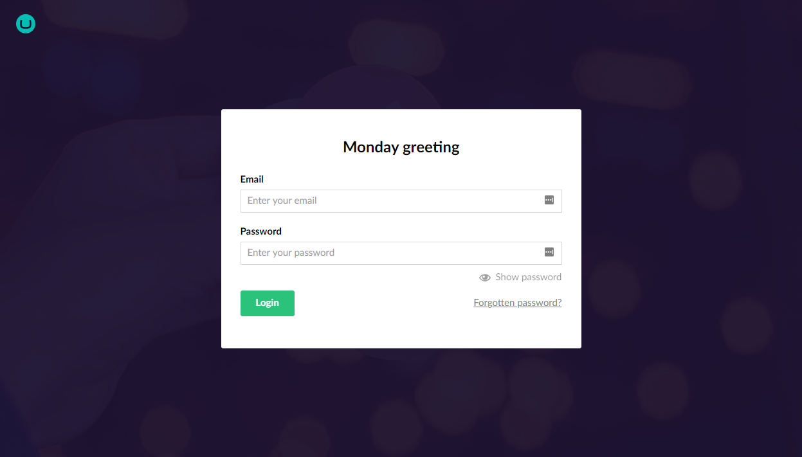

# Login

To access the backoffice, you will need to login. You can do this by adding `/umbraco` at the end of your website URL, e.g. http://mywebsite.com/umbraco.

You will be presented with a login form similar to this:



The **login** screen contains a **Greeting**, **Email**, **Password** field and optionally a **Forgotten password** link

Below, you will find instructions on how to customise the login screen.

## Greeting

The login screen features a greeting which you can personalize by overriding the existing language translation keys. To do this, create a 'user' translation file for the default language of your Umbraco site, (usually en-US) to override the greetings. For en-US, you'd create a file called: `en_us.user.xml` in the directory `~/config/lang/`. Then take the relevant keys (listed below) and add them to your `~/config/lang/en_us.user.xml` file, and update the greetings as necessary. Note: the `config` directory needs to be in the root of your project (_not_ the `wwwroot`).

```xml
<?xml version="1.0" encoding="utf-8" standalone="yes" ?>
<language culture="en-US">
	<area alias="login">
		<key alias="greeting0">Happy super Sunday</key>
		<key alias="greeting1">Happy manic Monday</key>
		<key alias="greeting2">Happy tubular Tuesday</key>
		<key alias="greeting3">Happy wonderful Wednesday</key>
		<key alias="greeting4">Happy thunderous Thursday</key>
		<key alias="greeting5">Happy funky Friday</key>
		<key alias="greeting6">Happy Caturday</key>
	</area>
</language>
```

You can customize other text on the login screen as well. First, grab the default values and keys from `~/umbraco/config/lang/en.xml`. Thereafter copy the ones you want to translate into `~/config/lang/en_us.user.xml` file. Note: the new /config/ folder needs to be created at the site root.

## Password reset

The **Forgotten password?** link allows your backoffice users to reset their password. To use this feature, you will need to add the following key to the `Umbraco.Cms.Security` section in the `appsettings.json` file:

```json
"Umbraco": {
    "CMS": {
      "Security": { 
        "AllowPasswordReset": true
      }
   }
}
```

Set it to `true` to enable the password reset feature, and `false` to disable the feature.

You will also need to configure an Simple Mail Transfer Protocol (SMTP) server in your `appsettings.json` file. When you get a successful result on the SMTP configuration when running a health check in the backoffice, you are good to go!

An example:

```json
"Umbraco": {
    "CMS": {
      "Global": {
        "Id": "xxxxxxxx-xxxx-xxxx-xxxx-xxxxxxxxxxxx",
        "Smtp": {
          "From": "noreply@test.com",
          "Host": "127.0.0.1",
          "Username": "username",
          "Password": "password"
        }
      }
    }
}
```

## Custom background image and logo

It is possible to customize the background image and the logo for the backoffice login screen by adding the `"Content"` section in the `appsettings.json` file:

```json
"Umbraco": {
    "CMS": {
      "Content": {
        "LoginBackgroundImage": "../myImagesFolder/myLogin.jpg",
        "LoginLogoImage": "../myImagesFolder/myLogo.svg"
      }
   }
} 
```

The `LoginBackgroundImage` and `LoginLogoImage` are referenced from the `/wwwroot/umbraco/` folder.

To affect the styling of the images add a folder to the `/App_Plugins` folder containing a `CSS` folder, containing a CSS file, and a package.manifest file. An example structure might be:

```
/App_Plugins
    /myLoginFolder
        /css
            /myLoginStyles.css
        /package.manifest
```

An example stylesheet might be:

```css
    .login-overlay {
    	background-color: #000;
    }
    
    .login-overlay__background-image {
    /* Override background image opacity here if needed */
    /* opacity is set to 0.05 by default if background images is set */
    	/*opacity:0.05;*/
    	opacity:0;
    	background-size:contain;
    	background-image: none;
    }
    
    div.login-overlay__logo {
    	width: 10%;
    }
```

An example package.manifest might be:

```json
    {
    css: [
        '~/App_Plugins/myLoginFolder/css/myLoginStyles.css'
        ]
    }
```
