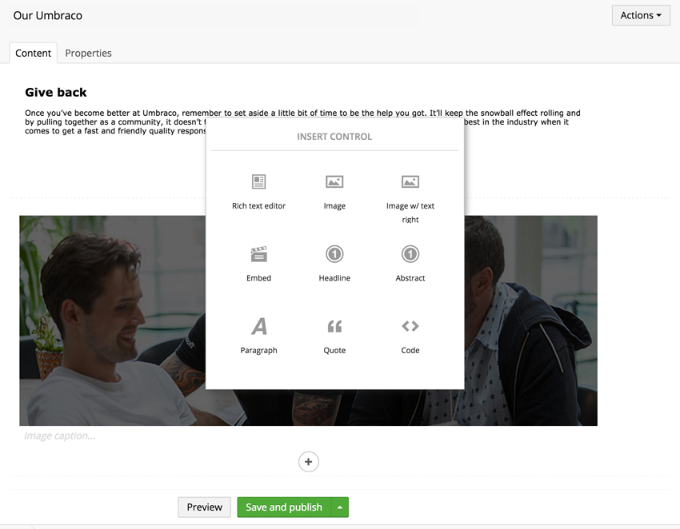

# Grid Layout

`Returns: JSON`

Gives editors a grid layout editor which allows them to insert different types of content in a predefined layout.

<figure><figcaption></figcaption></figure>

## [What are Grid Layouts](what-are-grid-layouts.md)

The basic concept of Grid Layouts.

## [Configuring the Grid Layout data type](configuring-the-grid-layout-datatype.md)

How to setup your Grid Layout data type.

## [Settings and styling](settings-and-styles.md)

Add settings and styles.

## [Grid editors](grid-editors.md)

Explanation of default Grid editors and how to customise them.

## [Build your own Grid editor](build-your-own-editor.md)

Build your own Grid editor from the ground up.

## [Render Grid in template](render-grid-in-template.md)

Render content created with Grid Layouts in your templates.

## [Grid Layout Best Practices](grid-layout-best-practices.md)

General guidelines when contemplating Grid Layout implementation.

## [Add values programmatically](add-value-programmatically.md)

Example how to add values programmatically.
