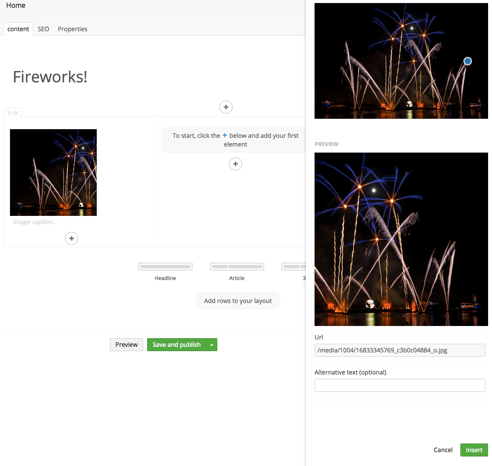

# Grid Editors

A grid editor is the component responsible for getting data into the grid - that could be a text field or a media picker. They're built in the same way as a property editor thus consists of 3 parts:

* .html view file
* .js controller
* .cshtml server side renderer

The view is what the editor sees, the controller handles how it acts and the cshtml determines how the entered data is rendered in the template.

## Default configuration

Grid editors are specified in `/config/grid.editors.config.js`. By default this file doesn't exist, so before you attempt to extend the configuration, make sure to create it first.

The default items in the config file are as follows below. It is recommended that you copy all of editors below before you add more, in case some of them are already in use.

If you don't add the editors below to this config file then they won't be available in your grid editors, even if there are existing grid datatypes already using these editors.


You will need to restart your site before any new customizations become available to use.


```json
[
    {
        "name": "Rich text editor",
        "alias": "rte",
        "view": "rte",
        "icon": "icon-article"
    },
    {
        "name": "Image",
        "nameTemplate": "{{ value && value.udi ? (value.udi | ncNodeName) : '' }}",
        "alias": "media",
        "view": "media",
        "icon": "icon-picture"
    },
    {
        "name": "Macro",
        "nameTemplate": "{{ value && value.macroAlias ? value.macroAlias : '' }}",
        "alias": "macro",
        "view": "macro",
        "icon": "icon-settings-alt"
    },
    {
        "name": "Embed",
        "alias": "embed",
        "view": "embed",
        "icon": "icon-movie-alt"
    },
    {
        "name": "Headline",
        "nameTemplate": "{{ value }}",
        "alias": "headline",
        "view": "textstring",
        "icon": "icon-coin",
        "config": {
            "style": "font-size: 36px; line-height: 45px; font-weight: bold",
            "markup": "<h1>#value#</h1>"
        }
    },
    {
        "name": "Quote",
        "nameTemplate": "{{ value ? value.substring(0,32) + (value.length > 32 ? '...' : '') : '' }}",
        "alias": "quote",
        "view": "textstring",
        "icon": "icon-quote",
        "config": {
            "style": "border-left: 3px solid #ccc; padding: 10px; color: #ccc; font-family: serif; font-style: italic; font-size: 18px",
            "markup": "<blockquote>#value#</blockquote>"
        }
    }
]
```

### Default Grid editors

Grid editor are created in the JSON format and each editor is an object like so:

```json
{
    "name": "Rich text editor",
    "alias": "rte",
    "view": "rte",
    "icon": "icon-article"
}
```

### Custom Grid editors

You can customize the built-in editors to tailor the grid to your need.

#### package.manifest

It is recommended that you define custom editors in a `package.manifest` file (not in the config file described above) like so:

```json
{
    "gridEditors":
    [
        {
            "name": "Rich text editor",
            "alias": "rte",
            "view": "rte",
            "icon": "icon-article"
        }
    ]
}
```

While the root JSON element of `/config/grid.editors.config.js` is an array of grid editors, `package.manifest` files start with a JSON object with a number of different properties - one of them being `gridEditors`.

The package manifest should be placed in a folder inside the `/App_Plugins/` folder - for instance `/App_Plugins/{YourPackageName}/package.manifest`. You can define as many grid editors you want and it can be done over multiple manifests so you can use grid editors from packages etc. With the `package.manifest` file in place, Umbraco will automatically pick it up during startup.

You can read more about `package.manifest` files in general at the [Package Manifest](../../../../../extending/property-editors/package-manifest.md) page.

**Grid editor configuration**

For a grid editor, the required values are:

* `name`: The name of the editor
* `alias`: Unique alias of the editor
* `icon`: Icon shown to the editor, uses same icon classes as the rest of
* `view` the view defines the editor used to enter a value. By default Umbraco will look in `/umbraco/views/propertyeditors/grid/editors` for a html view to use - but you can pass in your own path


You can also add a name template for generating grid item labels using the syntax `{{ value.propertyAlias }}`.

* If you would like to include the index position in the label, you can use `{{$index}}`.
* If your editor links to a content, media or member node, you can use the Angular filter `{{ value.udi | ncNodeName }}` to show the node name rather than the node ID.
* If your editor is a rich text editor, you can use the Angular filter `{{ value | ncRichText }}` to show the unformatted text.


The built-in views you can use are:

* `textstring`
* `rte`
* `embed`
* `macro`
* `media`

In most cases you will either use the textstring or media view, or built your own from scratch. The textstring and media editors come with some additional configuration to make it quick to customise these.

**Sample textstring config**

```json
{
    "name": "Headline",
    "alias": "headline",
    "view": "textstring",
    "icon": "icon-coin",
    "config": {
        "style": "font-size: 36px; line-height: 45px; font-weight: bold",
        "markup": "<h1>#value#</h1>"
    }
}
```

In this sample, the `config.style` value is applied to the editor so users can see an accurate preview in the backoffice. This will be applied as as inline styling to the textarea in the backoffice.

The `config.markup` is the string rendered server side in your template. `#value#`will be replaced with the actual value

**Sample media config**

```json
{
    "name": "Square Image",
    "alias": "squareImage",
    "view": "media",
    "icon": "icon-picture",
    "config": {
        "size": {
            "height": 200,
            "width": 200
        }
    }
}
```

In this sample `config.size` will resize the image according to `height` and `width`. The above example will result in a rendered image that is 200x200 pixels no matter the size of the uploaded image. If the ratio of the size differs from the uploaded image it is possible to set a focal point that determines how the image should be cropped.

<figure><figcaption></figcaption></figure>

**Sample macro config**

```json
{
    "name": "Your Custom Macro",
    "alias": "yourCustomMacroGridEditor",
    "view": "macro",
    "icon": "icon-smiley",
    "config": {
        "macroAlias": "AliasOfYourMacro"
    }
}
```

In this sample a new option will appear in the `Choose type of content` with direct access to the macro.
