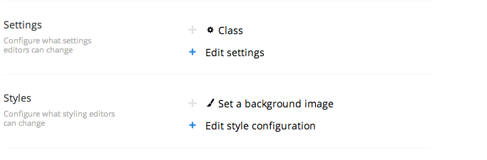

# Settings And Styling

A grid layout can also expose custom settings - such as data-attributes or styling options - on each cell or row. This allows editors to use a friendly UI to add configuration values to grid elements. When custom settings and styles are applied, they will by default be included in the grid html as either html attributes or inline styles.

<figure><figcaption></figcaption></figure>

These settings and styles must be configured by developers when setting up the grid layout data type.

## Configuring a custom setting or style

To add a setting, click the edit settings link. This will expand a dialog showing you the raw configuration data. This data is in the JSON format and will only save if it's valid JSON.

The settings data could look like this, with an object for each setting:

```json
[
  {
    "label": "Class",
    "description": "Set a css class",
    "key": "class",
    "view": "textstring",
    "modifier": "col-sm-{0}",
    "applyTo": "row|cell"
  }
]
```

The different values are:

* `label` : Field name displayed in the content editor UI
* `description` : Descriptive text displayed in the content editor UI to guide the user
* `key` : The key the entered setting value will be stored under.
* `view` : The editor used to enter a setting value with.
* `prevalues` : For views that need predefined values, e.g. the radiobuttonlist view.
* `modifier (optional)` : A string formatter to modify the output of the editor to prepend or append extra values.
* `applyTo (optional)` : States whether the setting can be used on a cell or a row. If either not present or empty, the setting will be shown both on Rows and Cells.

**label** and **description** are straight-forward.

**key** defines the alias the configuration is stored under and by default the alias of the attribute will also be the attribute on the rendered html element. In the example above any value entered in this settings editor will be rendered in the grid html as:

```html
<div **class**="VALUE-ENTERED"></div>
```

By changing the key of the setting you can modify the `<div>` element's attributes like `class`, `title`, `id` or custom `data-*` attributes.

**view** the view defines the editor used to enter a value. By default Umbraco comes with a collection of prevalue editors:

* `textstring`
* `textarea`
* `radiobuttonlist`
* `mediapicker`
* `imagepicker`
* `boolean`
* `treepicker`
* `treesource`
* `number`
* `multivalues`

Alternatively you can also pass in a path to a custom view like "/App\_Plugins/grid/editors/view.html"

**prevalues** is for views that need predefined values, e.g. the radiobuttonlist view. Prevalues are defined as strings in an array:

```json
"prevalues": [
    "value_1",
    "value_2",
    "value_3"
]
```

and will translate in to three different options where each string will become a radiobutton. The strings represent the value of the options.

Prevalues can also be defined as an object of label/value allowing to have a displayed label instead of showing the actual underlying value. You can even mix and match these and use both label/value prevalues and string prevalues in the same configuration:

```json
"prevalues": [
    {
        "label": "Value one",
        "value": "value_1"
    },
    {
        "label": "Value two",
        "value": "value_2"
    },
    "value_3"
]
```

**modifier** is a basic way to prepend, append or wrap the value from the editor in a string. This is especially useful when working with custom styles which often requires additional values to function. For instance if you want to set a background image you can get an image path from the image picker view. But in order for it to work with css it has to be wrapped in `url()`. In that case you set the **modifier** to `url({0})` which means that `{0}` is replaced with the editor value.

**applyTo** defines what this setting can be applied to. It should be either **row** or **cell** as a string.

A JSON object can also be used if you need a more specific configuration. A JSON configuration could look like this:

```json
"applyTo": {
    "row": "Headline,Article",
    "cell": "4,8,6"
}
```

This would ensure the setting can only be used on rows named **Article** or **Headline**, or on cells sized: **4**, **8** or **6**. If it should only apply to cells you can remove the row property. If it should apply to all rows you can specify it by having the row property with null or an empty string as value.

### Sample settings

There are many ways to combine these, here are some samples:

#### Set a background image style

```json
{
    "label": "Background image",
    "description": "Choose an image",
    "key": "background-image",
    "view": "imagepicker",
    "modifier": "url('{0}')"
}
```

#### Set a title setting

```json
{
    "label": "Title",
    "description": "Set a title on this element",
    "key": "title",
    "view": "textstring"
}
```

#### Set a data-custom setting

```json
{
    "label": "Custom data",
    "description": "Set the custom data on this element",
    "key": "data-custom",
    "view": "radiobuttonlist",
    "prevalues": [
        "value_1",
        "value_2",
        "value_3"
    ]
}
```

### Multiple settings and styles

You can add multiple settings and styles configurations on a data type. This is done by creating a new setting or style object. Remember to separate the objects with a comma.

#### Adding multiple settings

```json
[
    {
        "label": "Class",
        "description": "Set a class on this element",
        "key": "class",
        "view": "textstring"
    },
    {
        "label": "Title",
        "description": "Set a title on this element",
        "key": "title",
        "view": "textstring"
    },
    {
        "label": "Custom data",
        "description": "Set the custom data on this element",
        "key": "data-custom",
        "view": "textstring"
    }
]
```

### Full-width settings and styles

It is possible to use settings and styles to add full-width background-images, background-colors and so forth. Make sure the surrounding _section_ is full-width (12 columns by default) and the _rows_ inside it will automatically become full-width.
