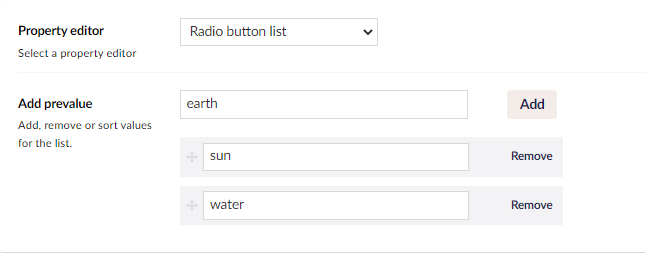
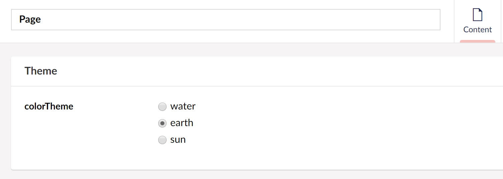

# Radiobutton List

`Alias: Umbraco.RadioButtonList`

`Returns: string`

Pretty much like the name indicates this Data type enables editors to choose from list of radio buttons and returns the value of the selected item as string.

## Data Type Definition Example



## Content Example



## MVC View Example

### Typed

#### Without Modelsbuilder

```csharp
@if (Model.HasValue("colorTheme"))
{
    var value = Model.Value("colorTheme");
    <p>@value</p>
}
```

#### With Modelsbuilder

```csharp
@if (Model.ColorTheme != null)
{
    var value = Model.ColorTheme;
    <p>@value</p>
}
```

## Add values programmatically

See the example below to see how a value can be added or changed programmatically. To update a value of a property editor you need the [Content Service](../../../../reference/management/services/contentservice/).


The example below demonstrates how to add values programmatically using a Razor view. However, this is used for illustrative purposes only and is not the recommended method for production environments.


```csharp
@using Umbraco.Cms.Core.Services;
@inject IContentService Services;
@{
    // Get access to ContentService
    var contentService = Services;

    // Create a variable for the GUID of the page you want to update
    var guid = new Guid("796a8d5c-b7bb-46d9-bc57-ab834d0d1248");
    
    // Get the page using the GUID you've defined
    var content = contentService.GetById(guid); // ID of your page
    
    // Set the value of the property with alias 'colorTheme'
    content.SetValue("colorTheme", "water");
            
    // Save the change
    contentService.Save(content);
}
```

Although the use of a GUID is preferable, you can also use the numeric ID to get the page:

```csharp
@{
    // Get the page using it's id
    var content = contentService.GetById(1234); 
}
```

If Modelsbuilder is enabled you can get the alias of the desired property without using a magic string:

```csharp
@using Umbraco.Cms.Core.PublishedCache;
@inject IPublishedSnapshotAccessor _publishedSnapshotAccessor;
@{
    // Set the value of the property with alias 'colorTheme'
    content.SetValue(Home.GetModelPropertyType(_publishedSnapshotAccessor, x => x.ColorTheme).Alias, "water");
}
```
