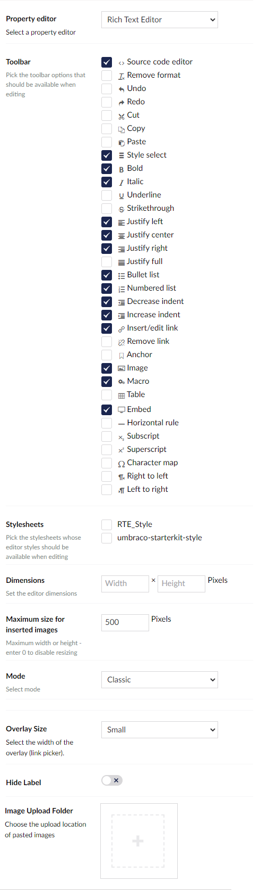
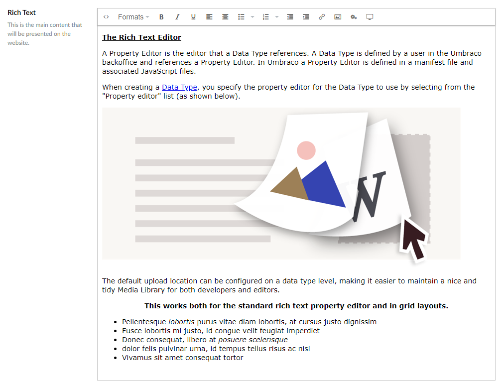

# Rich Text Editor

`Alias: Umbraco.TinyMCE`

`Returns: HTML`

The Rich Text Editor (RTE) is based on [tinymce](https://www.tinymce.com/) and is highly configurable. Depdending on the configuration, it will give your content editors more flexibility when working with content that should be more than only plain text.

## [Configuration options](configuration.md)

Customize everything from toolbar options to editor size to where pasted images are saved.

## [RTE Styles](rte-styles.md)

Use CSS to define specific editor styles and add them to the RTE.

## Data Type Definition Example



## Content Example



## MVC View Example

### Without Modelsbuilder

```csharp
@{
    if (Model.HasValue("richText")){
        <p>@(Model.Value("richText"))</p>
    }
}
```

### With Modelsbuilder

```csharp
@{
    if (!string.IsNullOrEmpty(Model.RichText.ToString()))
    {
        <p>@Model.RichText</p>
    }
}
```

## Add values programmatically

See the example below to see how a value can be added or changed programmatically. To update a value of a property editor you need the [Content Service](../../../../../reference/management/services/contentservice/).


The example below demonstrates how to add values programmatically using a Razor view. However, this is used for illustrative purposes only and is not the recommended method for production environments.


```csharp
@using Umbraco.Cms.Core.Services;
@inject IContentService Services;
@{
    // Get access to ContentService
    var contentService = Services;

    // Create a variable for the GUID of the page you want to update
    var guid = Guid.Parse("32e60db4-1283-4caa-9645-f2153f9888ef");

    // Get the page using the GUID you've defined
    var content = contentService.GetById(guid); // ID of your page

    // Create a variable for the desired value
    var htmlValue = new HtmlString("Add some text <strong>here</strong>");

    // Set the value of the property with alias 'richText'. 
    content.SetValue("richText", htmlValue);

    // Save the change
    contentService.Save(content);
}
```

Although the use of a GUID is preferable, you can also use the numeric ID to get the page:

```csharp
@{
    // Get the page using it's id
    var content = contentService.GetById(1234); 
}
```

If Modelsbuilder is enabled you can get the alias of the desired property without using a magic string:

```csharp
@using Umbraco.Cms.Core.PublishedCache;
@inject IPublishedSnapshotAccessor _publishedSnapshotAccessor;
@{
    // Set the value of the property with alias 'richText'
        content.SetValue(Home.GetModelPropertyType(_publishedSnapshotAccessor, x => x.RichText).Alias, "Add some text <strong>here</strong>");
}
```
