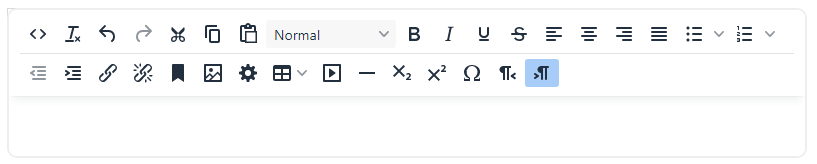
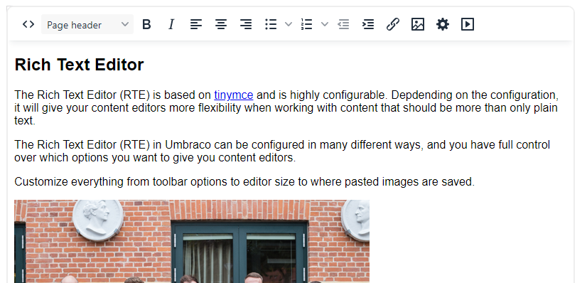
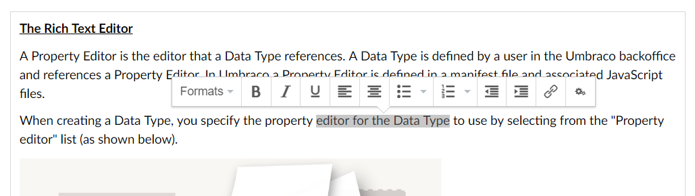

# Rich Text Editor Configuration

## Rich Text Editor Configuration


Rich Text Editor default implementation


### Toolbar

You have full control over which options should be available on the RTE.



In the examble above, all 34 options have been enabled. The options include copy/paste buttons, font styles like bold and italics, bullet lists and options to embed videos and insert images.

### Stylesheets

It is possible to define specific styles that can be used when editing content using the RTE. You can use as many of these styles with the RTE as you want.

The RTE styles are defined in CSS files which can be created in the **Settings** section. Read the [RTE Styles](rte-styles.md) article to learn more about this feature.

### Dimensions

Define `height` and `width` of the editor displayed in the content section.

### Maximum size for inserted images

Define the maximum size for images added through the Rich Text Editor.

If inserted images are larger than the dimensions defined here, the images will be resized automatically.

### Mode

The Rich Text Editor comes in two different modes: Classic and Distraction Free.

*   Classic

    The default mode, which displays the toolbar in the top.

    
*   Distraction Free

    In this mode the toolbar is hidden, and only shows up when content in the editor is highlighted.

    

### Overlay Size

Select the width of the link picker overlay. The overlay size comes in three sizes: Small, Medium, and Large.

### Hide Label

When this option is checked the label and description for the RTE property will be hidden.

### Ignore User Start Nodes

Some of the backoffice users might be restricted to a specific part of the content tree. When the "Ignore User Start Nodes" is checked, the users can pick any piece of content from the content tree, when adding internal links through the RTE.

### Image Upload Folder

Images added through the RTE is by default added to the root of the Media library.

Sometimes you might want to add the images to a specific folder. This folder can be configured using the "Image Upload Folder" setting.

## Advanced Configuration

The RTE can also accept advanced configuration through the `appSettings.json` file fed into the TinyMCE configuration. This is within `Umbraco:CMS:RichTextEditor` and allows you to configure the following:

* [Commands](https://www.tiny.cloud/docs/advanced/editor-command-identifiers/#executablecommands)
* [Plugins](https://www.tiny.cloud/docs/configure/integration-and-setup/#plugins)
* [CustomConfig](https://www.tiny.cloud/docs/configure/integration-and-setup/)
* [ValidElements](https://www.tiny.cloud/docs/configure/content-filtering/#valid\_elements)
* [InvalidElements](https://www.tiny.cloud/docs/configure/content-filtering/#invalid\_elements)

`CustomConfig` is slightly different from the rest as it extends the core config passed into TinyMCE.

### Allowing script tags in the RTE

Sometimes you want to allow your content editors to be able to add `<script>` tags into the RTE. This tag is classed as invalid by default which means the configuration needs to be updated to allow it. This is not something that can be done through the CMS and requires advanced configuration in the `appSettings.json` file. It uses the `ValidElements` property to append `,script[*]` to the pre-existing list of valid elements as shown below.

```
{
  "Umbraco": {
    "CMS": {
      "RichTextEditor": {
        "ValidElements": "+a[id|style|rel|data-id|data-udi|rev|charset|hreflang|dir|lang|tabindex|accesskey|type|name|href|target|title|class|onfocus|onblur|onclick|
        ondblclick|onmousedown|onmouseup|onmouseover|onmousemove|onmouseout|onkeypress|onkeydown|onkeyup],-strong/-b[class|style],-em/-i[class|style],-strike[class|
        style],-u[class|style],#p[id|style|dir|class|align],-ol[class|reversed|start|style|type],-ul[class|style],-li[class|style],br[class],img[id|dir|lang|longdesc|
        usemap|style|class|src|onmouseover|onmouseout|border|alt=|title|hspace|vspace|width|height|align|umbracoorgwidth|umbracoorgheight|onresize|onresizestart|
        onresizeend|rel|data-id],-sub[style|class],-sup[style|class],-blockquote[dir|style|class],-table[border=0|cellspacing|cellpadding|width|height|class|align|
        summary|style|dir|id|lang|bgcolor|background|bordercolor],-tr[id|lang|dir|class|rowspan|width|height|align|valign|style|bgcolor|background|bordercolor],
        tbody[id|class],thead[id|class],tfoot[id|class],#td[id|lang|dir|class|colspan|rowspan|width|height|align|valign|style|bgcolor|background|bordercolor|scope],
        -th[id|lang|dir|class|colspan|rowspan|width|height|align|valign|style|scope],caption[id|lang|dir|class|style],-div[id|dir|class|align|style],
        -span[class|align|style],-pre[class|align|style],address[class|align|style],-h1[id|dir|class|align|style],-h2[id|dir|class|align|style],
        -h3[id|dir|class|align|style],-h4[id|dir|class|align|style],-h5[id|dir|class|align|style],-h6[id|style|dir|class|align|style],hr[class|style],
        small[class|style],dd[id|class|title|style|dir|lang],dl[id|class|title|style|dir|lang],dt[id|class|title|style|dir|lang],
        object[class|id|width|height|codebase|*],param[name|value|_value|class],embed[type|width|height|src|class|*],map[name|class],
        area[shape|coords|href|alt|target|class],bdo[class],button[class],iframe[*],figure,figcaption,video[*],audio[*],picture[*],source[*],canvas[*],script[*]"
      }
}
```
