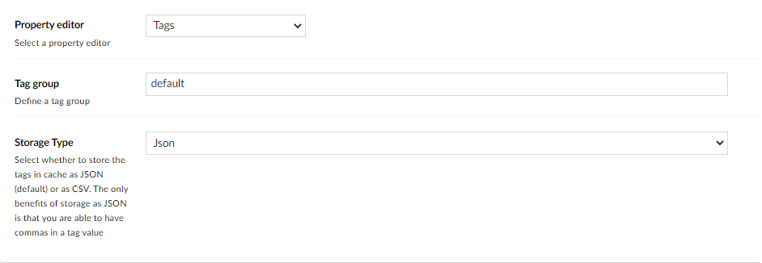
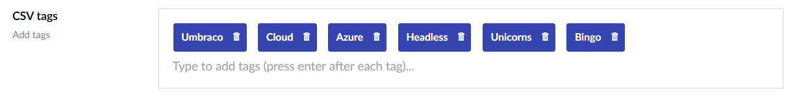
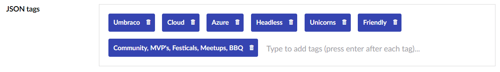
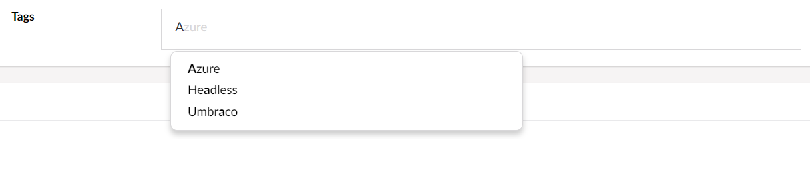

# Tags

`Alias: Umbraco.Tags`

`Returns: IEnumerable<string>`

The Tags property editor allows you to add multiple tags to a node.

## Data Type Definition Example



### Tag group

The **Tag group** setting provides a way to categorize your tags in groups. So for each category you will create a new instance of the Tags property editor and setup the unique category name for each instance. Whenever a tag is added to an instance of the tags property editor it's added to the tag group, which means it will appear in the Typeahead list when you start to add another tag. Only tags that belong to the specified group will be listed. If you have a "Frontend" group and a "Backend" group the tags from the "Frontend" group will only be listed if you're adding a tag to the Tags property editor configured with the "Frontend" group name and vice versa.

### Storage type

Data can be saved in either Comma-Separated Values (CSV) format or in JSON format. By default data is saved in JSON format. The difference between using CSV and JSON is that with JSON you can save a tag, which includes comma separated values.

There are built-in property value converters, which means you don't need to worry about writing them yourself or parse the JSON output when choosing "JSON" in the storage type field. Therefore [the last code example](tags.md#mvc-view-example---displays-a-list-of-tags) on this page will work out of the box without further ado.

## Content Examples

### CSV tags



### JSON tags



### Tags typeahead

Whenever a tag has been added it will be visible in the typeahead when you start typing on other pages.



## MVC View Example - displays a list of tags

### Multiple items - with Modelsbuilder

```csharp
@if(Model.Tags.Any()){
    <ul>
        @foreach(var tag in Model.Tags){
            <li>@tag</li>
        }
    </ul>
}
```

### Multiple items - without Modelsbuilder

```csharp
@if(Model.HasValue("tags"))
{
 var tags = Model.Value<IEnumerable<string>>("tags");
    <ul>
        @foreach(var tag in tags)
        {
            <li>@tag</li>
        }
    </ul>
}
```

### Setting Tags Programmatically

You can use the ContentService to create and update Umbraco content from c# code, when setting tags there is an extension method (SetTagsValue) on IContentBase that helps you set the value for a Tags property. Remember to add the using statement for `Umbraco.Core.Models` to take advantage of it.


The example below demonstrates how to add values programmatically using a Razor view. However, this is used for illustrative purposes only and is not the recommended method for production environments.


```csharp
@using Umbraco.Cms.Core.Services
@inject IContentService Services;
@using Newtonsoft.Json
@{
    // Get access to ContentService
    var contentService = Services;

    // Create a variable for the GUID of the page you want to update
    var guid = Guid.Parse("9daf8585-6ab6-4ac2-98f0-28bf83aeea6e");

    // Get the page using the GUID you've defined
    var content = contentService.GetById(guid); // ID of your page

    // Set the value of the property with alias 'tags'. 
    content.SetValue("tags", JsonConvert.SerializeObject(new[] { "News", "Umbraco", "Example", "Setting Tags", "Helper" }));

    // Save the change
    contentService.Save(content);
}
```

Although the use of a GUID is preferable, you can also use the numeric ID to get the page:

```csharp
@{
    // Get the page using it's id
    var content = contentService.GetById(1234); 
}
```

If Modelsbuilder is enabled, you can get the alias of the desired property without using a magic string:

```csharp
@using Umbraco.Cms.Core.PublishedCache;
@inject IPublishedSnapshotAccessor _publishedSnapshotAccessor;
@{
    // Set the value of the property with alias 'tags'
    content.SetValue(Home.GetModelPropertyType(_publishedSnapshotAccessor, x => x.Tags).Alias, JsonConvert.SerializeObject(new[] {  "News", "Umbraco", "Example", "Setting Tags" }));
}
```

### More on working with Tags

More on working with Tags (query all of them) can be found at the [UmbracoHelper reference page](../../../../reference/querying/umbracohelper.md#working-with-tags)
