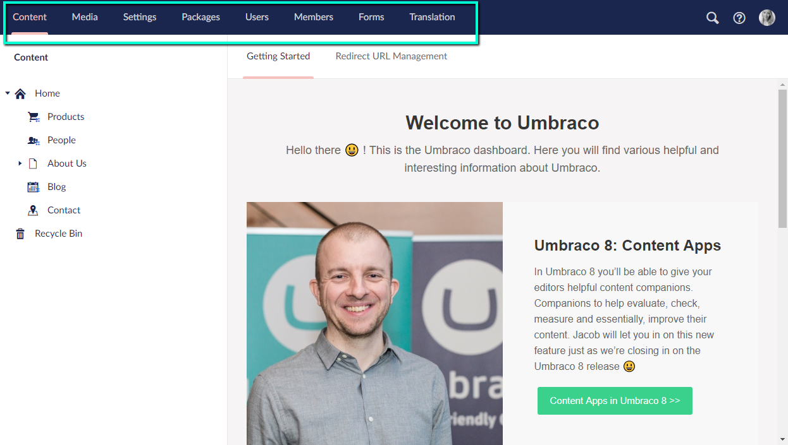

# Sections

A section in Umbraco is where you perform specific tasks related to a particular area of Umbraco. For example Content, Settings and Users are all sections. You can navigate between the different sections by clicking the corresponding icon in the section menu which is positioned at the top of the Backoffice.

_The **Section menu** is the horizontal menu located at the top of the Umbraco Backoffice._

<figure><figcaption></figcaption></figure>

There are eight default sections that come with Umbraco:

## Content

The Content section contains the content of the website. Content is displayed as nodes in the content tree. Nodes can also show content state:

* Grayed out nodes have not been published
*  Nodes have unpublished versions (but are currently published)
*  Nodes are protected from the public (can only be accessed by a logged in Member)
*  Nodes are currently locked/non-deletable
*  Nodes are containers (a List View for example)

In order to create content, you must define it using Document Types.

## Media

The Media section contains the media for the website. By default, you can create folders and upload media files (images and PDFs). You can customize the existing media types or define your own from the Settings section.

## Settings

The Settings section is where you can work with the website layout files, languages, and define media and content types. In this section, you can also find the Log Viewer to browse through your log files.

The Settings tree consists of:

* Document Types
* Media Types
* Member Types
* Data Types
* Macros
* Relation Types
* Log Viewer
* Languages
* Content Templates
* Templates (`.cshtml` files)
* Partial views (`.cshtml` files)
* Partial View Macro Files (`.cshtml` files)
* Stylesheets (`.css` files)
* Scripts (`.js` files)

The **Settings** section of the Umbraco backoffice has its own set of default dashboards. For more information, see the [Settings Dashboards](settings-dashboards.md) article.

## Packages

In this section, you can browse and install packages into your Umbraco solution. You can also get an overview of all the installed packages as well as uninstall packages you no longer need.

## Users

Manage, create, and customize Backoffice users and user groups.

## Members

Manage, create, and customize members and member groups.

## Forms

You can install Umbraco Forms directly from the Backoffice by clicking the install button. Once installed, this section is where you create and manage your forms.

## Translation

This is the section where you create and manage your dictionary items.

## Help sections

In the top-right corner, you'll find a search tool, which is also accessible by hitting `CTRL + Space` on your keyboard.

Next to the search tool, there is a help section. In the help section you can find Backoffice tours and links to Umbraco resources such as documentation and UmbracoTV.

There is also a small 'user section' with shortcuts to edit the currently logged in user, and view their most recent activities.

## Custom Sections

Along with the default sections that come with Umbraco, you can create your own [Custom Sections](../../extending/section-trees/).

## Access based on User Group

A User can access a particular section based on the User Group permissions.

Learn more about how to configure the permissions in the article about [backoffice users](../data/users.md).
