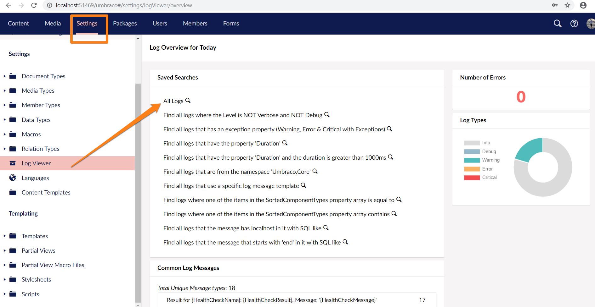
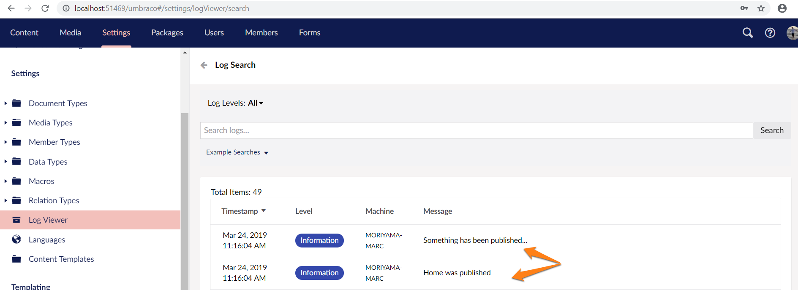

# Subscribing To Notifications

Subscribing to notifications allows you to execute custom code on a number of operations both before and after the operation occurs. All you need to follow this guide is an Umbraco installation with some content, e.g. the Umbraco starter kit.

## Subscribing to a notification

Let's add a string of text to the log when a document is published. (The log is useful for debugging, different parts of the Umbraco codebase 'log' key events, warnings and errors to the log)

We react to notifications in Umbraco inside a notification handler, so let's create one. Add a new C# class to our project - call it _LogWhenPublishedHandler_ and use `: INotificationHandler<ContentPublishedNotification>` to identify our code as a handler, that will handle `ContentPublishedNotification`. We'll need to add `using Umbraco.Cms.Core.Events;` to the top of the .cs file and because the notifications that you can subscribe to in Umbraco are found in the core notifications namespace, we also need to add a using statement for that: `using Umbraco.Cms.Core.Notifications;`.

We now have a class that looks like this:

```c#
using Umbraco.Cms.Core.Events;
using Umbraco.Cms.Core.Notifications;

namespace MyProject
{
    public class LogWhenPublishedHandler : INotificationHandler<ContentPublishedNotification>
    {
        // Here we'll handle a notification.
    }
}
```

However, we have an error and a red squiggly line under our class, this is because the `INotificationHandler` interface expects us to implement a `Handle` method for our notification. Let's create a public method called `Handle` that takes a `ContentPublishedNotification` as a parameter:

```c#
using Umbraco.Cms.Core.Events;
using Umbraco.Cms.Core.Notifications;

namespace MyProject
{
    public class LogWhenPublishedHandler : INotificationHandler<ContentPublishedNotification>
    {
        public void Handle(ContentPublishedNotification notification)
        {
            // The custom code to fire every time content is published goes here!
            throw new System.NotImplementedException();
        }
    }
}
```

To check that this works, let's add a message to the log every time a content node is published.

We'll need to inject a Microsoft ILogger into our notification handler, by adding `using Microsoft.Extensions.Logging;` to the top our file to add the required namespace, and creating a constructor for our handler that allows Umbraco to inject the logger:

```C#
using Microsoft.Extensions.Logging;
using Umbraco.Cms.Core.Events;
using Umbraco.Cms.Core.Notifications;

namespace MyProject
{
    public class LogWhenPublishedHandler : INotificationHandler<ContentPublishedNotification>
    {
        private readonly ILogger<LogWhenPublishedHandler> _logger;

        public LogWhenPublishedHandler(ILogger<LogWhenPublishedHandler> logger)
        {
            _logger = logger;
        }
        
        public void Handle(ContentPublishedNotification notification)
        {
            // The custom code to fire every time content is published goes here!
            throw new System.NotImplementedException();
        }
    }
}
```

Now we can use the logger to send a message to the logs:

```C#
public void Handle(ContentPublishedNotification notification)
{
    // The custom code to fire every time content is published goes here!
    _logger.LogInformation("Something has been published.");
}
```

We could log the name of each item that is being published too:

```C#
public void Handle(ContentPublishedNotification notification)
{
    // The custom code to fire every time content is published goes here!
    _logger.LogInformation("Something has been published.");
    foreach (var publishedItem in notification.PublishedEntities)
    {
        _logger.LogInformation("{ContentName} was published", publishedItem.Name);
    }
}
```

Now we have a notification handler that logs the name of a piece of content every time it's published, however, we're not done yet.

Umbraco needs to know that our handler exists and that it handles `ContentPublishedNotification`, to tell Umbraco this, we open up the `Startup.cs` file in the root of the project. First, we need to add `using Umbraco.Cms.Core.Notifications;` to the top of this file as well, once we've done this we need to find the `ConfigureServices` method. We now add `.AddNotificationHandler<ContentPublishedNotification, LogWhenPublishedHandler>()` to the `ConfigureServices` method right before the `Build()` part. The method now looks like this:

```c#
        public void ConfigureServices(IServiceCollection services)
        {
#pragma warning disable IDE0022 // Use expression body for methods
            services.AddUmbraco(_env, _config)
                .AddBackOffice()             
                .AddWebsite()
                .AddComposers()
                .AddNotificationHandler<ContentPublishedNotification, LogWhenPublishedHandler>()
                .Build();
#pragma warning restore IDE0022 // Use expression body for methods

        }
```

The entire handler class should look like this:

```csharp
using Microsoft.Extensions.Logging;
using Umbraco.Cms.Core.Events;
using Umbraco.Cms.Core.Notifications;

namespace MyProject
{
    public class LogWhenPublishedHandler : INotificationHandler<ContentPublishedNotification>
    {
        private readonly ILogger<LogWhenPublishedHandler> _logger;

        public LogWhenPublishedHandler(ILogger<LogWhenPublishedHandler> logger)
        {
            _logger = logger;
        }
        
        public void Handle(ContentPublishedNotification notification)
        {
            // The custom code to fire every time content is published goes here!
            _logger.LogInformation("Something has been published.");
            foreach (var publishedItem in notification.PublishedEntities)
            {
                _logger.LogInformation("{ContentName} was published", publishedItem.Name);
            }
        }
    }
}
```

Now we're ready to spin up our site and give it a try. Go to the Umbraco backoffice and publish a piece of content. Switch to the Settings section and find the Log Viewer in the Settings tree:



Search 'All Logs', and if all is wired up correctly you should discover your custom publish log message entries:



### Before and after

As you can see our custom code has been executed when we published a piece of content. It executed after the item was published because we used the `ContentPublishedNotification`. If you want to run code before publishing, use `ContentPublishingNotification`. The same goes for most other notifications so `Saving` : `Saved`, `Copying` : `Copied` and so forth.

### More information

* [Notifications Reference](../../reference/notifications/)
