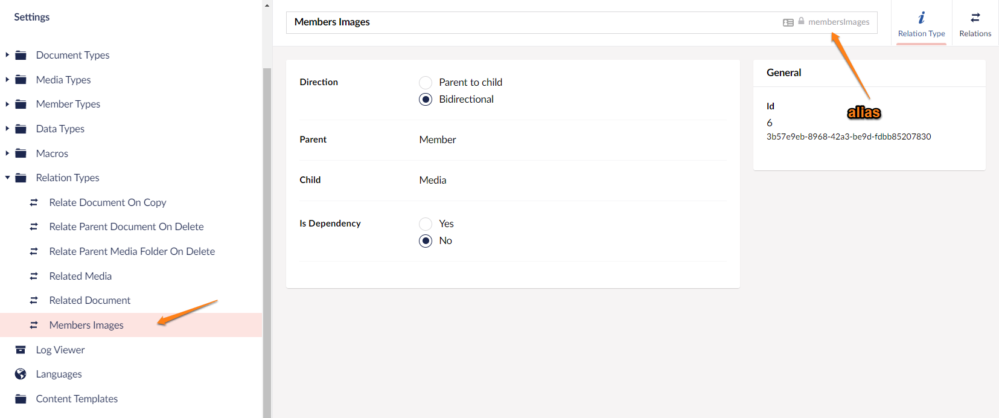

# Relations

Umbraco sections are built around the concept of 'trees' and there is an implicit relationship between items in a section tree.

We refer to these relationships in the manner of a 'Family Tree' - eg, One content item might be the 'Parent' of some content items, and those content items would be referred to as the 'Children' of that parent. Items within the same branch of the tree can also be described as 'Ancestors' or 'Descendants' of an item, depending if they are above or below them in the depth of the tree.

There are methods in Umbraco to support querying content items by their relative position in the tree to the current page using these concepts, eg `Model.Ancestors()` or `Model.Children()` or `Model.Descendants()` - but what about 'Cousins'?

What if there are no direct Parent/Child/Ancestor/Descendant relationships between two items in a tree, but they are still somehow 'related' in the context of your website? For example, the alternate language translation pages of a content page.

What if there is also a 'relation' between different types of Umbraco entities in your site, eg Content -> Member or Member -> MediaFolder? Perhaps, you'd like to be able to retrieve and display the uploaded images from a specific logged-in Member.

These are the scenarios where the concept of **Umbraco Relations** provides a solution.

## The Concept of Umbraco Relations

Umbraco Relations allow you to relate almost any object in Umbraco to almost any other Umbraco object - under a defined _Relation Type_.

### How is this different to pickers?

With a Content/Member/Media picker that you might add to a Content Type - the relationship is ONLY 1-way. Your content item knows it has 'picked' another content item, perhaps to display a shared banner across different pages, but that 'banner' content item doesn't know where it has been picked!

Umbraco Relations are 2-way, when you create a relation between two different types of entities, you can alway find one entity from the other and vice versa. eg you could list out in the backoffice all the pages that a content banner had been picked on.

## Relation Types

To create and use Relations in your Umbraco Website, you need to define a 'Relation Type' to specify what the two types of entities will be relatable and to give the Relation Type an alias. So, you can test if two items are related for a particular 'relation type'. Two items might be related under multiple different Relation Types, and you might be only interested in your 'Related Language Page' Relation Type.

### Create a Relation Type

Navigate to the **Settings** section in the Umbraco backoffice and you'll find the **Relation Types** folder in the Settings tree.

If you expand the Relation Type tree, you can see that Umbraco 'ships' with some default Relation Types. These are used by the Umbraco backoffice to help deliver some key backoffice functionality:

For example, there is a Relation Type that tracks when Media is picked in Content to be able to provide the functionality of warning an editor if they try to delete a Media Item that it is 'in use'. There is a Relation Type, to help 'restore' deleted content back to the place it was deleted from in the Recycle Bin.

To create your new Relation Type, follow these steps:

1. Right-click the **Relation Types** folder.
2. Provide a **Name** for the Relation Type. This will generate it's alias.
3. Choose the **Direction** of the relationship, for example, usually **Bidirectional** to get the benefits of relations.
4.  Define the type of one object in the relation called **Parent** that defines which column in the database this value is stored in.

    For a bidirectional relationship, it doesn't matter which type of entity is defined as the Parent or the Child. If there is 'one thing' that will be related to lots of 'other things', then choose that thing as the Parent.
5.  Choose the different types for each entity (**Parent** and **child**) from the drop-down list.

    Currently the available types are: Document(Content), Media, Member, Document Type, Media Type, Member Type, Member Group, Data Type, Root, and Recycle Bin

    Example: For relating Members to their uploaded Images, we might create a 'Member Images' relation

    
6. Select **Is Dependency** as **Yes** if you wish this Relation Type to be used in Umbraco's 'tracking' functionality; that warns editors when trying to delete entities if they are 'used' in a Relation Type marked as 'Is Dependency'
7.  Click **Create** and you'll see your new Relation Type created in the Relation Types folder. You can see the 'Alias' that you'll need to make note of when working with Relations.

    

## Viewing Relations

To view one of the existing Relation Types, go to the **Relations** tab. It displays a long list of all the objects that have been related for this specific Relation Type.

## Creating Relations

You can create Relations using the RelationService API via code.

[Some examples are provided here in the RelationService Documentation Page](../../reference/management/services/relationservice.md)

### Use cases

You might want to create a 'Relation' between two objects either as:

* A response to a backoffice event. For example, a content item being published that has picked several other content items. Storing a relationship between these items would make querying between them easier. Perhaps show all the pages on which a particular 'banner' has been picked.
* A logged-in member on the front end of an Umbraco website might have the facility to upload images. In response, the implementation could store the photos programmatically in the Media Section and at the same time, create a Relation to record the relationship between the member and their uploaded pictures. On an image gallery page, it would be possible to display all the gallery images for the current logged-in Member using the relations.

### Community Packages

Some of the community packages that use Relations are listed below:

* ['Relations Picker'](https://our.umbraco.com/packages/backoffice-extensions/relations-picker/) - a content picker that automatically creates Relations.
* ['ContentRelations'](https://our.umbraco.com/packages/backoffice-extensions/contentrelations/) - allows you to relate two items via the Backoffice.
* ['LinkedPages'](https://our.umbraco.com/packages/backoffice-extensions/linked-pages/) - Provides a LinkedPages context item to show, edit, and add relations between content pages.
