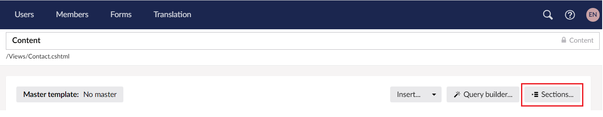
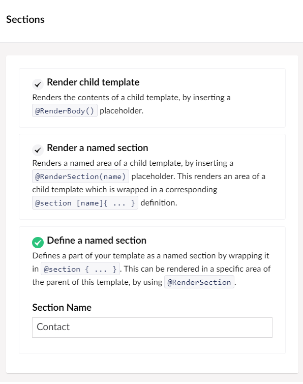
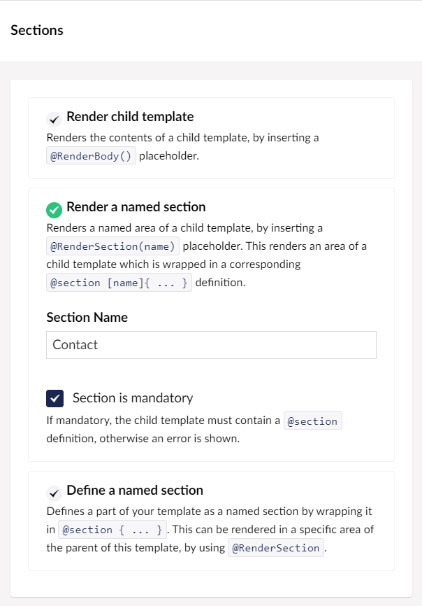

# Named Sections

Template sections support the ability to add additional _Named Sections_ to layout templates. These sections can be defined anywhere in the layout file (including within the section of the HTML) and allow you to output dynamic content in your template.

## Defining a Named Section

You can define a part of your template as a named section by wrapping it in `@section`. This can be rendered in a specific area of the parent of this template, by using `@RenderSection`.

For example, you can define the following section within a child template like a Content page:

```csharp
@section Contact
{
    <div class="container">
        <div class="row section">
            <div class="col-md-9">
                <p>@Model.AuthorName()</p> 
            </div>
        </div>
    </div>

}
```

To define a Named Section, follow these steps:

1. Go to **Settings**.
2.  Navigate to a template and click **Sections**.

    <figure><figcaption></figcaption></figure>
3. Select **Define a named section** and enter the **Section Name**. 
4. Click **Submit**.

## Render a Name Section

Renders a named area of a child template, by inserting a `@RenderSection(name)` placeholder. This renders an area of a child template that is wrapped in a corresponding `@section [name]` definition.

For example, you can define the following section within a Master template:

```csharp
@RenderSection("Contact", false)
```

To render a Named Section, follow these steps:

1. Go to **Settings**.
2.  Navigate to a template and click **Sections**.

    <figure><figcaption></figcaption></figure>
3. Select **Render a named section** and enter the **Section Name**. 
4. \[Optional] Select **Section is mandatory**. This means that the child templates need to have the named section defined for them to work.
5. Click **Submit**.
