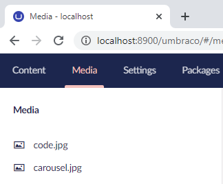
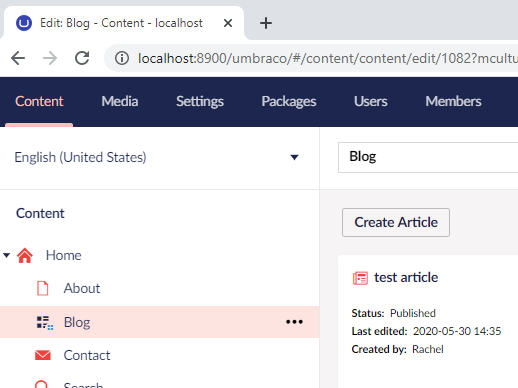

# changeTitle

Setting the title of the page the user is working on is important for accessibility purposes. People using assistive technology need to know what they are maintaining. By setting the page title, people who work with multiple tabs will also find the page they were working on.

To use the directive call:

```
$scope.$emit("$changeTitle", title);
```

When the user navigates through the site there is some logic which sets the default page title this is based on:

* The current section the user is in
* The deployment environment



The original title of the page is based on the section being edited and the host name.



The title to use will then be prefixed to the original title of the page.

To remove the title displayed and revert to the default title, pass in an empty string.
