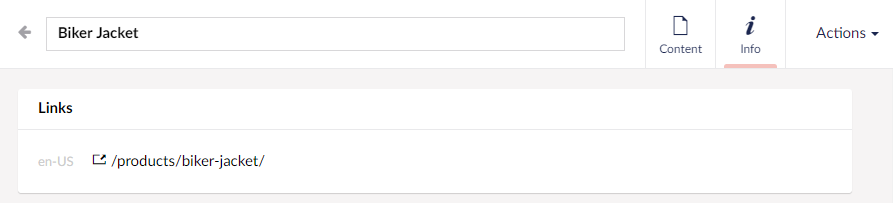

# Customizing the "Links" box

For a content item, Umbraco will show a **Links** box within the **Info** content app. By default, this box will show one or more links to content item.



With the `SendingContentNotification` event, we can manipulate the links in the `Urls` property. This could be by replacing it with custom links although a URL provider would be more suitable:

```C#
public void Handle(SendingContentNotification notification)
{
    notification.Content.Urls = new[]
    {
        new UrlInfo($"/products/?id={notification.Content.Id}", true, CultureInfo.CurrentCulture.Name)
    };
}
```

or remove the box entirely by providing an empty list of links:

```C#
public void Handle(SendingContentNotification notification)
{
    notification.Content.Urls = null;
}
```
