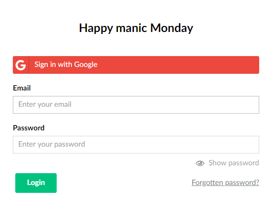

# External login providers

Both the Umbraco backoffice users and website members supports external login providers (OAuth) for performing authentication of your users or members. This could be any OpenIDConnect provider such as Entra ID/Azure Active Directory, Identity Server, Google or Facebook.

Unlike previous major releases of Umbraco the use of Identity Extensions package is no longer required.

Install an appropriate nuget package for the provider you wish to use. Some popular ones found in Nuget include:

* [Google](https://www.nuget.org/packages/Microsoft.AspNetCore.Authentication.Google)
* [Facebook](https://www.nuget.org/packages/Microsoft.AspNetCore.Authentication.Facebook)
* [Microsoft](https://www.nuget.org/packages/Microsoft.AspNetCore.Authentication.MicrosoftAccount/)
* [Twitter](https://www.nuget.org/packages/Microsoft.AspNetCore.Authentication.Twitter/3.0.0)
* [Open ID Connect](https://www.nuget.org/packages/Microsoft.AspNetCore.Authentication.OpenIdConnect)
* [Others](https://docs.microsoft.com/en-us/aspnet/core/security/authentication/social/other-logins?view=aspnetcore-5.0)


**Try it out**

* This community-created package with a complete Umbraco solution incl. an SQLite database demonstrates how OpenID Connect can be used: [Umbraco OpenIdConnect Example](https://github.com/jbreuer/Umbraco-OpenIdConnect-Example).&#x20;
* This community-created package will allow you to automatically create Umbraco user accounts for users in your directory. This will then associate the Umbraco users with groups based on their AD group: [Umbraco.Community.AzureSSO](https://github.com/Gibe/Umbraco.Community.AzureSSO).

It is great for testing and for trying out the implementation before building it into your own project.


To configure the provider create a new static extension class for your provider and configure a custom named options like `GoogleBackOfficeExternalLoginProviderOptions` described in details in the [auto linking](auto-linking.md) section. The code example below shows how the configuration for Google Authentication can be done. You can find an example for how this can be done with Microsoft in the [Authenticating on the Umbraco backoffice with Active Directory credentials](../../tutorials/authenticate-with-active-directory.md) article.

```
using Umbraco.Cms.Core.DependencyInjection;
using Umbraco.Extensions;
using Umbraco.Cms.Web.BackOffice.Security;
using Microsoft.Extensions.DependencyInjection;
using Microsoft.Extensions.Configuration;

namespace Umbraco.Cms.Web.UI.NetCore.Configuration
{
    public static class GoogleBackofficeAuthenticationExtensions
    {
        public static IUmbracoBuilder AddGoogleBackofficeAuthentication(this IUmbracoBuilder builder)
        {
            builder.AddBackOfficeExternalLogins(logins =>
            {
                logins.AddBackOfficeLogin(
                    backOfficeAuthenticationBuilder =>
                    {
                        backOfficeAuthenticationBuilder.AddGoogle(
                            // The scheme must be set with this method to work for the back office
                            backOfficeAuthenticationBuilder.SchemeForBackOffice(GoogleBackOfficeExternalLoginProviderOptions.SchemeName),
                            options =>
                            {
                                //  By default this is '/signin-google' but it needs to be changed to this
                                options.CallbackPath = "/umbraco-google-signin";
                                options.ClientId = "YOURCLIENTID";
                                options.ClientSecret = "YOURCLIENTSECRET";
                            });
                    });
            });
            return builder;
        }
    }
}
```

And another, but fairly similar, example of configuration for Google Authentication for members may look like:

```
using Microsoft.Extensions.DependencyInjection;
using Umbraco.Cms.Core.DependencyInjection;
using Umbraco.Extensions;

namespace Umbraco.Cms.Web.UI.NetCore.Configuration
{
    public static class GoogleMemberAuthenticationExtensions
    {
        public static IUmbracoBuilder AddGoogleMemberAuthentication(this IUmbracoBuilder builder)
        {
            builder.AddMemberExternalLogins(logins =>
            {
                logins.AddMemberLogin(
                    memberAuthenticationBuilder =>
                    {
                        memberAuthenticationBuilder.AddGoogle(
                            // The scheme must be set with this method to work for the back office
                            memberAuthenticationBuilder.SchemeForMembers(GoogleMemberExternalLoginProviderOptions.SchemeName),
                            options =>
                            {
                                options.ClientId = "YOURCLIENTID";
                                options.ClientSecret = "YOURCLIENTSECRET";
                            });
                    });
            });
            return builder;
        }
    }
}
```

Finally, update `ConfigureServices` in your `Startup.cs` class to register your configuration with Umbraco. An example may look like:

```
public void ConfigureServices(IServiceCollection services)
{
    services.AddUmbraco(_env, _config)
        .AddBackOffice()
        .AddWebsite()
        .AddComposers()
        .AddGoogleBackofficeAuthentication()
        .AddGoogleMemberAuthentication()
        .Build();
}
```

For a more in depth article on how to setup OAuth providers in .NET refer to the [Microsoft Documentation](https://docs.microsoft.com/en-us/aspnet/core/security/authentication/social/?view=aspnetcore-5.0\&tabs=visual-studio).

Depending on the provider you've configured and its caption/color, the end result will look similar to this for users:



Because Umbraco do not control the UI of members, this can be setup to look exactly like you would like, but Umbraco ships with partial macro snippets for `Login` that will show all configured external login providers.

## Auto-linking accounts for custom OAuth providers

Traditionally a backoffice user or members will need to exist first and then that user can link their user account to an external login provider in the backoffice. In many cases however, the external login provider you install will be the source of truth for all of your users.

In this case, you would want to be able to create user accounts in your external login provider and then have that user given access to the backoffice without having to create the user in the backoffice first. This is done via auto-linking.

This could also be the case for members if your website allows public creation of members. In this case, the creation process can be simplified by allowing auto-linking the external account. E.g. using Facebook, Twitter or Google.

Read more about [auto linking](auto-linking.md).
