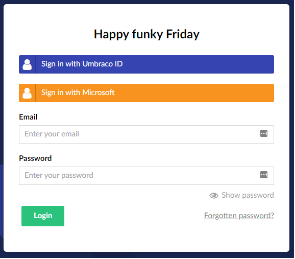
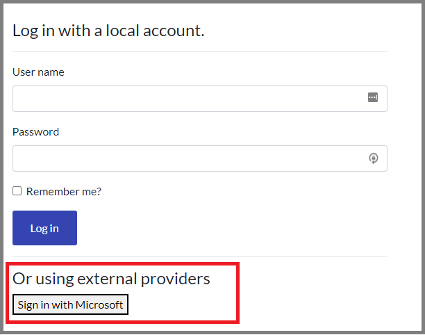

# Authenticating the Umbraco backoffice with Microsoft Entra ID (Azure Active Directory) credentials

This article describes how to configure Microsoft Entra ID (Azure Active Directory/Azure AD) with Umbraco Users and Members.

## Configuring Entra ID

Before your applications can interact with Entra ID B2C, they must be registered in a tenant that you manage. For more information, see [Microsoft's Tutorial: Create an Azure Active Directory B2C tenant](https://learn.microsoft.com/en-us/azure/active-directory-b2c/tutorial-create-tenant).

## Installing the NuGet Package

You need to install the `Microsoft.AspNetCore.Authentication.MicrosoftAccount` NuGet package. There are two approaches to installing the packages:

1. Use your favorite IDE and open up the **NuGet Package Manager** to search and install the packages.
2. Use the command line to install the package.

## Entra ID Authentication for Users

1.  Create a class called `BackofficeAuthenticationExtensions.cs` to configure the external login.

    ```csharp
    using Microsoft.AspNetCore.Authentication.MicrosoftAccount;
    using Microsoft.Extensions.DependencyInjection;

    namespace MyApp
    {
        public static class BackofficeAuthenticationExtensions
        {
            public static IUmbracoBuilder ConfigureAuthentication(this IUmbracoBuilder builder)
            {
                builder.AddBackOfficeExternalLogins(logins =>
                {
                    const string schema = MicrosoftAccountDefaults.AuthenticationScheme;
                    
                    logins.AddBackOfficeLogin(
                        backOfficeAuthenticationBuilder =>
                        {
                            backOfficeAuthenticationBuilder.AddMicrosoftAccount(
                                // the scheme must be set with this method to work for the back office
                                backOfficeAuthenticationBuilder.SchemeForBackOffice(schema) ?? string.Empty,
                                options =>
                                {
                                    //By default this is '/signin-microsoft' but it needs to be changed to this
                                    options.CallbackPath = "/umbraco-signin-microsoft/";
                                    //Obtained from the ENTRA ID B2C WEB APP
                                    options.ClientId = "{your_client_id}";
                                    //Obtained from the ENTRA ID B2C WEB APP
                                    options.ClientSecret = "{your_client_secret}";
                                    //options.TokenEndpoint = $"https://login.microsoftonline.com/{tenantId}/oauth2/v2.0/token";
                                    //options.AuthorizationEndpoint = $"https://login.microsoftonline.com/{tenantId}/oauth2/v2.0/authorize";                                    
                                });
                        });
                });
                return builder;
            }
        }
    }
    ```

    
    Ensure to replace **{your\_client\_id}** and **{your\_client\_secret}** in the code with the values from the Entra ID tenant. If Entra ID is configured to use accounts in the organizational directory only (single tenant), you also have to specify the Token and AuthorizationEndpoint.
    
2.  Update `ConfigureServices` method in the `Startup.cs` file:

    ```csharp
    public void ConfigureServices(IServiceCollection services)
    {
        services.AddUmbraco(_env, _config)
            .AddBackOffice()
            .AddWebsite()
            .AddComposers()
            // Add ConfigureAuthentication
            .ConfigureAuthentication()
            .Build();
    }
    ```
3.  Build and run the website. You can now login with your Entra ID credentials.

    

## Entra ID Authentication for Members

1. Create a Member login functionality, see the [Member registration and login](../../tutorials/members-registration-and-login.md#member-registration-and-login) article.
2.  Create a class called `MemberAuthenticationExtensions.cs` to configure the external login.

    ```csharp
    using Microsoft.Extensions.DependencyInjection;

    namespace MyApp
    {
        public static class MemberAuthenticationExtensions
        {
            public static IUmbracoBuilder ConfigureAuthenticationMembers(this IUmbracoBuilder builder)
            {
                builder.Services.ConfigureOptions<EntraIDB2CMembersExternalLoginProviderOptions>();
                builder.AddMemberExternalLogins(logins =>
                {
                    logins.AddMemberLogin(
                        membersAuthenticationBuilder =>
                        {
                            membersAuthenticationBuilder.AddMicrosoftAccount(
                                // The scheme must be set with this method to work for members
                                membersAuthenticationBuilder.SchemeForMembers(EntraIDB2CMembersExternalLoginProviderOptions.SchemeName),
                                options =>
                                {
                                    //Callbackpath - Important! The CallbackPath represents the URL to which the browser should be redirected to and the default value is
                                    // /signin-oidc This should be unique!.
                                    options.CallbackPath = "/umbraco-b2c-members-signin";
                                    //Obtained from the ENTRA ID B2C WEB APP
                                    options.ClientId = "YOURCLIENTID";
                                    //Obtained from the ENTRA ID B2C WEB APP
                                    options.ClientSecret = "YOURCLIENTSECRET"; 
                                    options.SaveTokens = true;
                                });
                        });
                });
                return builder;
            }
        }
    }
    ```


```
Ensure to replace **{your_client_id}** and **{your_client_secret}** in the code with the values from the Entra ID tenant.
```


1.  To enable a member to link their account to an external login provider such as Entra ID in the Umbraco Backoffice, you have to implement a custom named configuration `MemberExternalLoginProviderOptions` for Members. Add the following code in the `EntraIDB2CMembersExternalLoginProviderOptions.cs` file:

    ```csharp
    using Microsoft.Extensions.Options;
    using Umbraco.Cms.Core;
    using Umbraco.Cms.Web.Common.Security;

    namespace MyApp
    {
        public class EntraIDB2CMembersExternalLoginProviderOptions : IConfigureNamedOptions<MemberExternalLoginProviderOptions>
        {
            public const string SchemeName = "EntraIDB2C";
            public void Configure(string name, MemberExternalLoginProviderOptions options)
            {
                if (name != "Umbraco." + SchemeName)
                {
                    return;
                }

                Configure(options);
            }

            public void Configure(MemberExternalLoginProviderOptions options)
            {

                options.AutoLinkOptions = new MemberExternalSignInAutoLinkOptions(
                    // must be true for auto-linking to be enabled
                    autoLinkExternalAccount: true,

                    // Optionally specify the default culture to create
                    // the user as. If null it will use the default
                    // culture defined in the web.config, or it can
                    // be dynamically assigned in the OnAutoLinking
                    // callback.

                    defaultCulture: null,
                    
                    // Optionally specify the default "IsApprove" status. Must be true for auto-linking.
                    defaultIsApproved: true,

                    // Optionally specify the member type alias. Default is "Member"
                    defaultMemberTypeAlias: "Member"

                )
                {
                    // Optional callback
                    OnAutoLinking = (autoLinkUser, loginInfo) =>
                    {
                        // You can customize the user before it's linked.
                        // i.e. Modify the user's groups based on the Claims returned
                        // in the externalLogin info
                    },
                    OnExternalLogin = (user, loginInfo) =>
                    {
                        // You can customize the user before it's saved whenever they have
                        // logged in with the external provider.
                        // i.e. Sync the user's name based on the Claims returned
                        // in the externalLogin info

                        return true; //returns a boolean indicating if sign-in should continue or not.
                    }
                };
            }
        }
    }
    ```
2.  Next, update `ConfigureServices` method in the `Startup.cs` file:

    ```csharp
    public void ConfigureServices(IServiceCollection services)
    {
        services.AddUmbraco(_env, _config)
            .AddBackOffice()
            .AddWebsite()
            .AddComposers()
            // Add ConfigureAuthentication
            .ConfigureAuthentication()
            //Add Members ConfigureAuthentication
            .ConfigureAuthenticationMembers()
            .Build();
    }
    ```
3.  Build and run the website. Your members can now login with their Entra ID credentials.

    
