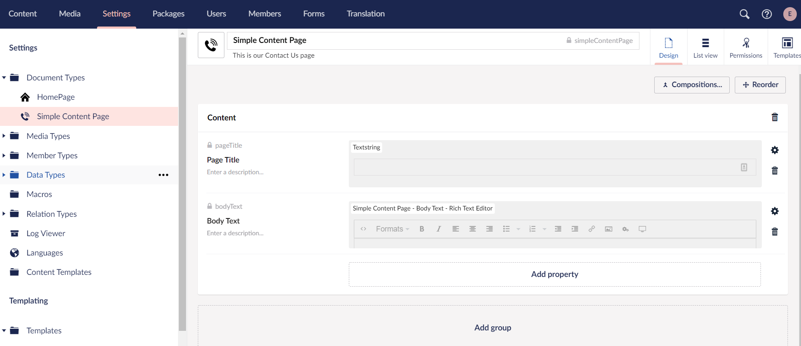
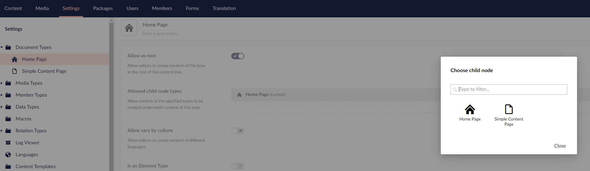
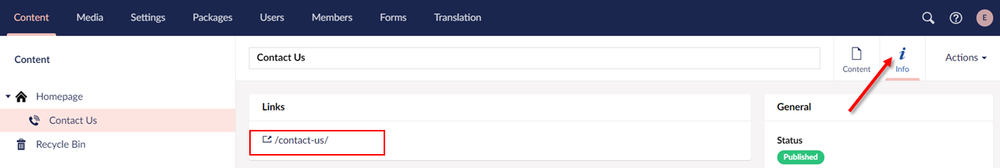

# Creating Pages and Using the Master Template

## Creating a Contact Us Page

We are now going to create a page where we put our contact details. For added functionality, you might want to look at replacing this with a fully fledged contact us form.

Some potential solutions:

* If you're not a programmer you can use the Umbraco built-in package - Umbraco Forms. Umbraco Forms has the added benefit that editors can also create their own forms. Find more information and purchase the product through [Umbraco Apps](https://umbraco.com/apps/umbraco-forms/).
* Build your own contact form using [Surface Controllers](../../fundamentals/code/creating-forms.md).

### Creating the Document Type and Template

Let's create a content-only contact page where we can provide a title and some rich text.

1. Go to **Settings**.
2. Select the **...** next to the **Document Types** in the **Settings** tree.
3. Select **Document Type with Template**. The Document Type opens in the content editor.
4. Select an **Icon** from the list of icons.
5. Enter a **Name**. Let's call it _Simple Content Page_.
6. Enter a Description.
7.  Let's add two fields with the following specifications:

    | Group   | Field Name | Alias     | Data Type        |
    | ------- | ---------- | --------- | ---------------- |
    | Content | Page Title | pageTitle | Textstring       |
    | Content | Body Text  | bodyText  | Rich Text Editor |

    
8. Click **Save**.
9. Go to **Templates** to view your _Simple Content Page_ template that was created automatically with the Document Type.
10. Select the **Simple Content Page** template and then select **Master** as the **Master template**.
11. Add the following HTML to the **Simple Content Page** template and click **Save**.

    ```html
    <!-- Jumbotron, w title -->
        <div class="jumbotron text-center jumbotron-fluid">
                <div class="container">
                    <h1 class="display-1">Umbraco Support</h1>
                </div>
            </div>

    <!-- Main -->
    <section id="main" class="wrapper">
        <div class="container">

            <p>Are you a developer?</p>
            <p>Are you a marketer?</p>
            <p>Are you working at an agency?</p>
            <p>Let Umbraco unleash your talent</p>
        </div>
    </section>        
    ```
12. Click **Save**.

### Updating the Document Type Permissions

We now need to update the Document Type permissions to specifically add child nodes under the root content node.

To update the Document Type permissions:

1. Go to **Settings**.
2. Open the **Homepage** Document Type and go to the **Permissions** tab.
3. Select **Add child** in the **Allowed child node types**. The **Choose child node** dialog opens.
4.  Select **Simple Content Page** and click **Save**.\\

    <figure><figcaption></figcaption></figure>

### Creating the content node

To create a content node:

1. Go to **Content**.
2. Select **...** next to the **Homepage** and select **Simple Content Page**.
3. Enter a name for the Document Type. Let's call it _Contact Us_.
4. Fill in details for the **Page Title** and **Body Text**.
5. Click **Save and Publish**.

### Adding the Document Type Properties

To add the Document Type properties:

1. Go to **Settings**.
2. Select **Templates** from the **Templating** section, and open the **Simple Content Page** template.
3. Scroll to the `<!-- Jumbotron, w title -->` (around line 8) section and highlight the text `“Umbraco Support”` (around line 11).
4. Click **Insert** and select **Value**.
5. Select the **pageTitle** field from the drop-down list and click **Submit**.
6. Repeat the same process for the `<div class="container">` tag:
   * Highlight the content from the `<p>` tag (around line 19) to the end of the `</p>` tag (around line 22).
   * Click **Insert** and select **Value**.
   * Select **bodyText** field from the drop-down list.
   * Click **Submit**.
7. Click **Save**.

### Viewing the Contact Us Page

To view the **Contact Us** Page:

1. Go to **Content**.
2. Select the **Contact Us** page.
3. Go to the **Info** tab.
4.  Click the link to view the page. \\

    <figure><figcaption></figcaption></figure>

## Using Document Type Properties from the Homepage

You may notice that the footer is now empty - we don't have the content from our Homepage node.

To use the Document Type properties from the homepage, do the following:

1. Go to **Settings**.
2. Select **Templates** from the **Templating** section, and open the **Master** template.
3. Highlight `@Model.Value("footerText")` in the footer (around line 52) and click **Insert**.
4. Select **Value** and choose the **footerText** again from the **Choose field** dropdown.
5. Select **Yes, make it recursive** checkbox. This notifies Umbraco to look up the content tree if the field doesn't exist at the node level for the page we're requesting.
6. Click **Submit**.
7. Click **Save**.

Reload the _Contact Us_ page to view the content with the footer.
