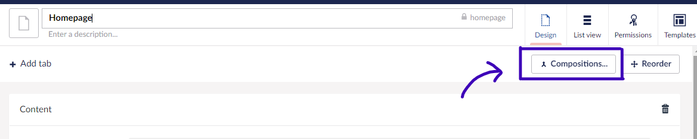
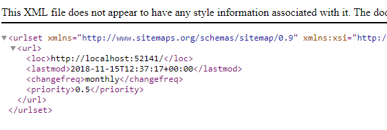
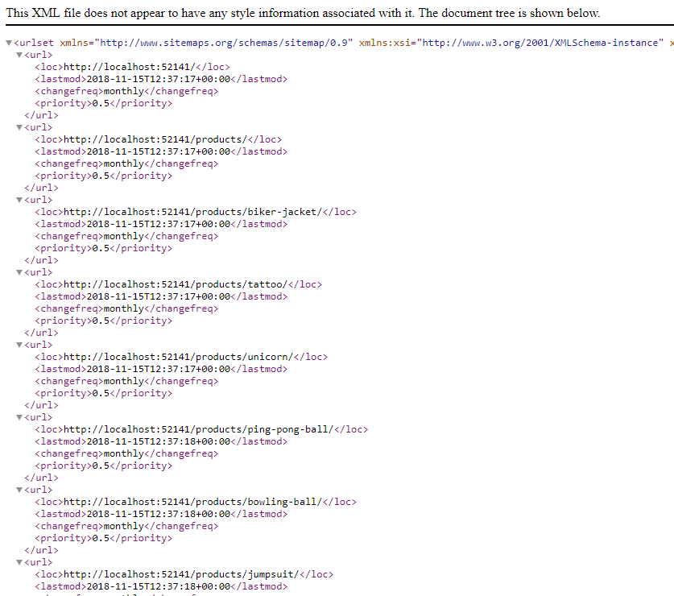

# Creating an XML Sitemap

An XML sitemap is a guide for search engines to discover and index your content. Each page on your site that you wish to feature will be represented by a `<url>` entry in the list.

Adding an XML sitemap to your site makes it easier for search engines such as Google to find and index the pages of your website. Having a sitemap will improve the Search Engine Optimization (SEO) for your website.

This tutorial will take you through the steps of building and configuring a sitemap that fits your Umbraco website.

If you are in a hurry, there is a community package that can do the job for you:

* [SEO Tool Kit](https://marketplace.umbraco.com/package/seotoolkit.umbraco)

## What does an XML sitemap look like?

An XML sitemap is a list of URLs for the content on your site.

See the [Sitemaps XML format documentation](https://www.sitemaps.org/protocol.html) about the XML schema, the sitemap needs to conform to.

Below is an XML sample of a typical sitemap entry:

```xml
<?xml version="1.0" encoding="UTF-8"?>
<urlset xmlns="http://www.sitemaps.org/schemas/sitemap/0.9">
    <url>
        <loc>https://www.example.com/</loc>
        <lastmod>2005-01-01</lastmod>
        <changefreq>monthly</changefreq>
        <priority>0.8</priority>
    </url>
</urlset>
```

## Approach

There are different ways of approaching this task. The best approach will be determined by the size of your site and your preference for implementing functionality in Umbraco.

In this tutorial, we are going to write the code directly in a Template using Razor and `IPublishedContent`. You may want to take a different approach, like using route hijacking to write the code in an MVC controller.

Throughout this tutorial, we will:

* Create a new Document Type called 'XmlSiteMap' that is to be used for the sitemap content page,
* Create a Document Type composition, containing a consistent set of sitemap-related properties, and
* Build a Razor template view to generate the sitemap entries based on different criteria and filters.

## 1. Create an XmlSiteMap Document Type

In this first step of the tutorial, we will be creating a new Document Type for our sitemap page.


1. Navigate to the **Settings** section in the Umbraco backoffice.
2. Create a new **Document Type with Template** under the Document Types folder.
3. Name the new Document Type **XmlSiteMap**.
4. Add a TextString property called **Excluded Document Types** (alias: `excludedDocumentType`).
5. Save the XmlSiteMap Document Type.
6. Open the Document Type used at the root of your website (Example: **HomePage**).
7. Select the **Permissions** tab and add the new XmlSiteMap under **Allowed child node types**.
8. Navigate to the **Content** section.
9. Create a new XmlSiteMap page as a subpage to the root/home page in your Content tree.
10. Use the alias to add the XmlSiteMap Document Type to the "Excluded Document Type" list: `xmlSiteMap`.


## 2. Create an XmlSiteMapSettings Composition

In this step, we will be creating a Composition Document Type. This Document Type will be used to add sitemap options to all Document Types used to add content pages to the website.

The following options will be added:

* **Relative priority**: A sitemap entry will allow you to state the _relative priority_ of any particular page in terms of its importance within your site. A value of 1.0 is the highest level of importance and 0.1 is at the other end of the scale.
* **Change Frequency**: You can add a _change frequency_ to define how often the content on a particular page is expected to change. This will help the search engine know when to return to reindex any regularly updated content.

Create and configure the Document Type Composition by following these steps:

1. Navigate to the **Settings** section in the Umbraco backoffice.
2. Create a new **Composition** under the Document Types folder.
3. Name the new Document Type **XmlSiteMapSettings**.
4. Add the following properties: a. Slider named **Search Engine Relative Priority** (searchEngineRelativePriority): MinValue: 0.1, MaxValue: 1, Step Increments 0.1, InitialValue 0.5. b. Dropdown named **Search Engine Change Frequency** (searchEngineChangeFrequency): Always, hourly, daily, weekly, monthly, yearly, and never. c. Toggle named **Hide From Xml Sitemap** (hideFromXmlSitemap).

<figure><figcaption></figcaption></figure>

## 3. Add composition to all relevant Document Types

Add the XmlSiteMapSettings composition to all Document Types used to create content pages in the Content section.

<figure><figcaption></figcaption></figure>

This will give editors the ability to set a priority and a change frequency for each page on the site. We will use the values from the parent or parent's parent page in case the values are not specified on a particular page. This enables the values to be set in one place for a particular section.

## 4. Building the XmlSiteMap.cshtml template

In this step, we will be building the XmlSiteMap template to display the XML schema on the sitemap page.

Editing the template can be done in two different ways:

* Locate the XmlSiteMap Template in the **Settings** section of the Umbraco backoffice and use the editor to make the changes, or
* Open and work with the `Views/XmlSiteMap.cshtml` file in your preferred Integrated Development Environment (IDE) on your machine.

We will start by adding the XML schema for the sitemap. Since we do not want our template to inherit any 'master' HTML layouts we will set the `layout` to be `null`.

1. Navigate to the **Settings** section of the Umbraco backoffice.
2. Find and open the XmlSiteMap Template.
3. Set `Layout` to `null`.
4. Add `Context.Response.ContentType = "text/xml";` within the curly brackets.
5.  Add the following code snippet below the closing curly bracket in the template:

    ```xml
    <urlset xmlns="http://www.sitemaps.org/schemas/sitemap/0.9" 
            xmlns:xsi="http://www.w3.org/2001/XMLSchema-instance" 
            xsi:schemalocation="http://www.google.com/schemas/sitemap/0.9 http://www.sitemaps.org/schemas/sitemap/0.9/sitemap.xsd" 
            xmlns:image="http://www.google.com/schemas/sitemap-image/1.1">
        // Insert sitemap content here.
    </urlset>
    ```
6. Save the template.

### Getting a reference to the sitemap starting point

The sitemap should start at the homepage at the root of the site. Since our XmlSiteMap page is created as a subpage page to the root, we can use the `Root()` helper to define the starting point as `IPublishedContent`.

1. Add `IPublishedContent siteHomePage = Model.Root();` within the first set of curly brackets in the template.
2. Save the template.

### Rendering a sitemap entry

We will retrieve each page in the site as **IPublishedContent** and read in the `SearchEngineChangeFrequency` and `SearchEngineRelativePriority` properties. We will also read the URL of the page as well as when it was last modified.


You can include HTML markup in the body of a method declared in a code block. This is a great way to organize your razor view implementation and to avoid repeating code and HTML in multiple places.


1.  Add the following code snippet below the XML schema:

    ```csharp
    @{
        void RenderSiteMapUrlEntry(IPublishedContent node)
        {
            // The change frequency is recursive and should 'fallback to ancestor' when no value is given.
            var changeFreq = node.Value("searchEngineChangeFrequency", 
                                        fallback: Fallback.To(Fallback.Ancestors, Fallback.DefaultValue), 
                                        defaultValue: "monthly");

            // The relative priority is a per-page setting only. We will not set Fallback.ToAncestors and instead default to 0.5 if no value is set.
            var priority = node.HasValue("searchEngineRelativePriority") ? node.Value<string>("searchEngineRelativePriority") : "0.5";

            <url>
                <loc>@node.Url(mode: UrlMode.Absolute)</loc>
                <lastmod>@(string.Format("{0:s}+00:00", node.UpdateDate))</lastmod>
                <changefreq>@changeFreq</changefreq>
                <priority>@priority</priority>
            </url>
        }
    }
    ```
2.  Update the XML schema to include `RenderSiteMapUrlEntry(siteHomePage)`:

    ```csharp
    <urlset xmlns="http://www.sitemaps.org/schemas/sitemap/0.9" 
            xmlns:xsi="http://www.w3.org/2001/XMLSchema-instance" 
            xsi:schemalocation="http://www.google.com/schemas/sitemap/0.9 http://www.sitemaps.org/schemas/sitemap/0.9/sitemap.xsd" 
            xmlns:image="http://www.google.com/schemas/sitemap-image/1.1">
        @{
            RenderSiteMapUrlEntry(siteHomePage);
        }
    </urlset>
    ```


We are using `IPublishedContent` in this example. Using **ModelsBuilder** instead will enable you to take advantage of the fact that the XML Sitemap Settings composition will create an interface called `IXmlSiteMapSettings`. This will allow you to adjust the helper to accept `RenderSiteMapUrlEntry(IXmlSiteMapSettings node)` and read properties without the `Value` helper. You would still need to create an extension method on `IXmlSiteMapSettings` to implement the recursive functionality we make use of on the `SearchEngineChangeFrequency` property.


Visit the URL of your sitemap page (`http://yoursite.com/sitemap`) to render a single sitemap entry for the homepage.



### Looping through the rest of the site

We need to go through each page created beneath the homepage to see if they should be added to the sitemap.

We will add a `RenderSiteMapUrlEntriesForChildren` helper which accepts a 'Parent Page' parameter as the starting point. Then we will find the children of this Parent Page and write out their sitemap entry. Finally, we will call this same method again from itself.

1.  Add the following code snippet below the `RenderSiteMapUrlEntry` helper and before the closing curly bracket:

    ```csharp
    void RenderSiteMapUrlEntriesForChildren(IPublishedContent parentPage)
    {
        foreach (var page in parentPage.Children)
        {
            RenderSiteMapUrlEntry(page);
            if (page.Children.Any()){
                RenderSiteMapUrlEntriesForChildren(page);
            }
        }
    }
    ```
2.  Update the XML schema to include `RenderSiteMapUrlEntriesForChildren(siteHomePage)`:

    ```csharp
    <urlset xmlns="http://www.sitemaps.org/schemas/sitemap/0.9" 
            xmlns:xsi="http://www.w3.org/2001/XMLSchema-instance" 
            xsi:schemalocation="http://www.google.com/schemas/sitemap/0.9 http://www.sitemaps.org/schemas/sitemap/0.9/sitemap.xsd" 
            xmlns:image="http://www.google.com/schemas/sitemap-image/1.1">
        @{
            RenderSiteMapUrlEntry(siteHomePage);
            RenderSiteMapUrlEntriesForChildren(siteHomePage);
        }
    </urlset>
    ```

You will now see the XML sitemap rendered for the entire site.



## 5. Filter the sitemap content

In this step, we will use different parameters for filtering the content on the sitemap.

As everything is currently added on the sitemap, we have yet to take into account the pages that should be hidden.

We added a **HideFromXmlSitemap** checkbox to all Document Types via our `XmlSiteMapSettings` composition. This configuration needs to be included when rendering the sitemap. The helper needs to only return pages that do not have the HideFromXmlSitemap checked.

1.  Update the `RenderSiteMapUrlEntriesForChildren` helper as shown below:

    ```csharp
    void RenderSiteMapUrlEntriesForChildren(IPublishedContent parentPage)
    {
        // Filter the query based on the hideFromXmlSiteMap value
        foreach (var page in parentPage.Children.Where(x =>!x.Value<bool>("hideFromXmlSiteMap")))
        {
            RenderSiteMapUrlEntry(page);
            // Filter the query based on the hideFromXmlSiteMap value
            if (page.Children.Any(x =>!x.Value<bool>("hideFromXmlSiteMap"))){
                RenderSiteMapUrlEntriesForChildren(page);
            }
        }
    }
    ```

Revisit a page in the Content tree, and check the HideFromXmlSitemap option. This page will now be excluded from the sitemap.

To further control which and how many pages are shown in the sitemap you can filter by **depth**. We will provide the helper with a number that defines how deep into the Content tree the sitemap should look.

1. Navigate to the **Settings** section in the Umbraco backoffice.
2. Find and open the XmlSiteMap Document Type.
3. Add a Numeric property and call it **Max Site Map Depth** (alias: `maxSiteMapDepth`).
4. Save the Document Type.
5. Open the XmlSiteMap Template.
6.  Add the following line within the first set of curly brackets:

    ```csharp
    int maxSiteMapDepth = Model.HasValue("maxSiteMapDepth") ? Model.Value<int>("maxSiteMapDepth") : int.MaxValue;
    ```
7.  Update the `RenderSiteMapUrlEntriesForChildren` helper as shown below:

    ```csharp
    void RenderSiteMapUrlEntriesForChildren(IPublishedContent parentPage)
    {
        foreach (var page in parentPage.Children.Where(f=>!f.Value<bool>("hideFromXmlSiteMap")))
        {
            RenderSiteMapUrlEntry(page);
            // Filter the query based on the maxSiteMapDepth value
            if (page.Level < maxSiteMapDepth && page.Children.Any(f=>!f.Value<bool>("hideFromXmlSiteMap"))){
                RenderSiteMapUrlEntriesForChildren(page);
            }
        }
    }
    ```
8. Navigate to the **Content** section in the Umbraco backoffice.
9. Open the Sitemap page and set the **Max Site Map Depth** to `2`.
10. Save and publish the content.

Your sitemap will now only contain entries for the top two levels. Leaving the value blank will mean that no maximum depth restriction will be applied.

Finally, we need the helper to check the **Excluded Document Types** list on the XmlSiteMap Document Type.

1. Open the XmlSiteMap Template.
2.  Add the following code snippets within the first set of curly brackets:

    ```csharp
    // Get the value from the excludedDocumentTypes property as a 'string'
    string excludedDocumentTypeList = Model.Value<string>("excludedDocumentTypes");
    // Separate the values into separate Document Types and add them to an 'array'
    string[] excludedDocumentTypes = (!String.IsNullOrEmpty(excludedDocumentTypeList)) ? excludedDocumentTypeList.Split(new char[] { ',' }, StringSplitOptions.RemoveEmptyEntries).Select(p => p.Trim()).ToArray() : new string[] { };
    ```
3.  Update the `RenderSiteMapUrlEntriesForChildren` helper as shown below to pass in the array:

    ```csharp
    void RenderSiteMapUrlEntriesForChildren(IPublishedContent parentPage)
    {
        // Filter the query based on the excludedDocumentTypes value
        foreach (var page in parentPage.Children.Where(f => !excludedDocumentTypes.Contains(f.ContentType.Alias) && !f.Value<bool>("hideFromXmlSiteMap")))
        {
            RenderSiteMapUrlEntry(page);
            if (page.Level < maxSiteMapDepth && page.Children.Any(f => !f.Value<bool>("hideFromXmlSiteMap")))
            {
                RenderSiteMapUrlEntriesForChildren(page);
            }
        }
    }
    ```

Visit the URL of your sitemap page (`http://yoursite.com/sitemap`) to render a complete sitemap for your site.

It contains an entry for each page that is

* Not **hidden**,
* Not based on an **excluded Document Type**, and
* Located within the bounds of the defined **depth**.

## The finished XmlSiteMap Template

```csharp
@using Umbraco.Cms.Web.Common.PublishedModels;
@inherits Umbraco.Cms.Web.Common.Views.UmbracoViewPage<ContentModels.XmlSiteMap>
@using ContentModels = Umbraco.Cms.Web.Common.PublishedModels;

@{
    Layout = null;
    Context.Response.ContentType = "text/xml";
    IPublishedContent siteHomePage = Model.Root();

    // Get the maxSiteMapDepth value as an integer if the value is not empty
    int maxSiteMapDepth = Model.HasValue("maxSiteMapDepth") ? Model.Value<int>("maxSiteMapDepth") : int.MaxValue;

    // Get the value from the excludedDocumentTypes property as a 'string'
    string excludedDocumentTypeList = Model.Value<string>("excludedDocumentTypes");
    // Separate the values into separate Document Types and add them to an 'array'
    string[] excludedDocumentTypes = (!String.IsNullOrEmpty(excludedDocumentTypeList)) ? excludedDocumentTypeList.Split(new char[] { ',' }, StringSplitOptions.RemoveEmptyEntries).Select(p => p.Trim()).ToArray() : new string[] { };
}

<urlset xmlns="http://www.sitemaps.org/schemas/sitemap/0.9" 
        xmlns:xsi="http://www.w3.org/2001/XMLSchema-instance" 
        xsi:schemalocation="http://www.google.com/schemas/sitemap/0.9 http://www.sitemaps.org/schemas/sitemap/0.9/sitemap.xsd" 
        xmlns:image="http://www.google.com/schemas/sitemap-image/1.1">
    
    @{
        // Sitemap entry for the homepage is rendered
        RenderSiteMapUrlEntry(siteHomePage);
        // Sitemap for the rest of the site is rendered
        RenderSiteMapUrlEntriesForChildren(siteHomePage);
    }

</urlset>

@{
    // This helper is used to render the sitemap entries
    void RenderSiteMapUrlEntry(IPublishedContent node)
    {
        // The change frequency is recursive and should 'fallback to ancestor' when no value is given.
        var changeFreq = node.Value("searchEngineChangeFrequency", fallback: Fallback.To(Fallback.Ancestors, Fallback.DefaultValue), defaultValue: "monthly");
        // The relative priority is a per-page setting only. We will not set Fallback.ToAncestors and instead default to 0.5 if no value is set.
        var priority = node.HasValue("searchEngineRelativePriority") ? node.Value<string>("searchEngineRelativePriority") : "0.5";

        <url>
            <loc>@node.Url(mode: UrlMode.Absolute)</loc>
            <lastmod>@(string.Format("{0:s}+00:00", node.UpdateDate))</lastmod>
            <changefreq>@changeFreq</changefreq>
            <priority>@priority</priority>
        </url>
    }

    // This helper is used to filter which pages are shown in the sitemap
    void RenderSiteMapUrlEntriesForChildren(IPublishedContent parentPage)
    {
        // Filter the query based on the excludedDocumentTypes and hideFromXmlSiteMap values
        foreach (var page in parentPage.Children.Where(x => !excludedDocumentTypes.Contains(x.ContentType.Alias) && !x.Value<bool>("hideFromXmlSiteMap")))
        {
            RenderSiteMapUrlEntry(page);
            // Filter the query based on the maxSiteMapDepth and hideFromXmlSiteMap values
            if (page.Level < maxSiteMapDepth && page.Children.Any(x => !x.Value<bool>("hideFromXmlSiteMap")))
            {
                RenderSiteMapUrlEntriesForChildren(page);
            }
        }
    }
}
```

## Going further

Once you have added a sitemap to your site it is recommended that you also reference it in your `robots.txt` file.

1. Locate and open the `robots.txt` file in your preferred IDE.
2.  Add the following code snippet:

    ```xml
    Sitemap: https://www.yourlovelysite.com/xmlsitemap
    User-agent: *
    ```
3. Save the file.

Once you introduce a sitemap for the first time, you might find yourself being crawled by multiple different search engine bots. This is expected and exactly what you want.

It can be a good idea to add a **crawl-rate** to the `robots.txt` as well. This will instruct well-behaved search engine bots to increase the time between requests to your site.

1. Add `Crawl-delay: 10` to a new line in your `robots.txt` file.
2. Save the file.

### Test your XML sitemap in a validation tool

Visit [Xml-Sitemaps.com](https://www.xml-sitemaps.com/validate-xml-sitemap.html) to test the validity of your generated XML sitemap.
