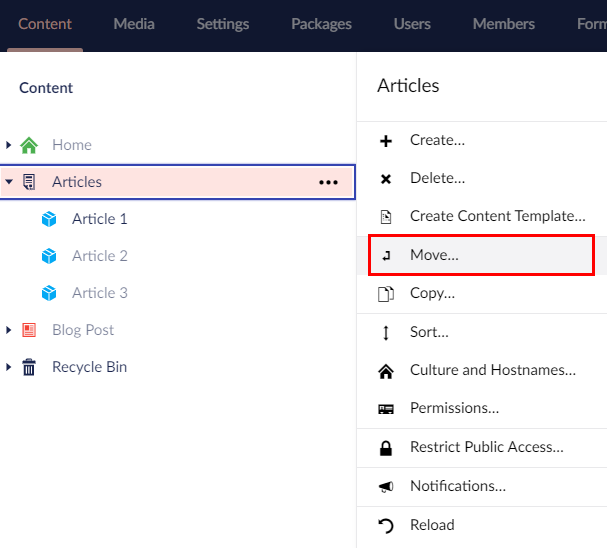
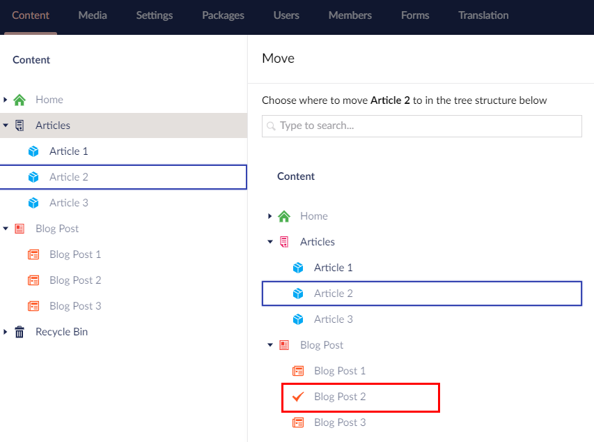
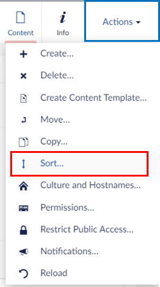

# Moving a Page

Move pages within the website through the tree view. Not all pages can be moved depending on your set-up or page permissions. If you need clarification, contact your system administrator.

You can move a page in two ways:

## Option 1

1. Go to **Content**.
2.  Right-click the page you wish to move and select **Move**. Alternatively, click **•••** next to the parent node, select **Do something else** and click **Move**.

    
3.  A window appears next to the section tree. Here, you can choose where you want to move the page in the tree structure.

    
4. Click **Move**.
5. A confirmation message appears. Click **OK** to dismiss the confirmation message.

## Option 2

1. Go to **Content**.
2. Select the page you wish to move.
3. Select **Actions** in the top-right corner of the screen.
4.  Select **Move** from the **Actions** drop-down menu.

    
5.  A window appears next to the section tree. Here, you can choose where you want to move the page in the tree structure.

    
6. Click **Move**.
7. A confirmation message appears. Click **OK** to dismiss the confirmation message.
