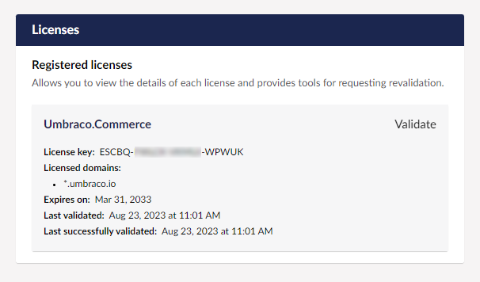

# Licensing

Umbraco Commerce is a commercial product. You can run an Umbraco Commerce unrestricted locally without the need a license. Running Umbraco Commerce on a public domain will display a warning banner in the backoffice and will limit the maximum number of orders (20). To remove these restrictions, you'll need to have a **valid license**.

## How does it work?

Licenses are sold per backoffice domain and will also work on all subdomains. If you have custom staging/qa environment domains that are not subdomains of the license domain, additional domains can be added to the license on request.


The licenses are not bound to a specific product version. They will work for all versions of the related product.


Let's say that you have a license configured for your domain, `mysite.com`, and you've requested two development domains, `devdomain.com` and `devdomain2.com`.

The license will cover the following domains:

* `localhost`
* `*.local`
* `*.mysite.com`
* `www.mysite.com`
* `devdomain.com`
* `www.devdomain.com`
* `devdomain2.com`
* `www.devdomain2.com`


You can have only 1 license per Umbraco installation.


## What does a license cover?

There are a few differences as to what the licenses cover:

* A single license covers the installation of Umbraco Commerce in 1 production backoffice domain, as well as in any requested development domains.
* The production domain includes **all subdomains** (e.g. `*.mysite.com`).
* The development domains work with or without the `www` subdomain.
* The license allows for an unlimited number of orders.
* The license also includes `localhost` and `*.local` as a valid domain.


If you have multiple backoffice domains pointing at the same installation, you have the option to purchase and [add **additional domains**](licensing-model.md#add-additional-domains) to your license.

This is an add-on domain for existing licenses. Refunds will not be given for this product.


## Configuring your license

You can purchase a license via the [Umbraco Commerce](https://umbraco.com/products/umbraco-commerce/) project page. A member of the [SUITS team](mailto:suits@umbraco.com) will manage this process and ask for the primary domain you wish to license along with any staging/qa domains you'd also like to be covered by the license. You should then receive a license code to be installed in your solution.

### Add additional domains

If you require to add addition domains to the license, please reach out to a member of the [SUITS team](mailto:suits@umbraco.com) with your request and they will manage this process.

## Installing your license

Once you have received your license code it needs to be installed on your site.

1. Open the root directory for your project files.
2. Locate and open the `appSettings.json` file.
3. Add your Umbraco Commerce license key to `Umbraco:Licenses:Umbraco.Commerce`:

```json
"Umbraco": {
  "Licenses": {
    "Umbraco.Commerce": "YOUR_LICENSE_KEY"
  }
}
```

### Verify the license installation

You can verify that your license is successfully installed by logging into your projects back office and navigating to the settings section. Here you will see a licenses dashboard which should display the status of your license.

