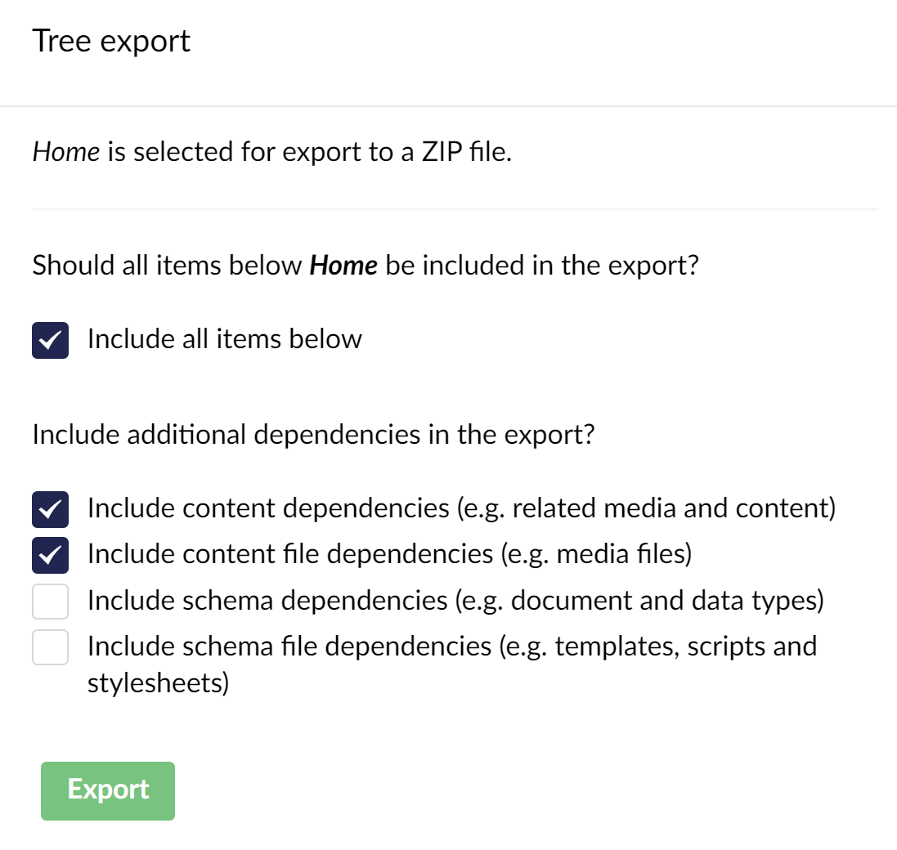
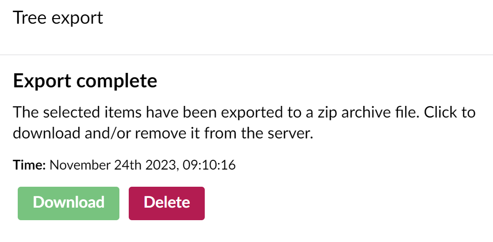
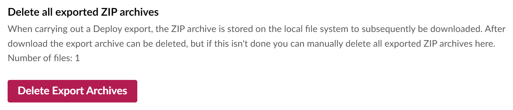
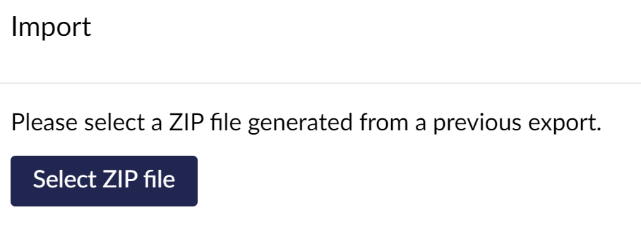
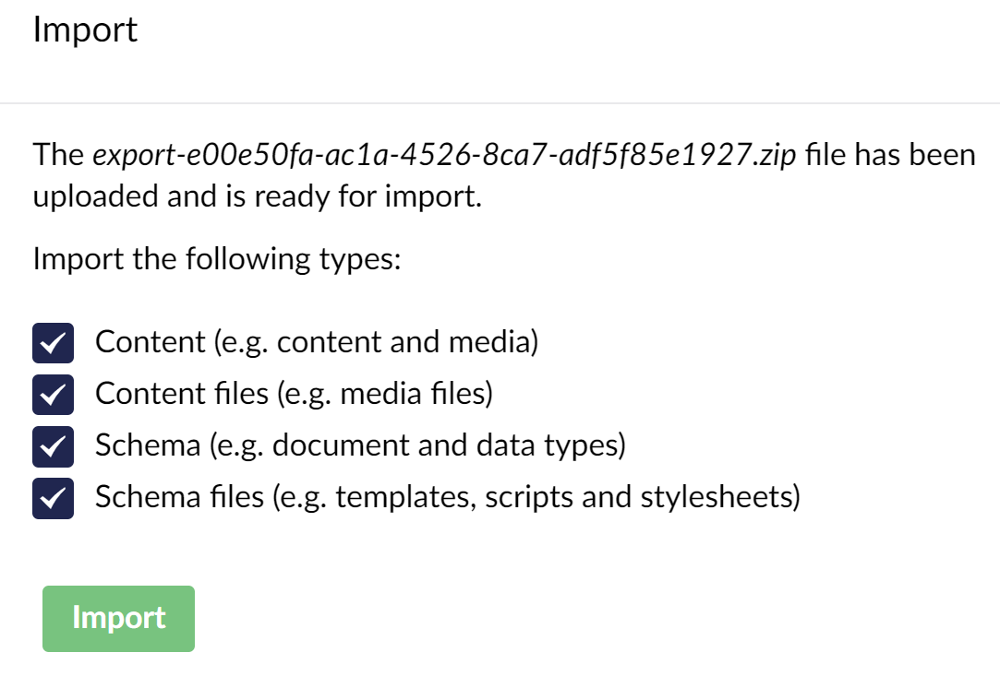
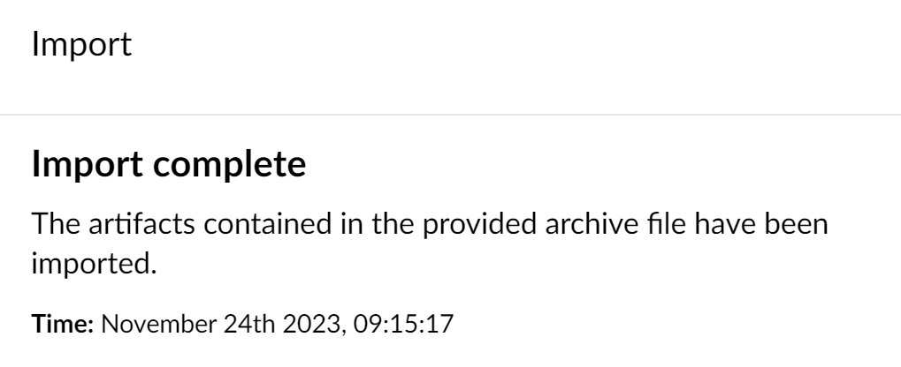

# Import and Export

## What is import and export?

The import and export feature of Umbraco Deploy allows you to transfer content and schema between Umbraco environments. Exports are made from one environment to a `.zip` file. And this file is imported into another environment to update the Umbraco data there.

## When to use import and export

Umbraco Deploy provides two primary workflows for managing different types of Umbraco data:

- Umbraco schema (such as document types and data types) are transferred [as `.uda` files serialized to disk](./deploying-changes.md). They are deployed to refresh the schema information in a destination environment along with code and template updates.
- Umbraco content (such as content and media) are [transferred by editors using backoffice operations](./content-transfer.md).

We recommend using these approaches for day-to-day editorial and developer activities.

Import and export is intended more for larger transfer options, project upgrades, or one-off tasks when setting up new environments.

As import and export is a two-step process, it doesn't require inter-environment communication. This allows us to process much larger batches of information without running into hard limits imposed by Cloud hosting platforms.

We are also able provide hooks to allow for migrations of artifacts (such as data types) and property data when importing. This should allow you to migrate your Umbraco data from one Umbraco major version to a newer one.

## Exporting content and schema

To export content and schema, you can select either a specific item of content, or a whole tree or workspace.

When exporting, you can choose to include associated media files. Bear in mind that including media files for a large site can lead to a big zip file.  So even with this option, you might want to consider a different method for transferring large amounts of media. For example using direct transfer between Cloud storage accounts or File Transfer Protocol (FTP).

If your account has access to the Settings section, you can also choose to include the schema information and related files as well.



Umbraco Deploy will then serialize all the selected items to individual files, archive them into a zip file and make that available for download.  You can download the file using the _Download_ button.

After the download, you should also delete the archive file from the server. You can do this immediately via the _Delete_ button available in the dialog.



If you miss doing this, you can also clean up archive files from the Umbraco Deploy dashboard in the _Settings_ section.



## Importing content and schema

Having previously exported content and schema to a zip file, you can import this into a new environment.



You can upload the file via the browser.

Similar to when exporting, you can choose to import everything from the archive file, or only content, schema or files.



We validate the file before importing.  Schema items that content depends on must either be in the upload itself or already exist on the target environment with the same details.  If there are any issues that mean the import cannot proceed, it will be reported.  You may also be given warnings for review. You can choose to ignore these and proceed if they aren't relevant to the action you are carrying out.

The import then proceeds, processing all the items provided in the zip file.



Once complete or on close of the dialog, the imported file will be deleted from the server. If this is missed, perhaps via a closed browser, you can also delete archive files from the Umbraco Deploy dashboard in the _Settings_ section.

## Migrating whilst importing

As well as importing the content and schema directly, we also provide support for modifying the items as part of the process.

For example, you may have taken an export from an Umbraco 8 site, and are looking to import it into a newer major version.  In this situation, most content and schema will carry over without issue. However, you may have some items that are no longer compatible.  Usually this is due to a property editor - either a built-in Umbraco one or one provided by a package. These may no longer be available in the new version.

Often though there is a similar replacement. Using Deploy's import feature we can transform the exported content for the obsolete property into that used by the new one during the import. The migration to a content set compatible with the new versions can then be completed.

For example, we can migrate from a Nested Content property in Umbraco 8 to a Block List in Umbraco 12.

We provide the necessary migration hooks for this to happen, divided into two types - **artifact migrators** and **property migrators**.

### Artifact migrators

Artifact migrators work by transforming the serialized artifact of any imported artifact, via two interfaces:

- `IArtifactMigrator` - where the migration occurs at the artifact property level
- `IArtifactJsonMigrator` - where the migration occurs at the lower level of transforming the serialized JSON itself.

Implementations to handle common migrations of data types from obsoleted property editors are available:

- `ReplaceMediaPickerDataTypeArtifactMigrator` - migrates a datatype from using the legacy media picker to the current version of this property editor
 - `ReplaceNestedContentDataTypeArtifactMigrator` - migrated from a datatype based on the obsolete nested content property editor to the block list.

We've also made available base implementations that you can use to build your own migrations. You may have a need to handle transfer of information between other obsolete and replacement property editors that you have in your Umbraco application.

- `ArtifactMigratorBase<TArtifact>`
- `DataTypeArtifactMigratorBase`
- `ReplaceDataTypeArtifactMigratorBase`
- `ArtifactJsonMigratorBase<TArtifact>`

### Property migrators

Property migrators work to transform the content property data itself.  They are used in the Deploy content connectors (documents, media and members) when the property editor is changed during an import:

Again we have an interface:

- `IPropertyTypeMigrator`

Implementations for common migrations:

- `MediaPickerPropertyTypeMigrator`
- `NestedContentPropertyTypeMigrator`

And a base type to help you build your own migrations:

 - `PropertyTypeMigratorBase`

### Registering migrators

Migrators will run if you've registered them to, hence you can enable only the ones needed for your solution.

You can do this via a composer, as in the following example. Here we register two of the migrators shipped with Umbraco Deploy:

```csharp
using Umbraco.Cms.Core.Composing;
using Umbraco.Deploy.Core.Migrators;
using Umbraco.Deploy.Infrastructure.Migrators;

internal class ArtifactMigratorsComposer : IComposer
{
    public void Compose(IUmbracoBuilder builder)
    {
        builder.DeployArtifactMigrators()
            .Append<ReplaceNestedContentDataTypeArtifactMigrator>()
            .Append<ReplaceMediaPickerDataTypeArtifactMigrator>();

        builder.DeployPropertyTypeMigrators()
            .Append<NestedContentPropertyTypeMigrator>()
            .Append<MediaPickerPropertyTypeMigrator>();
    }
}
 ```

### A custom migration example - Nested Content to Block List

In order to help writing your own migrations, we share here the source code of an example that ships with Umbraco Deploy. This migration converts Nested Content to Block List.

First we have the artifact migrator that handles the conversion of the configuration stored with a datatype:

```csharp
using System.Globalization;
using Umbraco.Cms.Core;
using Umbraco.Cms.Core.Models;
using Umbraco.Cms.Core.PropertyEditors;
using Umbraco.Cms.Core.Serialization;
using Umbraco.Cms.Core.Services;
using Umbraco.Deploy.Infrastructure.Artifacts;

/// <summary>
/// Migrates the <see cref="DataTypeArtifact" /> to replace the legacy/obsoleted <see cref="Constants.PropertyEditors.Aliases.NestedContent" /> editor with <see cref="Constants.PropertyEditors.Aliases.BlockList" />.
/// </summary>
public class ReplaceNestedContentDataTypeArtifactMigrator : ReplaceDataTypeArtifactMigratorBase<NestedContentConfiguration, BlockListConfiguration>
{
    private readonly IContentTypeService _contentTypeService;

    /// <summary>
    /// Initializes a new instance of the <see cref="ReplaceNestedContentDataTypeArtifactMigrator" /> class.
    /// </summary>
    /// <param name="propertyEditors">The property editors.</param>
    /// <param name="configurationEditorJsonSerializer">The configuration editor JSON serializer.</param>
    /// <param name="contentTypeService">The content type service.</param>
    public ReplaceNestedContentDataTypeArtifactMigrator(PropertyEditorCollection propertyEditors, IConfigurationEditorJsonSerializer configurationEditorJsonSerializer, IContentTypeService contentTypeService)
        : base(Constants.PropertyEditors.Aliases.NestedContent, Constants.PropertyEditors.Aliases.BlockList, propertyEditors, configurationEditorJsonSerializer)
        => _contentTypeService = contentTypeService;

    protected override BlockListConfiguration? MigrateConfiguration(NestedContentConfiguration configuration)
    {
        var blockListConfiguration = new BlockListConfiguration()
        {
            UseInlineEditingAsDefault = true // Similar to how Nested Content looks/works
        };

        if (configuration.MinItems > 0)
        {
            blockListConfiguration.ValidationLimit.Min = configuration.MinItems;
        }

        if (configuration.MaxItems > 0)
        {
            blockListConfiguration.ValidationLimit.Max = configuration.MaxItems;
        }

        if (configuration.ContentTypes is not null)
        {
            var blocks = new List<BlockListConfiguration.BlockConfiguration>();
            foreach (NestedContentConfiguration.ContentType nestedContentType in configuration.ContentTypes)
            {
                if (nestedContentType.Alias is not null &&
                    GetContentTypeKey(nestedContentType.Alias) is Guid contentTypeKey)
                {
                    blocks.Add(new BlockListConfiguration.BlockConfiguration()
                    {
                        Label = nestedContentType.Template,
                        ContentElementTypeKey = contentTypeKey
                    });
                }
            }

            blockListConfiguration.Blocks = blocks.ToArray();
        }

        if (blockListConfiguration.ValidationLimit.Min == 1 &&
            blockListConfiguration.ValidationLimit.Max == 1 &&
            blockListConfiguration.Blocks.Length == 1)
        {
            blockListConfiguration.UseSingleBlockMode = true;
        }

        return blockListConfiguration;
    }

    protected virtual Guid? GetContentTypeKey(string alias)
    {
        if (_contentTypeService.Get(alias) is IContentType contentTypeByAlias)
        {
            return contentTypeByAlias.Key;
        }

        // New content types are initially saved by Deploy with a custom postfix (to avoid duplicate aliases), so try to get the first matching item
        string aliasPrefix = alias + "__";
        foreach (IContentType contentType in _contentTypeService.GetAll())
        {
            if (contentType.Alias.StartsWith(aliasPrefix) &&
                int.TryParse(contentType.Alias[aliasPrefix.Length..], NumberStyles.HexNumber, null, out _))
            {
                return contentType.Key;
            }
        }

        return null;
    }
}
```

And secondly we have the property migrator that handles restructuring the content property data:

```csharp
using Microsoft.Extensions.Logging;
using Newtonsoft.Json;
using Newtonsoft.Json.Linq;
using Umbraco.Cms.Core;
using Umbraco.Cms.Core.Deploy;
using Umbraco.Cms.Core.Models;
using Umbraco.Cms.Core.Models.Blocks;
using Umbraco.Cms.Core.Services;
using Umbraco.Deploy.Core;
using Umbraco.Deploy.Core.Migrators;
using Umbraco.Deploy.Infrastructure.Extensions;

/// <summary>
/// Migrates the property value when the editor of a property type changed from <see cref="Constants.PropertyEditors.Aliases.NestedContent" /> to <see cref="Constants.PropertyEditors.Aliases.BlockList" />.
/// </summary>
public class NestedContentPropertyTypeMigrator : PropertyTypeMigratorBase
{
    private readonly ILogger<NestedContentPropertyTypeMigrator> _logger;
    private readonly IContentTypeService _contentTypeService;

    /// <summary>
    /// Initializes a new instance of the <see cref="NestedContentPropertyTypeMigrator" /> class.
    /// </summary>
    /// <param name="logger">The logger.</param>
    /// <param name="contentTypeService">The content type service.</param>
    public NestedContentPropertyTypeMigrator(ILogger<NestedContentPropertyTypeMigrator> logger, IContentTypeService contentTypeService)
        : base(Constants.PropertyEditors.Aliases.NestedContent, Constants.PropertyEditors.Aliases.BlockList)
    {
        _logger = logger;
        _contentTypeService = contentTypeService;
    }

    public override object? Migrate(IPropertyType propertyType, object? value, IDictionary<string, string> propertyEditorAliases, IContextCache contextCache)
    {
        if (value is not string stringValue || !stringValue.TryParseJson(out NestedContentItem[]? nestedContentItems) || nestedContentItems is null)
        {
            if (value is not null)
            {
                _logger.LogWarning("Skipping migration of Nested Content items ({PropertyTypeAlias}), because value could not be parsed: {Value}.", propertyType.Alias, value);
            }

            return null;
        }

        var layoutItems = new List<BlockListLayoutItem>();
        var contentData = new List<BlockItemData>();

        foreach (NestedContentItem nestedContentItem in nestedContentItems)
        {
            IContentType? contentType = contextCache.GetContentTypeByAlias(_contentTypeService, nestedContentItem.ContentTypeAlias);
            if (contentType is null)
            {
                _logger.LogWarning("Skipping migration of Nested Content item ({Id}), because content type does not exist: {ContentTypeAlias}.", nestedContentItem.Id, nestedContentItem.ContentTypeAlias);
                continue;
            }

            var udi = new GuidUdi(Constants.UdiEntityType.Element, nestedContentItem.Id);

            layoutItems.Add(new BlockListLayoutItem()
            {
                ContentUdi = udi
            });

            contentData.Add(new BlockItemData()
            {
                Udi = udi,
                ContentTypeKey = contentType.Key,
                RawPropertyValues = nestedContentItem.RawPropertyValues
            });
        }

        var blockValue = new BlockValue()
        {
            Layout = new Dictionary<string, JToken>()
            {
                { Constants.PropertyEditors.Aliases.BlockList, JToken.FromObject(layoutItems) }
            },
            ContentData = contentData
        };

        return JsonConvert.SerializeObject(blockValue, Formatting.None);
    }

    internal class NestedContentItem
    {
        [JsonProperty("key")]
        public Guid Id { get; set; } = Guid.NewGuid(); // Ensure a unique key is set, even if the JSON doesn't have one

        [JsonProperty("name")]
        public string? Name { get; set; }

        [JsonIgnore]
        public object? PropType { get; set; } // Ensure this property is ignored

        [JsonProperty("ncContentTypeAlias")]
        public string ContentTypeAlias { get; set; } = null!;

        [JsonExtensionData]
        public Dictionary<string, object?> RawPropertyValues { get; set; } = null!;
    }
}
```

Moving forward, other migrators may be built by HQ or the community for property editors found in community packages. We'll make them available for [use](https://www.nuget.org/packages/Umbraco.Deploy.Contrib) and [review](https://github.com/umbraco/Umbraco.Deploy.Contrib) via the `Umbraco.Deploy.Contrib` package.

### Migrating from Umbraco 7

The import and export feature is available from Deploy 4 (which supports Umbraco 8). It's not been ported back to Umbraco 7, hence you can't trigger an export from there in the same way.

We are still able to use this feature though to help migration from Umbraco 7 to a more recent major version.

We can generate an export zip file in the same format as that used by the content import/export feature. With that we can import it into Umbraco 8 or above.  And apply similar migrations to update obsolete data types and property data into newer equivalents.

This is possible via code - by temporarily applying a composer to an Umbraco 7 solution to generate the export file on start-up.

An example will follow shortly.

## Service details

Underlying the functionality of import/export with Deploy is the import/export service, defined by the `IArtifactImportExportService`.

You may have need to make use of this service directly if building something custom with the feature. For example you might want to import from or export to some custom storage.

The service interface defines two methods:

- `ExportArtifactsAsync` - takes a collection of artifacts and a storage provider defined by the `IArtifactExportProvider` interface. The artifacts are serialized and exported to storage.
    - `IArtifactExportProvider` defines methods for creating streams for writing serialized artifacts or files handled by Deploy (media, templates, stylesheets etc.).
- `ImportArtifactsAsync` - takes storage provider containing an import defined by the `IArtifactImportProvider` interface. The artifacts from storage are imported into Umbraco.
    - `IArtifactImportProvider` defines methods for creating streams for reading serialized artifacts or files handled by Deploy (media, templates, stylesheets etc.).

Implementations for `IArtifactExportProvider` and `IArtifactImportProvider` are provided for:
- A physical directory.
- An Umbraco file system.
- A zip file.

These are all accessible for use via extension methods available on `IArtifactImportExportService` found in the `Umbraco.Deploy.Infrastructure.Extensions` namespace.

The following example shows this service in use, importing and exporting from a zip file on startup.

```csharp
using System.IO.Compression;
using Umbraco.Cms.Core;
using Umbraco.Cms.Core.Composing;
using Umbraco.Cms.Core.Deploy;
using Umbraco.Cms.Core.Events;
using Umbraco.Cms.Core.Extensions;
using Umbraco.Cms.Core.Notifications;
using Umbraco.Deploy.Core;
using Umbraco.Deploy.Core.Connectors.ServiceConnectors;
using Umbraco.Deploy.Infrastructure;
using Umbraco.Deploy.Infrastructure.Extensions;
​
internal class ArtifactImportExportComposer : IComposer
{
    public void Compose(IUmbracoBuilder builder)
        => builder.AddNotificationAsyncHandler<UmbracoApplicationStartedNotification, ArtifactImportExportStartedAsyncHandler>();
​
    private sealed class ArtifactImportExportStartedAsyncHandler : INotificationAsyncHandler<UmbracoApplicationStartedNotification>
    {
        private readonly IHostEnvironment _hostEnvironment;
        private readonly IArtifactImportExportService _diskImportExportService;
        private readonly IServiceConnectorFactory _serviceConnectorFactory;
        private readonly IFileTypeCollection _fileTypeCollection;
​
        public ArtifactImportExportStartedAsyncHandler(IHostEnvironment hostEnvironment, IArtifactImportExportService diskImportExportService, IServiceConnectorFactory serviceConnectorFactory, IFileTypeCollection fileTypeCollection)
        {
            _hostEnvironment = hostEnvironment;
            _diskImportExportService = diskImportExportService;
            _serviceConnectorFactory = serviceConnectorFactory;
            _fileTypeCollection = fileTypeCollection;
        }
​
        public async Task HandleAsync(UmbracoApplicationStartedNotification notification, CancellationToken cancellationToken)
        {
            var deployPath = _hostEnvironment.MapPathContentRoot(Constants.SystemDirectories.Data + "/Deploy");
            await ImportAsync(Path.Combine(deployPath, "import.zip"));
​
            Directory.CreateDirectory(deployPath);
            await ExportAsync(Path.Combine(deployPath, $"export-{DateTimeOffset.UtcNow.ToUnixTimeSeconds()}.zip"));
        }
​
        private async Task ImportAsync(string zipFilePath)
        {
            if (File.Exists(zipFilePath))
            {
                using ZipArchive zipArchive = ZipFile.OpenRead(zipFilePath);
                await _diskImportExportService.ImportArtifactsAsync(zipArchive);
            }
        }
​
        private async Task ExportAsync(string zipFilePath)
        {
            using ZipArchive zipArchive = ZipFile.Open(zipFilePath, ZipArchiveMode.Create);
​
            IEnumerable<Udi> udis = DeployEntityTypes.GetEntityTypes(_fileTypeCollection, DeployEntityTypeCategories.ContentAndSchema).Select(Udi.Create);
            var contextCache = new DictionaryCache();
            string[] dependencyEntityTypes = DeployEntityTypes.GetEntityTypes(_fileTypeCollection, DeployEntityTypeCategories.All);
​
            await _diskImportExportService.ExportArtifactsAsync(_serviceConnectorFactory, udis, Constants.DeploySelector.ThisAndDescendants, contextCache, zipArchive, dependencyEntityTypes: dependencyEntityTypes);
        }
    }
}
```


