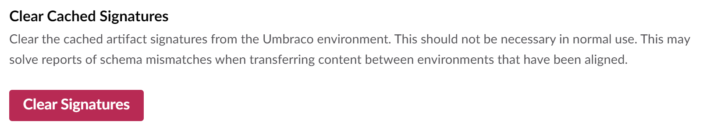
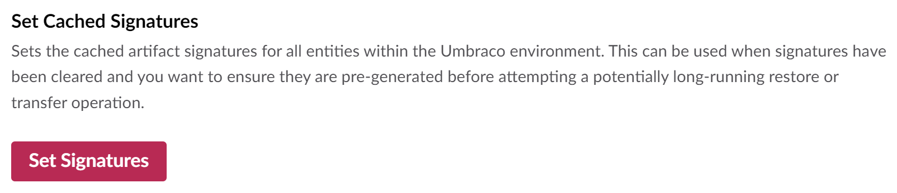
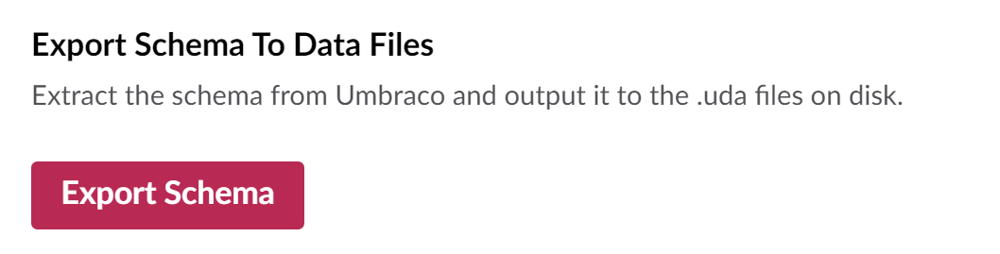

# Troubleshooting

In this troubleshooting section, you can find help to resolve issues that you might run into when using Umbraco Deploy.

If you are unable to find the issue you are having, then please reach out to our friendly support team at contact@umbraco.com.

## Schema mismatches

When transferring or restoring content between two Umbraco Deploy environments, you might run into **Schema mismatch** errors. For more information on how to resolve schema mismatch issues, see the [Schema Mismatches](https://docs.umbraco.com/umbraco-cloud/troubleshooting/deployments/schema-mismatches) article.

Umbraco Deploy maintains a cached set of signatures that represent each schema and content item. They are used when transferring or restoring content between environments to aid performance.

If having resolved schema mismatches you still have reports of errors, it might be that the signatures are out of date. In other words, Deploy is using a cached representation of an item that no longer matches the actual item stored in Umbraco.

This should not be necessary in normal use, but can occur after upgrades. If you have this situation, you can clear the cached signatures in both the upstream and downstream environments. You do this via the _Clear Cached Signatures_ operation available on the _Settings > Deploy_ dashboard:

## Slow responses or timeouts when restoring or transferring

When transferring or restoring content between environments, Deploy needs to ensure that all related items are updated together. It also checks that any schema dependencies an item has also exist in the target environment. When a large amount of content is selected for transfer or restore, this process of determining all the dependent items can take some time.

In some cases, a hard limit imposed by the Cloud hosting platforms such as Azure, used by Umbraco Cloud, can be reached.

If you find the process slow or reporting a platform timeout, there are a few options you can take.

### Consider partial restore

If restoring, you can choose to pull down a smaller set of content via the partial restore feature. With this you select an item in the remote environment to restore. You can select to include child items. Any items related to the selected ones, for example via content or media pickers, will also be restored.

### Consider import/export

In addition to transferring content via the backoffice, it is possible to move both content and schema between environments via Deploy's import/export feature. With this, a selection of Umbraco data can be exported from one environment to a .zip file. That file can then be imported into another environment.

As this process requires less inter-environment communication, it's possible to transfer much larger amounts of content without running into the hard platform limits.

[Read more about the import/export feature here](deployment-workflow/import-export.md).

### Review timeouts

Firstly, you can review and update the [timeout settings available with Deploy](getting-started/deploy-settings.md#timeout-settings). Increasing these from the default values may help, but won't necessarily resolve all issues. This is because, as noted, some timeouts are fixed values set by the hosting environment.

### Use batch configurations

There are two places where Deploy operations can be batched. This allows breaking up of a single, long process into multiple, smaller ones. By doing this it's possible to complete each smaller operation within the platform imposed timeout.

#### For transfers to upstream environments

If transferring items from a downstream environment to an upstream one, it's possible to [configure a batch size](getting-started/deploy-settings.md#batch-settings). With this in place, transfers will be batched into separate operations, allowing each single operation to complete before any hosting environment-enforced timeout.

This will take effect only for transfers to upstream environments and when multiple items are selected in the backoffice. An example is the selection of a single media folder containing many files.

#### For processing of a Deploy "package"

A package is an ordered structure containing all the items selected for a Deploy operation, plus all the determined dependencies and relations. The processing of this package in the target environment can also be batched via a [configuration setting](getting-started/deploy-settings.md#batch-settings).

When set, if the number of items determined for the package exceeds the batch size, the processing will be chunked into batches.

### Ensure signatures are pre-cached

For transfer or restore operations, it's worth ensuring Deploy's cached signatures are fully populated in both the upstream and downstream environments. This can be done via the _Set Cached Signatures_ operation available on the _Settings > Deploy_ dashboard:

The process make take a few minutes to complete if you have a lot of content or media in your installation. Information is written to the log indicating the signatures calculated for each entity type.

Now the checks Deploy has to do to figure out the items and dependencies to process will complete much more quickly.

### Modify the checksum calculation method for media files

Deploy will do comparisons between the entities in different environments to determine if they match and decide whether to include them in the operation. By default, for media files, a check is made on a portion of the initial bytes of the file.

If a lot of files need to be checked, this can be slow, and a faster option is available that uses the file metadata. The only downside of changing this option is a marginally increased chance of Deploy considering a media file hasn't changed when it has. This would omit it from the deployment.

This option can be [set in configuration](getting-started/deploy-settings.md#mediafilechecksumcalculationmethod).

### Consider disabling cache refresher notifications

When a Deploy operation completes, cache refresher notifications are fired. These are used to update Umbraco's cache and search index.

In production these should always be enabled, to ensure these additional data stores are kept up to date.

If attempting a one-off, large transfer operation, before a site is live, you could disable these via a [configuration setting](getting-started/deploy-settings.md#suppresscacherefreshernotifications). That would omit the firing and handling of these notifications and remove their performance overhead. Following which you would need to ensure to rebuild the cache and search index manually via the backoffice _Settings_ dashboards.

### Review relation types included in deploy operations

As well as transferring entities between environments Deploy will also include the relations between them. As of 10.1.2 and 11.0.1, two relation types used for usage tracking are omitted by default. These do not need to be transferred as they are recreated by the CMS as part of the save operation on the entity.

If using an earlier version, or to make further adjustments, modify the [settings for relation types](getting-started/deploy-settings.md#relationtypes) in configuration.

## Path too long exceptions

When restoring between different media systems exceptions can occur due to file paths. They can happen between a local file system and a remote system based on blob storage. What is accepted on one system may be rejected on another as the file path is too long. Normally this will only happen for files with particularly long names.

If you are happy to continue without throwing exceptions in these instances you can [modify the configuration](getting-started/deploy-settings.md#continueonmediafilepathtoolongexception). If this is done such files will be skipped, and although the media item will exist there will be no associated file.

## Schema files following upgrades

When Umbraco schema items are created, a representation of them is saved to disk as a `.uda` file in the `/data/revision/` folder. The representation is known as an artifact. It will be refreshed on further updates to represent the current state of the schema item.

Following an upgrade, it's possible the contents of the file will no longer match what would be generated by the current version. For example, if a property has been added to an artifact, this will be absent in the file. It would be added if the file was recreated following the upgrade.

This can lead to situations where Deploy continues to process a file it considers changed, even though the item represented is up-to-date. This in turn means slow updates of Umbraco schema, as Deploy is processing more files than it needs to do.

To resolve this situation, following an upgrade it is good practice to re=save the `.uda` files in the "left-most" environment. This will usually be the local one, or if not using that, the Development environment. You can do this via the _Export Schema To Data Files_ operation available on the _Settings > Deploy_ dashboard:

The updated files should be committed to source control and deployed to upstream environments.
