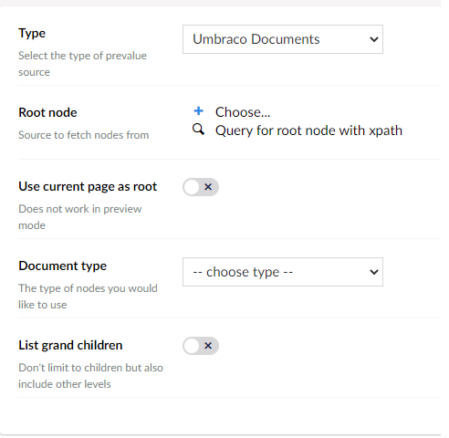
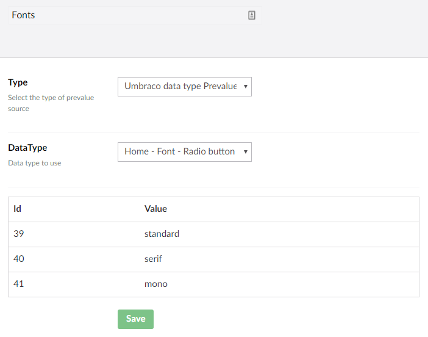

# Prevalue Source Types Overview

There are some default prevalue source types that can be used.

Here is a quick overview of them:

*   **Get values from textfile**

    Upload a textfile that contains the prevalues. Each prevalue should have its own line in the file. Once the file has been uploaded, you can find it in `~/wwwroot/App_Data/UmbracoForms/Data/PreValueTextFiles/{GUID}` where the `{GUID}`is replaced with the pre-value ID.
*   **Umbraco Documents**

    Allows to use content nodes from a specific source as prevalues. You can define the root node by either

    * Choosing a node directly from the Content tree or
    *   Using XPath

        

        Additional settings can be applied:

        * Select **Use current page as root** instead of choosing a specific root node. _The preview is not available when this setting is enabled._
        * Select a specific **Document type**, if the selected root node contains a different Document Type.
        * Select to include **Grand children** of the selected root node.
*   **SQL Database**

    Connect to a OleDB compatible database table and construct a prevalue source from it. Once selected, it will be editable from the Forms interface.

    The following configurations need to be set:

    * Connection string (either choose one from your web.config or add another from a textfield)
    * Connection String from configuration
    * Table Name
    * Key Column
    * Value Column
*   **Umbraco Data Type Prevalues**

    Choose an Umbraco Data Type to use its configured prevalue collection.

    In the example below, the prevalue collection from a Data Type called `Home - Font - Radio button` is used:

    
