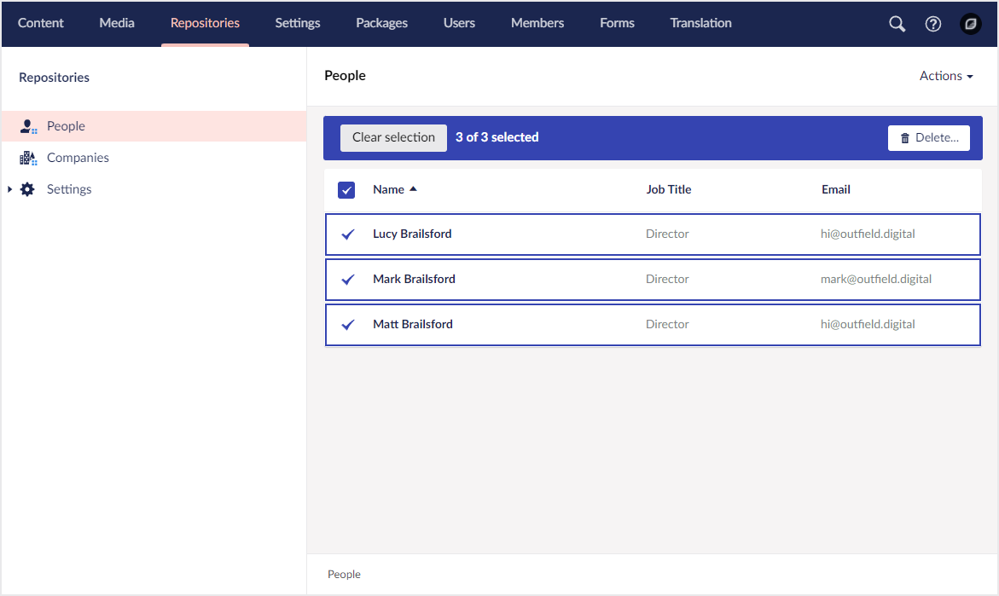

# Actions

Actions provide an API to perform custom tasks against a collection and its entities from multiple locations in the UI. Examples: menu actions, bulk actions, or individual table row actions.

Get started with actions by learning about the basics.


[the-basics.md](the-basics.md)

