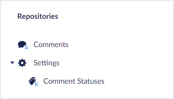

# Folders

A folder can appear in either a tree or as a sub folder to other folders. Folders can contain either other (sub)folders or [collections](../collections/overview.md).



## Defining a folder

You can define a folder by calling one of the `AddFolder` methods on a given [`Tree`](trees.md) or parent `Folder` config builder instance.

### **AddFolder(string name, Lambda folderConfig = null) : FolderConfigBuilder**

Adds a folder to the current tree with the given name and a default folder icon.

````csharp
// Example
treeConfig.AddFolder("Settings", folderConfig => {
    ...
});
````

### **AddFolder(string name, string icon, Lambda folderConfig = null) : FolderConfigBuilder**

Adds a folder to the current tree with the given name + icon.

````csharp
// Example
treeConfig.AddFolder("Settings", "icon-settings", folderConfig => {
    ...
});
````

## Changing a folder alias

### **SetAlias(string alias) : FolderConfigBuilder**

Sets the alias of the folder.  

**Optional:** When creating a new folder, an alias is automatically generated from the supplied name for you. However, if you need a specific alias you can use the `SetAlias` method to override this.

````csharp
// Example
folderConfig.SetAlias("settings");
````

## Changing a folder icon color

### **SetIconColor(string color) : FolderConfigBuilder**

Sets the folder icon color to the given color. The options that are possible are `black`, `green`, `yellow`, `orange`, `blue` or `red`.

````csharp
// Example
folderConfig.SetIconColor("blue");
````

## Adding a sub folder to a folder

### **AddFolder (string name, Lambda folderConfig = null) : FolderConfigBuilder**

Adds a sub folder to the current folder with the given name and a default folder icon.

````csharp
// Example
folderConfig.AddFolder("Categories", subFolderConfig => {
    ...
});
````

### **AddFolder (string name, string icon, Lambda folderConfig = null) : FolderConfigBuilder**

Adds a sub folder to the current folder with the given name + icon.

````csharp
// Example
folderConfig.AddFolder("Categories", "icon-tags", subFolderConfig => {
    ...
});
````

## Adding a collection to a folder

### **AddCollection&lt;TEntityType&gt;(Lambda idFieldExpression, string nameSingular, string namePlural, string description, Lambda collectionConfig = null) : CollectionConfigBuilder&lt;TEntityType&gt;**

Adds a collection to the current folder with the given names, descriptions, and default icons. An ID property accessor expression is required so that Umbraco UI Builder knows which property is the ID property. For more information check the [Collections documentation](../collections/overview.md).

````csharp
// Example
folderConfig.AddCollection<Person>(p => p.Id, "Person", "People", "A collection of people", collectionConfig => {
    ...
});
````

### **AddCollection&lt;TEntityType&gt;(Lambda idFieldExpression, string nameSingular, string namePlural, string description, string iconSingular, string iconPlural, Lambda collectionConfig = null) : CollectionConfigBuilder&lt;TEntityType&gt;**

Adds a collection to the current folder with the given names, description and icons. An ID property accessor expression is required so that Umbraco UI Builder knows which property is the ID property. For more information check the [Collections documentation](../collections/overview.md).

````csharp
// Example
folderConfig.AddCollection<Person>(p => p.Id, "Person", "People", "A collection of people", "icon-umb-users", "icon-umb-users", collectionConfig => {
    ...
});
````
