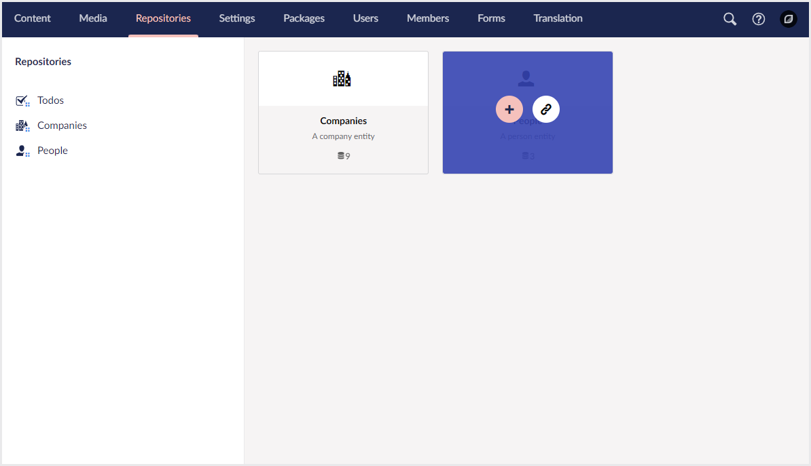

# Summary Dashboards

A summary dashboard is automatically displayed at the root of a Konstrukt defined section and it will display summaries of collections found within it that are told to display on the dashboard. It will also provide quick links to jump to that collections list view or to quickly add a new entry to that collection (if the collection isn't read only). 



## Showing a collection on a summary dashboard

Showing a collection in the summary dashboard is controlled via the collection configuration.

#### **ShowOnSummaryDashboard() : KonstruktCollectionConfigBuilder&lt;TEntityType&gt;**

Sets the collection to display on the summary dashboard.

````csharp
// Example
collectionConfig.ShowOnSummaryDashboard();
````


**NB:** Only section root level collections can be shown on the summary dashboard.
