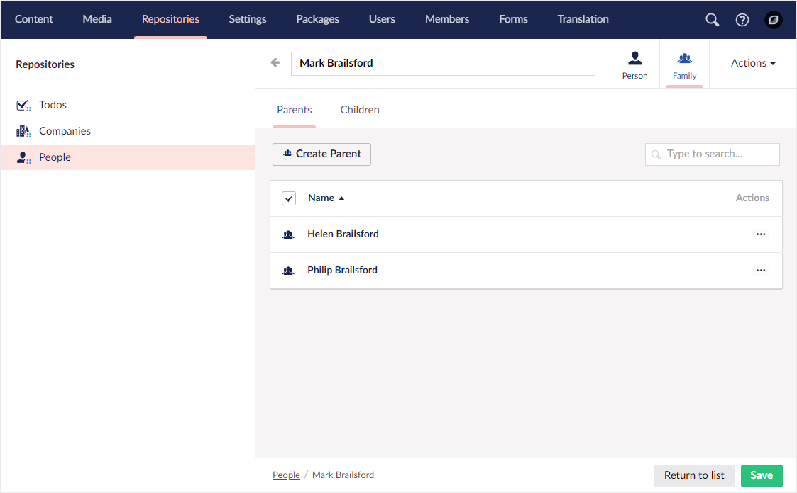

# Child Collection Groups

A child collection group is a container for other child collections. Its purpose is mainly to provide a logical grouping of multiple child collections to help with organization and an improved user experience.



## Defining a child collection group

You can define a child collection group by calling one of the `AddChildCollectionGroup` methods on a given collection config builder instance.

### **AddChildCollectionGroup(string name, Lambda childCollectionGroupConfig = null) : ChildCollectionGroupConfigBuilder**

Adds a child collection group to the current collection with the given name and default icon.

```csharp
// Example
collectionConfig.AddChildCollectionGroup("Family", childCollectionGroupConfig => {
    ...
});
```

### **AddChildCollectionGroup(string name, string icon, Lambda childCollectionGroupConfig = null) : ChildCollectionGroupConfigBuilder**

Adds a child collection group to the current collection with the given name and icon.

```csharp
// Example
collectionConfig.AddChildCollectionGroup("Family", "icon-users", childCollectionGroupConfig => {
    ...
});
```
