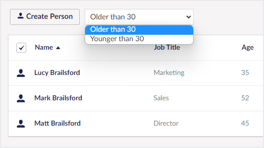

# Data Views

Data views allow you to define multiple, pre-filtered views of the same data source. This can be useful when entities exist in different states and you want a way to toggle between them.



## Defining data views

Data views are defined via the [collections](../collections/overview.md) configuration.

### **AddDataView(string name, Lambda whereClauseExpression) : CollectionConfigBuilder&lt;TEntityType&gt;**

Adds a data view with the given name and **where clause** filter expression. Expression must be a `boolean` expression.

````csharp
// Example
collectionConfig.AddDataView("Active", p => p.IsActive);
````

### **AddDataView(string group, string name, Lambda whereClauseExpression) : CollectionConfigBuilder&lt;TEntityType&gt;**

Adds a data view with the given group, name and **where clause** filter expression. Expression must be a `boolean` expression.

````csharp
// Example
collectionConfig.AddDataView("Status", "Active", p => p.IsActive);
````
