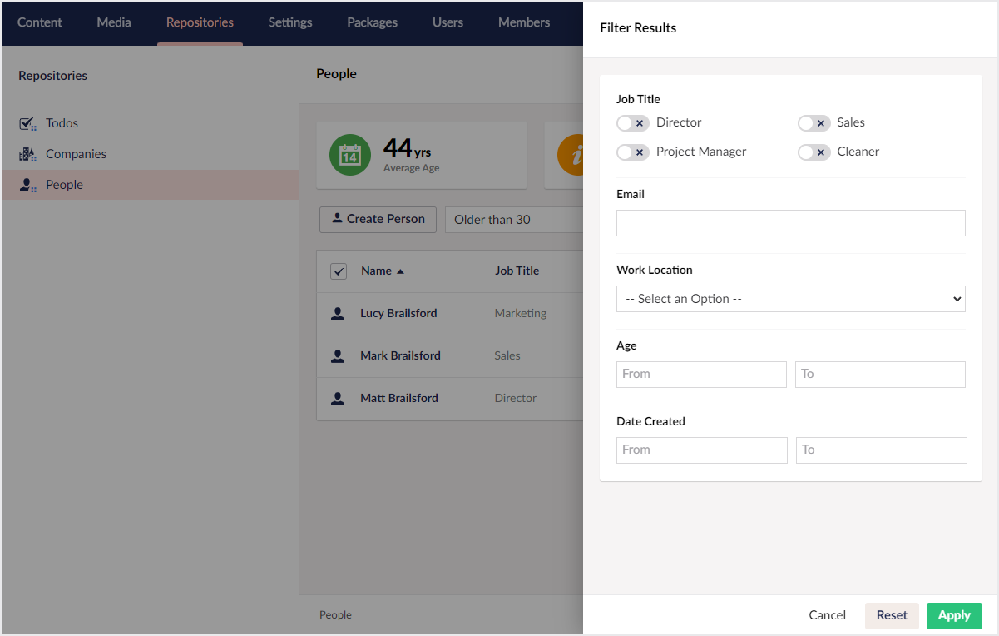

# Filtering

Beyond [searching](../searching/overview.md) there are also times when you need to be able to create specific views of a collections data. To help with this Konstrukt has a number of different filtering mechanisms available.

Choose a filtering method from the list below to find out more.


[global-filters.md](global-filters.md)


[data-views.md](data-views.md)


[filterable-properties.md](filterable-properties.md)
