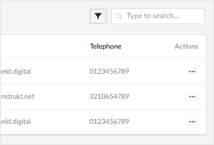

# Searching

Beyond listing collection entities, there are times when you need to be able to locate specific entities within a collection and for that Konstrukt provides a simple search API. 

Get started by reviewing how to define searchable properties.


[searchable-properties.md](searchable-properties.md)
