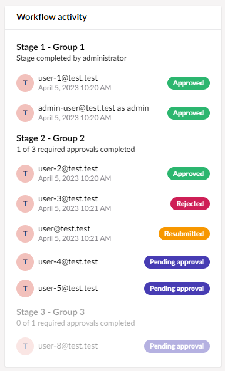
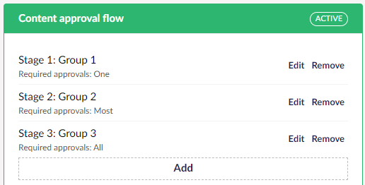

# Approval thresholds


This feature requires a license - learn more about [Workflow's licensing model](https://umbraco.com/products/umbraco-workflow)


Workflow's default behaviour requires one member of an approval group to review and approve a pending task to advance it to the next stage of the workflow. 

The approval thresholds feature introduces configuration options to set the required number of approvals for a given workflow stage.

The threshold options are:

 - **One**: pending task requires approval from any member of the assigned approval group. This is the default behaviour for all installations (trial and licensed)
 - **Most**: pending task requires an absolute majority of group members. For example, a group with three members requires two approvals, a group with four members requires three approvals, and a group with six members requires four approvals.
 - **All**: pending task requires approval from all group members.

The workflow detail UI displays the status of the current task, tracking the approval status for members of the current group, plus the progress towards meeting the threshold for the approval stage.

Approving a task as an administrator immediately satisfies the approval threshold for the task, and will advance to the next workflow stage.

When a task is rejected in a workflow stage where the approval threshold is Most or All, existing approvals can be managed via configuration:
 - Existing approvals can be reset, resetting progress towards the approval threshold. In this case all users in the approval group will be able to approve the resubmitted content.
 - Existing approvals can be kept. In this case users in the approval group who have already approved the task will not be able to approve the resubmitted content. 

## Related settings and configuration

Approval thresholds are managed via settings in the Workflow section or in `app-settings.json`, and directly on the workflow configuration in the Workflow content app on a content node.

### Settings
The settings below can be set from the Backoffice or via settings customisation in app-settings.json (refer to [Settings customisation](https://docs.umbraco.com/umbraco-workflow/getting-started/configuration#settingscustomization) for implementation instructions).

 - **Approval threshold**: sets the global approval threshold to One, Most or All.
 - **Rejection resets approvals**: when true, and the approval threshold is Most or All, rejecting a task resets the previous approvals for the workflow stage.
 - **Allow configuring approval threshold**: when true, enables setting the approval threshold for any stage of a workflow (on a content node or document type).

### Configuration
When configuring an approval flow on a content item or document type, and provided **Allow configuring approval threshold** is `true`, the approval threshold for an individual stage can be set using the control below the stage name:

