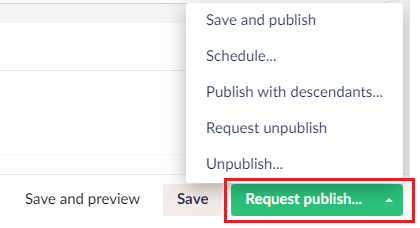
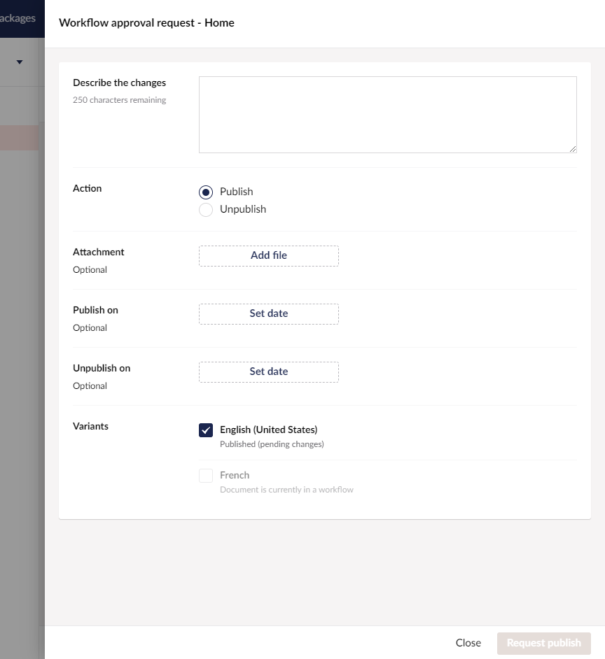
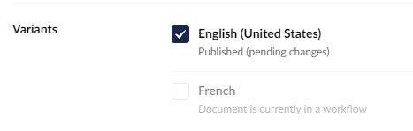

# Submitting Content for Approval


This article applies to versions 10.3.7 and higher.


When requesting workflow approval for content changes, editors must provide additional information detailing the change.

To submit the content changes, click the **Request publish** button in the editor footer.

The button opens the request approval overlay:

Depending on the Document Type and Workflow settings, the overlay will provide inputs for:

* A comment describing the changes
* A selector for choosing the workflow type - either publish or unpublish
  * Only visible when **Use Workflow for unpublish** is set to true
* A selector for choosing the variants to publish
  * Only visible on variant content
* A media picker for choosing a media attachment
  * Only visible when **Allow attachments** is set to true
* A date picker for setting a scheduled publishing date
  * Only visible when **Allow scheduling** is set to true and the workflow type is **Publish**
* A date picker for setting a scheduled unpublishing date
  * Only visible when **Allow scheduling** is true

It is not possible to schedule a **Publish on** date in an Unpublish workflow.

It is possible to schedule both **Publish on** and **Unpublish on** dates in a Publish workflow. Once content has been unpublished, a new workflow process is required to republish the content.

## Variant Workflows

If the document varies by culture, the editor must select one or more variants to submit for approval.

When a document is invariant, the variants selector is not displayed, and the approval flow follows the [default permissions inheritance pattern](workflow-content-app.md#approval-flow-types).

The editor will not be able to select variants where:

* They do not have permission to edit the language, or
* The variant is already in a workflow.

When submitting multiple variants, a workflow process is started for each variant, using the [default permissions inheritance pattern](workflow-content-app.md#approval-flow-types). Newly created variants are automatically assigned the configuration from the default language.

Alternatively, all variants can be submitted in an invariant workflow, where they will be approved in a single workflow process. Invariant workflows use the permissions set on the default language. Editors must have permission to edit all the current node's variants to be able to initiate an invariant workflow.

The invariant workflow will publish all variants, regardless of their node state, that are not already in workflows. This means that previously unpublished variants will be republished when using invariant workflows. In most cases, it is preferable to select the individual variants.

## Content Validation and Pending Changes

When submitting for approval, Workflow will automatically save variants with pending changes.

Validation errors are reported in the UI using Umbraco's validation messages.
