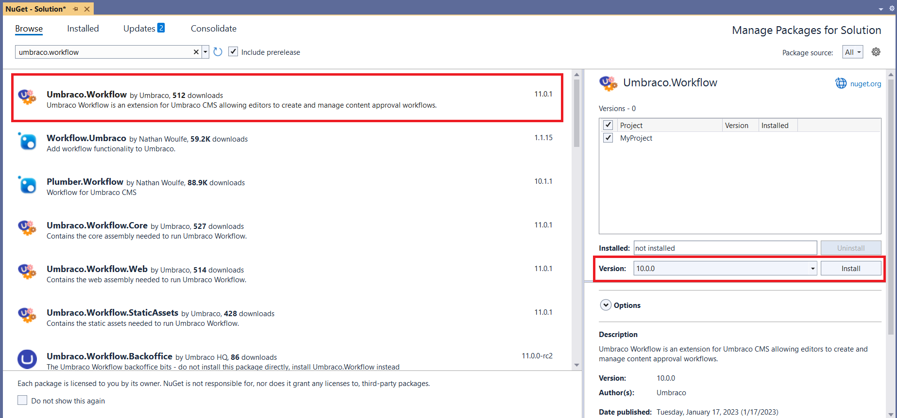

# Upgrading

This article shows how to manually upgrade Umbraco Workflow to run the latest version. Umbraco Workflow displays a prompt in the **Workflow** section when a new version is available.


If you are migrating from Plumber to Umbraco Workflow, see the [Migrate from Plumber to Workflow](migrating-workflow.md) article.


## Get the latest version of Umbraco Workflow

To get the latest version of Umbraco Workflow, you can upgrade using either of the two options:

* [NuGet](#nuget)
* [Visual Studio](#visual-studio)

### NuGet

*   NuGet installs the latest version of the package when you use the `dotnet add package Umbraco.Workflow` command unless you specify a package version:

    `dotnet add package Umbraco.Workflow --version <VERSION>`
* Run `dotnet restore` to install the package.

### Visual Studio

* Go to `Tools` -> `NuGet Package Manager` -> `Manage NuGet Packages for Solution...` in Visual Studio, to upgrade Umbraco Workflow:
* Select **Umbraco.Workflow**.
*   Select the latest version from the **Version** drop-down and click **Install**.

    <figure><figcaption><p>NuGet Package Manager</p></figcaption></figure>
*   Open the **.csproj** file to make sure the package reference is updated:

    ```xml
    <ItemGroup>
      <PackageReference Include="Umbraco.Workflow" Version="10.x.x" />
    </ItemGroup>
    ```
