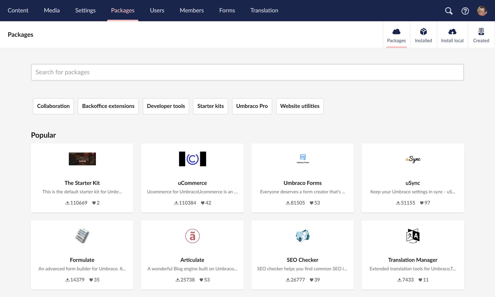

# Package Types

There are two main ways to install packages in Umbraco CMS: Package zip files and NuGet packages. Each of these has its own advantages.


The zip file package type is only available for Umbraco version 8 and earlier versions. Learn more about it in the [NuGet Packages](#package-zip files) section of this article.


When developing a package you need to consider the Umbraco CMS version you're using before determining the package type.

* Modern Umbraco (Umbraco 10+): Providing a NuGet package is the only option.
* Legacy Umbraco (Umbraco 8 and earlier versions): It is recommended to provide both a zip file and a NuGet package.

## NuGet Packages

A NuGet package is a standard way of delivering compiled code and configuration to a .NET project. NuGet packages contain dll-files and other files required for the solution. For more information on NuGet packages see Microsoft's [An introduction to NuGet](https://docs.microsoft.com/en-us/nuget/what-is-nuget) documentation.

NuGet packages can be installed using via the command line or through Visual Studio using either the [Package Manager Console](https://docs.microsoft.com/en-us/nuget/consume-packages/install-use-packages-powershell) or the [NuGet Package Manager](https://learn.microsoft.com/en-us/nuget/consume-packages/install-use-packages-visual-studio).

See below, for an example of installing a package using the Package Manager Console in Visual Studio:

```powershell
PM> Install-Package MyPackage -version 1.2
```

NuGet packages can include any solution files and can be configured to run PowerShell scripts after installation.

As NuGet packages are installed outside of the Umbraco website they cannot directly manipulate any of the Umbraco settings or content during their installation.

When adding or changing configuration of Umbraco as part of a NuGet package you need to develop code to run as part of a [Migration](../database.md). The Migration will run the first time the Umbraco site starts after the package is installed, applying the correct configuration.

### Advantages of NuGet packages

NuGet packages are useful when you wish to deploy your Umbraco site using standard CI/CD deployment tools.

NuGet manages package dependencies and references for you which means that you do not need to update your build process for each new package.

NuGet maintains a reference list of packages used in the project and ensures the ability to restore and update the packages from that list.

## Package zip files


zip file packages are only available for Umbraco CMS 8 and earlier versions.

Refer to the [NuGet Packages](#nuget-packages) section above, if your website is using Umbraco 10 or a later version.


A package zip file can be installed directly through the Umbraco backoffice.



Packages zip files can contain:

* Content
* Solutions files (`dll`s, `App_Plugins` files, etc)
* Document Types
* Templates
* Stylesheets
* Macros
* Languages
* Dictionary Items
* Data Types
* Media


If you want to include media in your package, you must select it in both the "Media" section and the "Package Files" section under "Path to file"


### Advantages of package zip files

Package zip files have been developed for Umbraco and have a number of advantages.

Packages uploaded to [Our.umbraco.com](https://our.umbraco.com/packages/) or the [Umbraco Marketplace (Umbraco 8+)](https://marketplace.umbraco.com/) are listed in the package directory and are accessible through the Umbraco backoffice

Package zip files can add items to Umbraco and you can change Umbraco config and settings via package actions.
