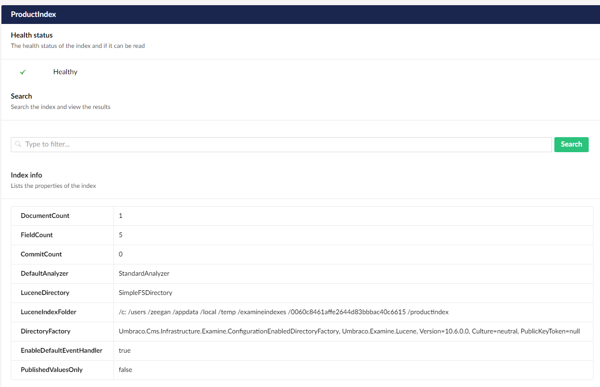

# Custom indexing

## Customizing the built in indexes

You can modify the built-in indexes in the following ways:

* [Events](https://shazwazza.github.io/Examine/articles/indexing.html#events) - giving you control over exactly what data goes into them and how the fields are configured
* Changing the field value types to change how values are stored in the index
* Changing the `IValueSetValidator` to change what goes into the index
* Take control of the entire index creation pipeline to change the implementation

We can do all this by using the `ConfigureNamedOptions` pattern.

## Creating a ConfigureOptions class

We will start by creating a ConfigureExamineOptions class, that derives from `IConfigureNamedOptions<LuceneDirectoryIndexOptions>`:

```csharp
using Examine.Lucene;
using Microsoft.Extensions.Options;

namespace Umbraco.Docs.Samples.Web.CustomIndexing
{
    public class ConfigureExternalIndexOptions : IConfigureNamedOptions<LuceneDirectoryIndexOptions>
    {
        public void Configure(string name, LuceneDirectoryIndexOptions options)
        {
            throw new System.NotImplementedException();
        }

        public void Configure(LuceneDirectoryIndexOptions options)
        {
            throw new System.NotImplementedException();
        }
    }
}
```


In this sample we are altering the external index and thus we name the class `ConfigureExternalIndexOptions`. If you are altering multiple indexes, it is recommended to have separate classes for each index - i.e. `ConfigureExternalIndexOptions` for the external index, `ConfigureInternalIndexOptions` for the internal index and so on.


When using the `ConfigureNamedOptions` pattern, we have to register this in a composer for it to configure our indexes, this can be done like this:

```csharp
using Microsoft.Extensions.DependencyInjection;
using Umbraco.Cms.Core.Composing;
using Umbraco.Cms.Core.DependencyInjection;

namespace Umbraco.Docs.Samples.Web.CustomIndexing
{
    public class ExamineComposer : IComposer
    {
        public void Compose(IUmbracoBuilder builder)
        {
            builder.Services.ConfigureOptions<ConfigureExternalIndexOptions>();
        }
    }
}
```

### Changing field value types

By default, Examine will store values into the Lucene index as "Full Text" fields, meaning the values will be indexed and analyzed for a textual search. However, if a field value is numerical, date/time, or another non-textual value type, you might want to change how the value is stored in the index. This will let you take advantage of some value type-specific search features such as numerical or date range.

There is some documentation about this in the [Examine documentation](https://shazwazza.github.io/Examine/configuration).

The easiest way to modify how a field is configured is using the ConfigureNamedOptions pattern like so:

```csharp
using Examine;
using Examine.Lucene;
using Microsoft.Extensions.Options;
using Umbraco.Cms.Core;

namespace Umbraco.Docs.Samples.Web.CustomIndexing
{
    public class ConfigureExternalIndexOptions : IConfigureNamedOptions<LuceneDirectoryIndexOptions>
    {
        public void Configure(string name, LuceneDirectoryIndexOptions options)
        {
            if (name.Equals(Constants.UmbracoIndexes.ExternalIndexName))
            {
                options.FieldDefinitions.AddOrUpdate(new FieldDefinition("price", FieldDefinitionTypes.Double));
            }
        }

        // Part of the interface, but does not need to be implemented for this.
        public void Configure(LuceneDirectoryIndexOptions options)
        {
            throw new System.NotImplementedException();
        }
    }
}
```

This will ensure that the `price` field in the index is treated as a `double` type (if the `price` field does not exist in the index, it is added).

## Changing IValueSetValidator

An `IValueSetValidator` is responsible for validating a `ValueSet` to see if it should be included in the index. For example, by default the validation process for the ExternalIndex checks if a `ValueSet` has a category type of either "media" or "content" (not member). If a `ValueSet` was passed to the ExternalIndex and it did not pass this requirement it would be ignored.

The `IValueSetValidator` is also responsible for filtering the data in the `ValueSet`. For example, by default the validator for the MemberIndex will validate on all the default member properties, so an extra property "PhoneNumber", would not pass validation, and therefore not be included.

The `IValueSetValidator` implementation for the built-in indexes, can be changed like this:

```csharp
using Examine.Lucene;
using Microsoft.Extensions.Options;
using Umbraco.Cms.Core;
using Umbraco.Cms.Infrastructure.Examine;

namespace Umbraco.Docs.Samples.Web.CustomIndexing
{
    public class ConfigureMemberIndexOptions : IConfigureNamedOptions<LuceneDirectoryIndexOptions>
    {
        public void Configure(string name, LuceneDirectoryIndexOptions options)
        {
            if (name.Equals(Constants.UmbracoIndexes.MembersIndexName))
            {
                options.Validator = new MemberValueSetValidator(null, null, new[] {"email"}, null);
            }
        }

        // Part of the interface, but does not need to be implemented for this.
        public void Configure(LuceneDirectoryIndexOptions options)
        {
            throw new System.NotImplementedException();
        }
    }
}
```


Remember to register `ConfigureMemberIndexOptions` in your composer.


## Creating your own index

The following example will show how to create an index that will only include nodes based on the document type _product_.


We always recommend that you use the existing built in ExternalIndex. You should then query based on the NodeTypeAlias instead of creating a new separate index based on that particular node type. However, should the need arise, the example below will show you how to do it.

Take a look at our [Examine Quick Start](quick-start.md) to see some examples of how to search the ExternalIndex.


To create this index we need five things:

1. An `UmbracoExamineIndex` implementation that defines the index
2. An `IConfigureNamedOptions` implementation that configures the fields of the index
3. An `IValueSetBuilder` implementation that builds the value sets for the index
4. An `IndexPopulator` implementation that populates the index with the value sets
5. A composer that adds all these services to the runtime.

### ProductIndex

```csharp
using Examine.Lucene;
using Microsoft.Extensions.Logging;
using Microsoft.Extensions.Options;
using Umbraco.Cms.Core.Hosting;
using Umbraco.Cms.Core.Services;
using Umbraco.Cms.Infrastructure.Examine;

namespace Umbraco.Docs.Samples.Web.CustomIndexing
{
    public class ProductIndex : UmbracoExamineIndex
    {
        public ProductIndex(
            ILoggerFactory loggerFactory,
            string name,
            IOptionsMonitor<LuceneDirectoryIndexOptions> indexOptions,
            IHostingEnvironment hostingEnvironment,
            IRuntimeState runtimeState)
            : base(loggerFactory,
            name,
            indexOptions,
            hostingEnvironment,
            runtimeState)
        {
        }
    }
}
```

### ConfigureProductIndexOptions

```csharp
using Examine;
using Examine.Lucene;
using Lucene.Net.Analysis.Standard;
using Lucene.Net.Index;
using Lucene.Net.Util;
using Microsoft.Extensions.Options;
using Umbraco.Cms.Core.Configuration.Models;
using Umbraco.Cms.Core.Scoping;
using Umbraco.Cms.Core.Services;
using Umbraco.Cms.Infrastructure.Examine;

namespace Umbraco.Docs.Samples.Web.CustomIndexing
{
    public class ConfigureProductIndexOptions : IConfigureNamedOptions<LuceneDirectoryIndexOptions>
    {
        private readonly IOptions<IndexCreatorSettings> _settings;
        private readonly IPublicAccessService _publicAccessService;
        private readonly IScopeProvider _scopeProvider;

        public ConfigureProductIndexOptions(
            IOptions<IndexCreatorSettings> settings,
            IPublicAccessService publicAccessService,
            IScopeProvider scopeProvider)
        {
            _settings = settings;
            _publicAccessService = publicAccessService;
            _scopeProvider = scopeProvider;
        }

        public void Configure(string name, LuceneDirectoryIndexOptions options)
        {
            if (name.Equals("ProductIndex"))
            {
                options.Analyzer = new StandardAnalyzer(LuceneVersion.LUCENE_48);

                options.FieldDefinitions = new(
                    new("id", FieldDefinitionTypes.Integer),
                    new("name", FieldDefinitionTypes.FullText)
                    );

                options.UnlockIndex = true;

                if (_settings.Value.LuceneDirectoryFactory == LuceneDirectoryFactory.SyncedTempFileSystemDirectoryFactory)
                {
                    // if this directory factory is enabled then a snapshot deletion policy is required
                    options.IndexDeletionPolicy = new SnapshotDeletionPolicy(new KeepOnlyLastCommitDeletionPolicy());
                }
            }
        }

        public void Configure(LuceneDirectoryIndexOptions options)
        {
            throw new System.NotImplementedException();
        }
    }
}
```

### ProductIndexValueSetBuilder

```csharp
using System.Collections.Generic;
using Examine;
using Umbraco.Cms.Core.Models;
using Umbraco.Cms.Infrastructure.Examine;

namespace Umbraco.Docs.Samples.Web.CustomIndexing
{
    public class ProductIndexValueSetBuilder : IValueSetBuilder<IContent>
    {
        public IEnumerable<ValueSet> GetValueSets(params IContent[] contents)
        {
            foreach (var content in contents)
            {
                var indexValues = new Dictionary<string, object>
                {
                    ["name"] = content.Name!,
                    ["nodeName"] = content.Name!,
                    ["id"] = content.Id,
                };

                yield return new ValueSet(content.Id.ToString(), IndexTypes.Content, indexValues);
            }
        }
    }
}
```

### ProductIndexPopulator

```csharp
using System;
using System.Collections.Generic;
using System.Linq;
using Examine;
using Umbraco.Cms.Core.Services;
using Umbraco.Cms.Infrastructure.Examine;

namespace Umbraco.Docs.Samples.Web.CustomIndexing
{
    public class ProductIndexPopulator : IndexPopulator
    {
        private readonly IContentService _contentService;
        private readonly ProductIndexValueSetBuilder _productIndexValueSetBuilder;

        public ProductIndexPopulator(IContentService contentService, ProductIndexValueSetBuilder productIndexValueSetBuilder)
        {
            _contentService = contentService;
            _productIndexValueSetBuilder = productIndexValueSetBuilder;
            RegisterIndex("ProductIndex");
        }

        protected override void PopulateIndexes(IReadOnlyList<IIndex> indexes)
        {
            foreach (IIndex index in indexes)
            {
                IContent[] roots = _contentService.GetRootContent().ToArray();
                index.IndexItems(_productIndexValueSetBuilder.GetValueSets(roots));

                foreach (IContent root in roots)
                {
                    const int pageSize = 10000;
                    var pageIndex = 0;
                    IContent[] descendants;
                    do
                    {
                        descendants = _contentService.GetPagedDescendants(root.Id, pageIndex, pageSize, out _).ToArray();
                        IEnumerable<ValueSet> valueSets = _productIndexValueSetBuilder.GetValueSets(descendants);
                        index.IndexItems(valueSets);

                        pageIndex++;
                    }
                    while (descendants.Length == pageSize);
                }
            }
        }
    }
}
```

Note that this is only an example of how you could do indexing. In this example we're indexing all content, also unpublished content.
If you want to filter those out, you will have to create your own logic for that.
You could as an example look at published status in the `ProductIndexValueSetBuilder.GetValueSets()` method and filter it there.


### ExamineComposer

```c#
using Examine;
using Microsoft.Extensions.DependencyInjection;
using Umbraco.Cms.Core.Composing;
using Umbraco.Cms.Core.DependencyInjection;
using Umbraco.Cms.Infrastructure.Examine;

namespace Umbraco.Docs.Samples.Web.CustomIndexing
{
    public class ExamineComposer : IComposer
    {
        public void Compose(IUmbracoBuilder builder)
        {
            builder.Services.AddExamineLuceneIndex<ProductIndex, ConfigurationEnabledDirectoryFactory>("ProductIndex");

            builder.Services.ConfigureOptions<ConfigureProductIndexOptions>();

            builder.Services.AddSingleton<ProductIndexValueSetBuilder>();

            builder.Services.AddSingleton<IIndexPopulator, ProductIndexPopulator>();
        }
    }
}
```


The order of these registration matter. It is important to register your index with `AddExamineLuceneIndex` before calling `ConfigureOptions`.

### Result




The index will only update its content when you manually trigger an index rebuild in the Examine dashboard. This is not always the desired behaviour for a custom index.

To update your index when content changes, you can use notification handlers. You can find inspiration for implementing those in the UmbracoExamine.PDF package: https://github.com/umbraco/UmbracoExamine.PDF

