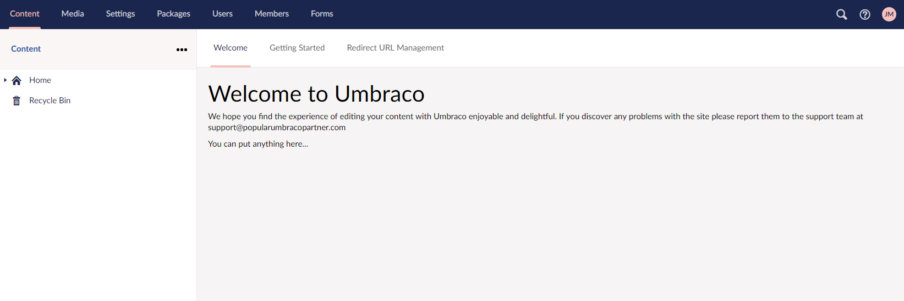
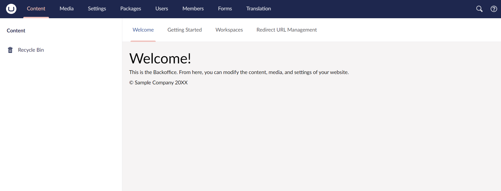
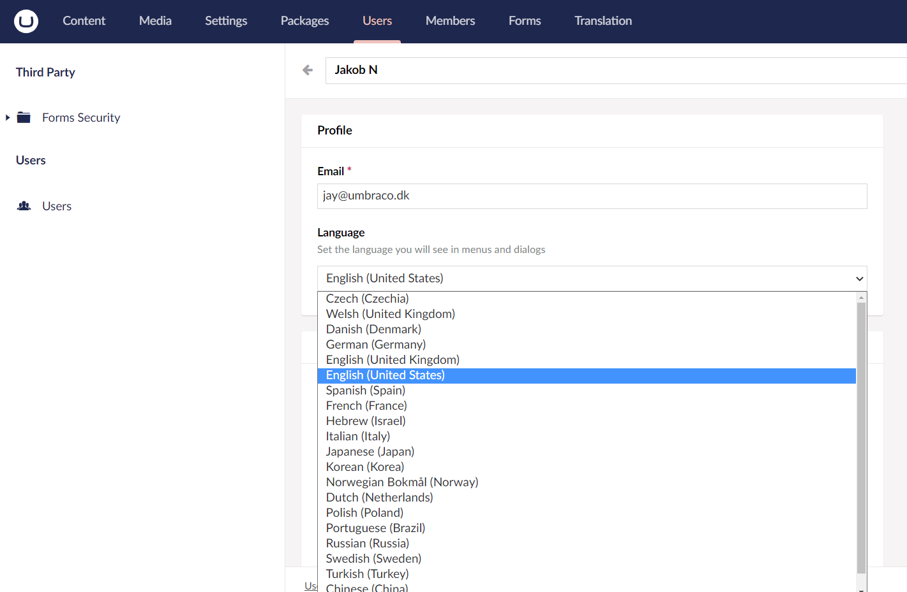
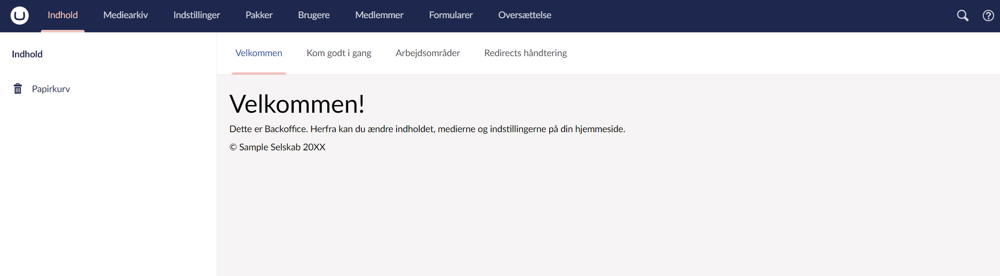
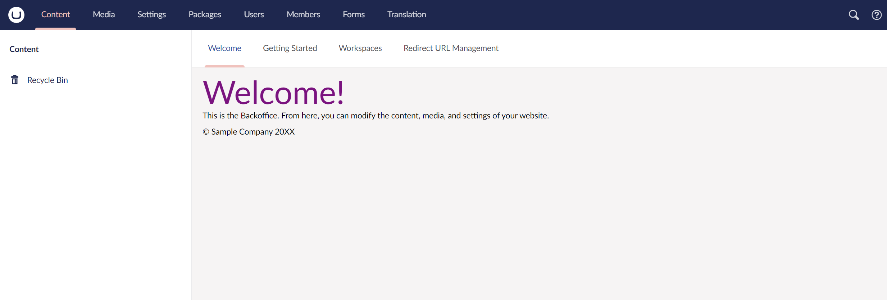
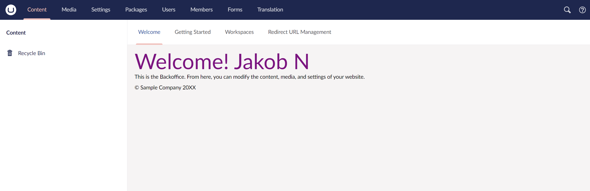
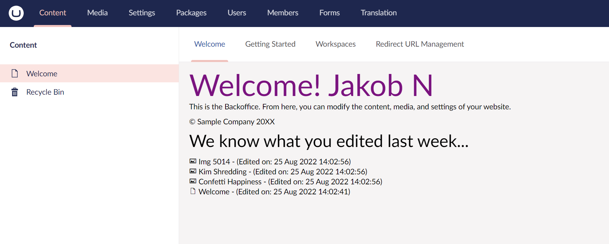
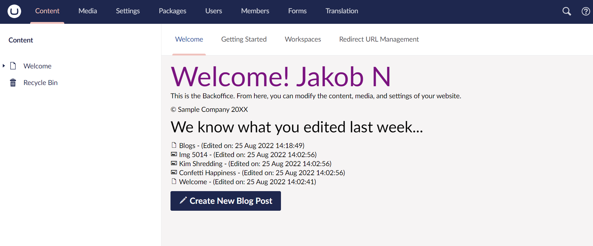
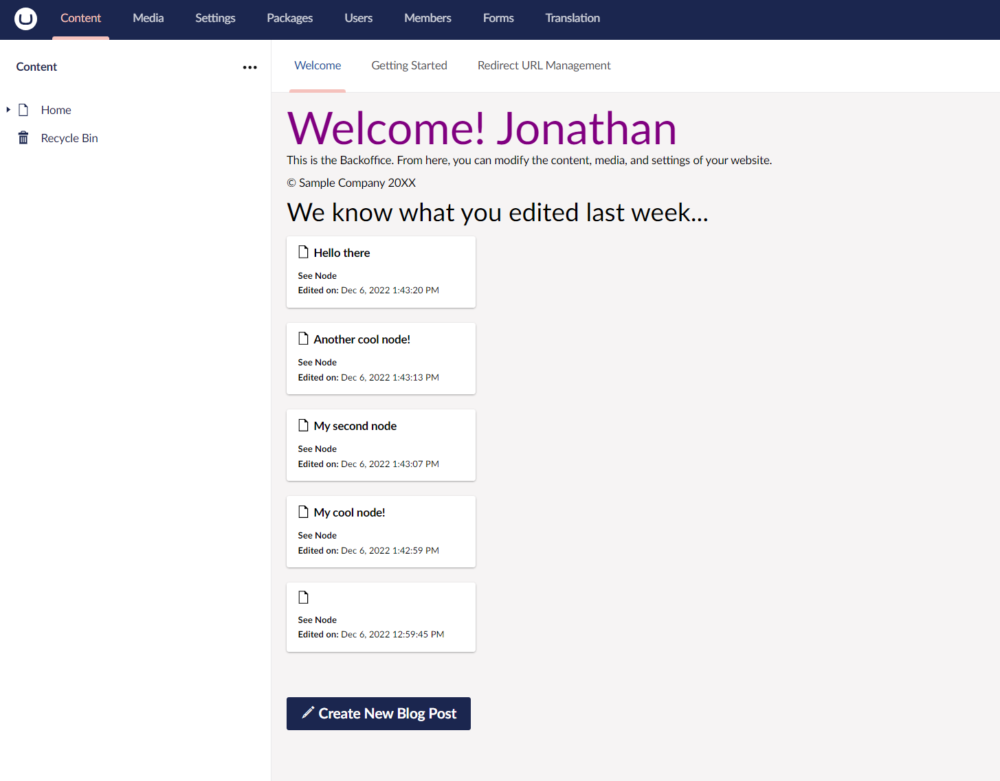

# Creating a Custom Dashboard

## Overview

This guide takes you through the steps to set up a Custom Dashboard in Umbraco.

### What is a Dashboard?

A Dashboard is a tab on the right-hand side of a section eg. the Getting Started dashboard in the Content section:

.jpg>)

### Why provide a Custom Dashboard for your editors?

It is generally considered good practice to provide a custom dashboard to welcome your editors to the backoffice of your site. You can provide information about the site and/or provide a helpful gateway to common functionality the editors will use. This guide will show the basics of creating a custom 'Welcome Message' dashboard. The guide will also show how you can go a little further to provide interaction using AngularJS.

The finished dashboard will give the editors an overview of which pages and media files they've worked on most recently.

Here's an overview of the steps that will be covered:

* Setting up the dashboard plugin
* Writing a basic Welcome Message view
* Configure the Custom Welcome Dashboard to be displayed
* Adding translations
* Adding styles
* Adding an AngularJS controller
* Display the current user's name in our welcome message
* Display the current user's recent updates
* Create a shortcut button to add a new blog post
* You can do anything...

### Prerequisites

This tutorial uses AngularJS with Umbraco, so it does not cover AngularJS itself, there are tons of resources on that already here:

* [Egghead.io](https://egghead.io/courses/angularjs-fundamentals)
* [AngularJS.org/tutorial](https://docs.angularjs.org/tutorial)
* [Pluralsight](https://www.pluralsight.com/paths/angular-js)

There are a lot of parallels with Creating a Property Editor. The tutorial '[Creating a Property Editor Tutorial](creating-a-property-editor/)' is worth a read too.

### The end result

At the end of this guide, we should have a friendly welcoming dashboard displaying a list of the editor's recent site updates.

## Setting up a plugin

The first thing we must do is create a new folder inside our site's '/App\_Plugins' folder. We will call it 'CustomWelcomeDashboard'

## Creating the dashboard view

Next, we will create an HTML file inside this folder called `WelcomeDashboard.html`. The HTML file will contain a fragment of an HTML document and does not need \<html>\<head>\<body> entities.

Add the following HTML to the `WelcomeDashboard.html`.


```html
<div class="welcome-dashboard">
    <h1>Welcome to Umbraco</h1>
    <p>We hope you find the experience of editing your content with Umbraco enjoyable and delightful. If you discover any problems with the site please report them to the support team at <a href="mailto:">support@popularumbracopartner.com</a></p>
    <p>You can put anything here...</p>
</div>
```


## Configuring the dashboard to appear

Similar to a property editor you will now register the dashboard in a `package.manifest` file. Add a new file inside the `~/App_Plugins/CustomWelcomeDashboard` folder called `package.manifest`:


```json
{
    "dashboards":  [
        {
            "alias": "welcomeDashboard",
            "view":  "/App_Plugins/CustomWelcomeDashboard/WelcomeDashboard.html",
            "sections":  [ "content" ],
            "weight": -10,
            "access": [
                { "deny": "translator" },
                { "grant": "admin" }
            ]
        }
    ]
}
```


The above configuration is effectively saying:

> "Add a tab called 'WelcomeDashboard' to the 'Content' section of the Umbraco site, use the WelcomeDashboard.html as the content (view) of the dashboard and don't allow 'translators', but do allow 'admins' to see it!"


The order in which the tab will appear in the Umbraco Backoffice depends on its weight. To make our Custom Welcome message the first Tab the editors see, make sure the weight is less than the default dashboards. [Read more about the default weights](../extending/dashboards.md).

You can specify multiple controls to appear on a particular tab, and multiple tabs in a particular section.


### Add Language Keys

After registering your dashboard, it will appear in the backoffice - however, it will have its dashboard alias \[WelcomeDashboard] wrapped in square brackets. This is because it is missing a language key. The language key allows people to provide a translation of the dashboard name in multilingual environments. To remove the square brackets - add a language key:

You will need to create a _Lang_ folder in your custom dashboard folder and create a package-specific language file: `~/App_Plugins/CustomWelcomeDashboard/Lang/en-US.xml`


The `App_Plugins` version of the `Lang` directory is case-sensitive on Linux systems, so make sure that it starts with a capital `L`.



```xml
<?xml version="1.0" encoding="utf-8" standalone="yes"?>
<language>
  <area alias="dashboardTabs">
    <key alias="welcomeDashboard">Welcome</key>
  </area>
</language>
```


[Read more about language files](../extending/language-files.md)

### The Result

<figure><figcaption></figcaption></figure>

We can apply the same workflow to elements inside the dashboard, not only the name/alias. Extend the translation file xml like so:


```xml
<?xml version="1.0" encoding="utf-8" standalone="yes"?>
<language>
    <area alias="dashboardTabs">
        <key alias="welcomeDashboard">Welcome</key>
    </area>
    <area alias="welcomeDashboard">
        <key alias="heading">Welcome!</key>
        <key alias="bodytext">This is the Backoffice. From here, you can modify the content, media, and settings of your website.</key>
        <key alias="copyright">© Sample Company 20XX</key>
    </area>
</language>
```


We are adding another area tag with a few keys. Let us adjust the dashboard HTML accordingly:


```html
<div class="welcome-dashboard">
    <h1><localize key="welcomeDashboard_heading">Default heading</localize></h1>
    <p><localize key="welcomeDashboard_bodytext">Default bodytext</localize></p>
    <p><localize key="welcomeDashboard_copyright">Default copyright</localize></p>
</div>
```


The `localize` tag will be replaced with the translated keywords. We have some default text inside the tags above, which can be removed. It would usually not be visible after the translation is applied.

As for the `localize` tag syntax in HTML, the area alias is combined with the key alias - so if you want to translate:

```html
<localize key="welcomeDashboard_heading">Default heading</localize>
```

The XML for that specific key will look like this:

```xml
    <area alias="welcomeDashboard">
        <key alias="heading">Welcome!</key>
    </area>
```

The area and key aliases are combined and an underscore is added in between.




If you don't see the brackets disappearing - you may need to restart the website.


### Different languages

With the above steps completed, your dashboard is all set up to be translated across different backoffice languages. To test it out, you could, for example, add another language XML file, like `da.xml` for the Danish language.

```xml
<?xml version="1.0" encoding="utf-8" standalone="yes"?>
<language>
    <area alias="dashboardTabs">
        <key alias="welcomeDashboard">Velkommen</key>
    </area>
    <area alias="welcomeDashboard">
        <key alias="heading">Velkommen!</key>
        <key alias="bodytext">Dette er Backoffice. Herfra kan du ændre indholdet, medierne og indstillingerne på din hjemmeside.</key>
        <key alias="copyright">© Sample Selskab 20XX</key>
    </area>
</language>
```

The backoffice language can be changed in the Users section if you wish to test out the translations.





## Adding a bit of style

Congratulations! Job well done, however, this is only the starting point. Dashboards can be styled with CSS, but there are a couple more steps to follow to be able to apply a custom stylesheet:

Inside this package manifest we add a bit of JSON to describe the dashboard's required JavaScript and stylesheet resources:

```json
{
    "dashboards":  [
        {
            "alias": "welcomeDashboard",
            "view":  "/App_Plugins/CustomWelcomeDashboard/WelcomeDashboard.html",
            "sections":  [ "content" ],
            "weight": -10,
            "access": [
                { "deny": "translator" },
                { "grant": "admin" }
            ]
        }
    ],
    "javascript": [
        /*javascript files listed here*/
    ],
    "css": [
        "~/App_Plugins/CustomWelcomeDashboard/customwelcomedashboard.css"
    ]
}
```

Now create a stylesheet in our CustomWelcomeDashboard folder called 'customwelcomedashboard.css', and add some styles, I don't know perhaps a bit of purple:

```css
.welcome-dashboard h1 {
    font-size:4em;
    color:purple;
}
```

This stylesheet will now be loaded and applied to your dashboard. Add images and HTML markup as required.




One caveat is that the package.manifest file is loaded into memory when Umbraco starts up. If you are adding a new stylesheet or JavaScript file you will need to start and stop your application for it to be loaded.


**For version 9 and above:** If the title doesn't change color, [Smidge](https://github.com/shazwazza/smidge) may be caching the CSS and JavaScript. To clear the cache and get it to load in the new JavaScript and CSS, you can configure the [Runtime minification settings](../reference/configuration/runtimeminificationsettings.md#runtime-minification-settings) in the `appsettings.json` file. When you reload the page, you'll see the colorful title.

For information on creating bundles of your site's CSS or JavaScript files in your code, see the [Bundling & Minification for JavaScript and CSS](../fundamentals/design/stylesheets-javascript.md#bundling--minification-for-javascript-and-css) section.

Hopefully, now you can see the potential of what you can provide to an editor as a basic welcome dashboard.

## Adding functionality

We can add functionality to the dashboard by associating an AngularJS controller with the HTML view.

Let's add a new file to the CustomWelcomeDashboard folder called 'customwelcomedashboard.controller.js' where our controller code will live.

We register this AngularJS controller to the Umbraco Angular module:

```js
angular.module("umbraco").controller("CustomWelcomeDashboardController", function ($scope) {
    var vm = this;
    alert("hello world");
});
```

In our HTML view, we update the outer div to wire up the controller to the view:

```html
<div class="welcome-dashboard" ng-controller="CustomWelcomeDashboardController as vm">
```


The use of vm (short for view model) is to enable communication between the view and the controller.


Finally, we need to update the package.manifest file to load the additional controller JavaScript file when the dashboard is displayed:

```json
{
    "dashboards":  [
        {
            "alias": "welcomeDashboard",
            "view":  "/App_Plugins/CustomWelcomeDashboard/WelcomeDashboard.html",
            "sections":  [ "content" ],
            "weight": -10,
            "access": [
                { "deny": "translator" },
                { "grant": "admin" }
            ]
        }
    ],
    "javascript": [
        "~/App_Plugins/CustomWelcomeDashboard/customwelcomedashboard.controller.js"
    ],
    "css": [
        "~/App_Plugins/CustomWelcomeDashboard/customwelcomedashboard.css"
    ]
}
```

If all is set up fine we should receive the 'Hello world' alert every time the dashboard is reloaded in the content section.

### Going further - Umbraco Angular Services and Directives

Umbraco has a fine selection of angular directives, resources, and services that you can use in your custom property editors and dashboards. The details are here: [Backoffice UI](../reference/api-documentation.md#backoffice-ui). For this example, it would be nice to welcome the editor by name. To achieve this we can use the `userService` to customize our dashboard welcome message and increase friendliness:

We inject the **userService** into our AngularJS controller like so:

```js
angular.module("umbraco").controller("CustomWelcomeDashboardController", function ($scope,userService) {
```

and then we can use the userService's promise based **getCurrentUser()** method to get the details of the current logged-in user:

```js
angular.module("umbraco").controller("CustomWelcomeDashboardController", function ($scope, userService) {
    var vm = this;
    vm.UserName = "guest";

    var user = userService.getCurrentUser().then(function(user) {
        console.log(user);
        vm.UserName = user.name;
    });
});
```


Notice you can use `console.log()` to write out to the browser console window what is being returned by the promise. This helps to debug, but also understand what properties are available to use.


Finally we can now update our view to incorporate the current user's name in our Welcome Message:

```html
<h1><localize key="welcomeDashboard_heading">Default heading</localize> {{vm.UserName}}</h1>
```



## I know what you did last Tuesday

An editor may find it useful to see a list of articles they have been editing along with a link to load and continue editing. This could be instead of having to remember and find the item again in the Umbraco Content Tree.

We can make use of Umbraco's Angular resource for retrieving audit log information. Add `logResource` to the method and use the `getPagedUserLog` method to return a list of activities the current user has performed recently.

We inject the logResource into our controller:

```js
angular.module("umbraco").controller("CustomWelcomeDashboardController", function ($scope, userService, logResource) {
```

Add a property on our ViewModel to store the log information:

```js
vm.UserLogHistory = []; 
```

Add to our WelcomeDashboard.html view some markup using angular's _ng-repeat_ to display a list of these log entries:

```html
<h2>We know what you edited last week...</h2>
<ul>
    <li ng-repeat="logEntry in vm.UserLogHistory.items">{{logEntry.nodeId}} - {{logEntry.logType}} - {{logEntry.timestamp  | date:'medium'}}</li>
</ul>
```

In our controller, we will populate the array of entries using the `logResource`. The `getPagedUserLog` method expects to receive a JSON object containing information to filter the log by:

```js
var userLogOptions = {
    pageSize: 10,
    pageNumber: 1,
    orderDirection: "Descending",
    sinceDate: new Date(2018, 0, 1)
};
```

These options should retrieve the last ten activities for the current user in descending order since the start of 2018. We pass the options into the `getPagedUserLog` like so:

```js
logResource.getPagedUserLog(userLogOptions)
    .then(function (response) {
        console.log(response);
        vm.UserLogHistory = response;
    });
```

Take a look at the output of console.log of the response in your browser to see the kind of information retrieved from the log:

```js
{pageNumber: 1, pageSize: 10, totalPages: 1, totalItems: 1, items: Array(1)}
    items: Array(1)
        0:
            $$hashKey: "object:1289"
            comment: "Published languages: English (United States)"
            entityType: "Document"
            logType: "PublishVariant"
            nodeId: 1055
            parameters: "English (United States)"
            timestamp: "2019-10-10T14:49:55.223Z"
            userAvatars: []
            userId: 1
            userName: "Jakob N"
    pageNumber: 1
    pageSize: 10
    totalItems: 1
    totalPages: 1
```

It's nearly all we need but missing information about the item that was saved and published!

We can use the **entityResource**, another Umbraco Angular resource to enable us to retrieve more information about an entity given its id.

Inject this into our angular controller:

```js
angular.module("umbraco").controller("CustomWelcomeDashboardController", function ($scope, userService, logResource, entityResource) {
```

We need to loop through the log items from the **logResource**. Since this includes everything, we need to filter out activities we're not interested in eg, Macro Saves, or DocType Saves. Generally we need the entry in the log to have a `nodeId`, a 'logType' of 'save' and an entity type of Media or Content.

The `entityResource` then has a `getById` method that accepts the ID of the item and the entity 'type' to retrieve useful information about the entity. For example, its Name and Icon.

The `getById` method is supported on the following entity types: Document (content), Media, Member Type, Member Group, Media Type, Document Type, Member and Data Type. This needs to be defined before we loop through the entries.

Putting this together:

```js
  logResource.getPagedUserLog(userLogOptions)
        .then(function (response) {
            console.log(response);
            vm.UserLogHistory = response;

            // define the entity types that we care about, in this case only content and media
            var supportedEntityTypes = ["Document", "Media"];

            // define an empty array "nodes we know about"
            var nodesWeKnowAbout = [];

            // define an empty array "filtered log entries"
            var filteredLogEntries = [];

            // loop through the entries in the User Log History
            angular.forEach(response.items, function (item) {

              // if the item is already in our "nodes we know about" array, skip to the next log entry
              if (nodesWeKnowAbout.includes(item.nodeId)) {
                return;
              }

              // if the log entry is not for an entity type that we care about, skip to the next log entry
              if (!supportedEntityTypes.includes(item.entityType)) {
                return;
              }

              // if the user did not save or publish, skip to the next log entry
              if (item.logType !== "Save" && item.logType !== "Publish") {
                return;
              }

              // if the item does not have a valid nodeId, skip to the next log entry
              if (item.nodeId < 0) {
                return;
              }

              // now, push the item's nodeId to our "nodes we know about" array
              nodesWeKnowAbout.push(item.nodeId);

              // use entityResource to retrieve details of the content/media item
              var ent = entityResource.getById(item.nodeId, item.entityType).then(function (ent) {
                  console.log(ent);
                  item.Content = ent;
              });

              // get the edit url
              if (item.entityType === "Document") {
                  item.editUrl = "content/content/edit/" + item.nodeId;
              }
              if (item.entityType === "Media") {
                  item.editUrl = "media/media/edit/" + item.nodeId;
              }

              // push the item to our "filtered log entries" array
              filteredLogEntries.push(item);

            // end of loop
            });

            // populate the view with our "filtered log entries" array
            vm.UserLogHistory.items = filteredLogEntries;

        // end of function
        });
```

Finally update our view to use the additional retrieved entity information:

```js
<h2>We know what you edited last week...</h2>
<ul class="unstyled">
    <li ng-repeat="logEntry in vm.UserLogHistory.items">
        <i class="{{logEntry.Content.icon}}"></i> <a href="/Umbraco/#/{{logEntry.editUrl}}">{{logEntry.Content.name}} <span ng-if="logEntry.comment">- {{logEntry.comment}}</span></a> - <span class="text-muted">(Edited on: {{logEntry.timestamp  | date:'medium'}})</span>
    </li>
</ul>
```

and we should have a list of recently saved content and media:




The URL `/umbraco/#/content/content/edit/1234` is the path to open up a particular entity (with id 1234) ready for editing.

The `logResource` has a few bugs prior to version 8.1.4. If you are on a lower version this may not give the expected result.


## I know what you want to do today

One of the key user journeys an editor will make in the backoffice is to create a new thing of some sort. If it is a person's job to create new blog entries, why not create a handy shortcut to help them achieve this common task?

We could add a shortcut to allow the users to add a blogpost.

Add the following to our view:

```html
<div>
    <a class="btn btn-primary btn-large" href="/umbraco/#/content/content/edit/1065?doctype=BlogPost&create=true">
        <i class="icon-edit"></i>
        Create New Blog Post
    </a>
</div>
```

`1065` is the ID of our blog section and `blogPost` is the alias of the type of document we want to create.



At this point we are done with the tutorial, your files should contain this:

**CustomWelcomeDashboardController:**

```js
angular.module("umbraco").controller("CustomWelcomeDashboardController", function ($scope, userService, logResource, entityResource) {
    var vm = this;
    vm.UserName = "guest";

    var user = userService.getCurrentUser().then(function (user) {
        console.log(user);
        vm.UserLogHistory = [];
        vm.UserName = user.name;
    });
    var userLogOptions = {
        pageSize: 10,
        pageNumber: 1,
        orderDirection: "Descending",
        sinceDate: new Date(2018, 0, 1)
    };
    
  logResource.getPagedUserLog(userLogOptions)
        .then(function (response) {
            console.log(response);
            vm.UserLogHistory = response;

            // define the entity types that we care about, in this case only content and media
            var supportedEntityTypes = ["Document", "Media"];

            // define an empty array "nodes we know about"
            var nodesWeKnowAbout = [];

            // define an empty array "filtered log entries"
            var filteredLogEntries = [];

            // loop through the entries in the User Log History
            angular.forEach(response.items, function (item) {

              // if the item is already in our "nodes we know about" array, skip to the next log entry
              if (nodesWeKnowAbout.includes(item.nodeId)) {
                return;
              }

              // if the log entry is not for an entity type that we care about, skip to the next log entry
              if (!supportedEntityTypes.includes(item.entityType)) {
                return;
              }

              // if the user did not save or publish, skip to the next log entry
              if (item.logType !== "Save" && item.logType !== "Publish") {
                return;
              }

              // if the item does not have a valid nodeId, skip to the next log entry
              if (item.nodeId < 0) {
                return;
              }

              // now, push the item's nodeId to our "nodes we know about" array
              nodesWeKnowAbout.push(item.nodeId);

              // use entityResource to retrieve details of the content/media item
              var ent = entityResource.getById(item.nodeId, item.entityType).then(function (ent) {
                  console.log(ent);
                  item.Content = ent;
              });

              // get the edit url
              if (item.entityType === "Document") {
                  item.editUrl = "content/content/edit/" + item.nodeId;
              }
              if (item.entityType === "Media") {
                  item.editUrl = "media/media/edit/" + item.nodeId;
              }

              // push the item to our "filtered log entries" array
              filteredLogEntries.push(item);

            // end of loop
            });

            // populate the view with our "filtered log entries" array
            vm.UserLogHistory.items = filteredLogEntries;

        // end of function
        });

});
```

**WelcomeDashboard.html:**

```html
<div class="welcome-dashboard" ng-controller="CustomWelcomeDashboardController as vm">
    <h1><localize key="welcomeDashboard_heading">Default heading</localize> {{vm.UserName}}</h1>
    <p><localize key="welcomeDashboard_bodytext">Default bodytext</localize></p>
    <p><localize key="welcomeDashboard_copyright">Default copyright</localize></p>

    <h2>We know what you edited last week...</h2>
    <ul class="unstyled">
        <li ng-repeat="logEntry in vm.UserLogHistory.items">
            <i class="{{logEntry.Content.icon}}"></i> <a href="/Umbraco/#/{{logEntry.editUrl}}">{{logEntry.Content.name}} <span ng-if="logEntry.comment">- {{logEntry.comment}}</span></a> - <span class="text-muted">(Edited on: {{logEntry.timestamp  | date:'medium'}})</span>
        </li>
    </ul>

    <div>
        <a class="btn btn-primary btn-large" href="/umbraco/#/content/content/edit/1065?doctype=BlogPost&create=true">
            <i class="icon-edit"></i>
            Create New Blog Post
        </a>
    </div>
</div>
```

## Extending the Dashboard using the Umbraco UI library

Now that we have a fully functioning dashboard we might want to make it look prettier.

To do this we can use the Umbraco UI library.

The [Umbraco UI Library](../extending/ui-library.md) is a set of web components that we can use to build Umbraco User Interfaces.

To get started using the UI library, the easiest way is to add the Content Delivery Network (CDN) script.

Add it at the bottom of the **WelcomeDashboard.html** file.

```javascript
<script src="https://cdn.jsdelivr.net/npm/@umbraco-ui/uui@latest/dist/uui.min.js"></script>
```

Once it has been added, we can start building our UI for our editors.

Since we are showing our editors their recently edited content nodes on this dashboard, it makes sense to use the [Content Node Card](https://uui.umbraco.com/?path=/docs/uui-card-content-node--aaa-overview):


First, we need to wrap our unordered list and its content in the `<uui-card-content-node>` so it will look like this:

```html
<uui-card-content-node name="The card">
    <ul class="unstyled">
        <li ng-repeat="logEntry in vm.UserLogHistory.items">
            <i class="{{logEntry.Content.icon}}"></i> <a href="/Umbraco/#/{{logEntry.editUrl}}">{{logEntry.Content.name}} <span ng-if="logEntry.comment">- {{logEntry.comment}}</span></a> - <span class="text-muted">(Edited on: {{logEntry.timestamp  | date:'medium'}})</span>
        </li>
    </ul>
</uui-card-content-node>
```

Let's make sure that the card shows the name of the content nodes that the editors recently worked with. To do this, we need to replace "The card" value of the `name` property in the `<uui-card-content-node>` with `{{logEntry.Content.name}}` so it will look like this:

```html
<uui-card-content-node name="{{logEntry.Content.name}}"> 
```

We also need to move the `ng-repeat` parameter from the

*   tag below into the `uui-card-content-node` as well.

    Which then will look like this:

    ```html
    <uui-card-content-node name="{{logEntry.Content.name}}" ng-repeat="logEntry in vm.UserLogHistory.items">
    ```

    At this point the code looks like this:

    ```html
    <uui-card-content-node name="{{logEntry.Content.name}}" ng-repeat="logEntry in vm.UserLogHistory.items">
        <ul class="unstyled">
            <li>
                <i class="{{logEntry.Content.icon}}"></i> <a href="/Umbraco/#/{{logEntry.editUrl}}">{{logEntry.Content.name}} <span ng-if="logEntry.comment">- {{logEntry.comment}}</span></a> - <span class="text-muted">(Edited on: {{logEntry.timestamp | date:'medium'}})</span>
            </li>
        </ul>
    </uui-card-content-node>
    ```

    Now we also want the editors to go directly to the content node, let's move the `<a href="/Umbraco/#/{{logEntry.editUrl}}">{{logEntry.Content.name}} <span ng-if="logEntry.comment">- {{logEntry.comment}}</span></a>` line down under the `<uui-card-content-node>`.

    Make sure to add some text to the `<a>` tag like _"click here"_ or _"See Node"_ so that our code should look like this:

    ```html
    <uui-card-content-node name="{{logEntry.Content.name}}" ng-repeat="logEntry in vm.UserLogHistory.items">
        <a href="/Umbraco/#/{{logEntry.editUrl}}"><span ng-if="logEntry.comment"> {{logEntry.comment}}</span><span style="font-weight: 700">See Node</span></a>
        <ul class="unstyled">
            <li>
                <i class="{{logEntry.Content.icon}}"></i><span class="text-muted">(Edited on: {{logEntry.timestamp  | date:'medium'}})</span>
            </li>
        </ul>
    </uui-card-content-node>
    ```

    Next up, let's go ahead and update the `<ul>` tag with the style from the UI library Card with the following:

    `style="list-style: none; padding-inline-start: 0px; margin: 0;`

    We can also go ahead and remove the `<i class="{{logEntry.Content.icon}}"></i>` from our list as we won't be using the icon as the card has one by default.

    Once that is done, our code looks like this:

    ```html
    <uui-card-content-node name="{{logEntry.Content.name}}" ng-repeat="logEntry in vm.UserLogHistory.items">
        <a href="/Umbraco/#/{{logEntry.editUrl}}"><span ng-if="logEntry.comment"> {{logEntry.comment}}</span><span style="font-weight: 700">See Node</span></a>
        <ul style="list-style: none; padding-inline-start: 0px; margin: 0;">
            <li>
                <span class="text-muted">(Edited on: {{logEntry.timestamp  | date:'medium'}})</span>
            </li>
        </ul>
    </uui-card-content-node>
    ```

    Lets for good measure add the styling from the **Content Node Card** to our `<li>` tag as well so it will look like this:

    ```html
    <li>
        <span style="font-weight:700" class="text-muted">Edited on:</span> {{logEntry.timestamp  | date:'medium'}}
    </li>
    ```

    Once the styling has been added, we are finally done with editing our card.

    And your file should look like this:

    ```html
    <!DOCTYPE html>
    <div class="welcome-dashboard" ng-controller="CustomWelcomeDashboardController as vm">
        <h1><localize key="welcomeDashboard_heading">Default heading</localize> {{vm.UserName}}</h1>
        <p><localize key="welcomeDashboard_bodytext">Default bodytext</localize></p>
        <p><localize key="welcomeDashboard_copyright">Default copyright</localize></p>

        <h2>We know what you edited last week...</h2>
            <uui-card-content-node name="{{logEntry.Content.name}}" ng-repeat="logEntry in vm.UserLogHistory.items">
                <a href="/Umbraco/#/{{logEntry.editUrl}}"><span ng-if="logEntry.comment"> {{logEntry.comment}}</span><span style="font-weight: 700">See Node</span></a>   
                <ul style="list-style: none; padding-inline-start: 0px; margin: 0;">
                    <li>
                        <span style="font-weight:700" class="text-muted">Edited on:</span> {{logEntry.timestamp  | date:'medium'}}
                    </li>
                </ul>
            </uui-card-content-node>
        <br />
        <br />
        <div>
            <a class="btn btn-primary btn-large" href="/umbraco/#/content/content/edit/1065?doctype=BlogPost&create=true">
                <i class="icon-edit"></i>
                Create New Blog Post
            </a>
        </div>
    </div>

    <script src="https://cdn.jsdelivr.net/npm/@umbraco-ui/uui@latest/dist/uui.min.js"></script>
    ```

    The last thing we need to do is to add a bit of styling to the UI.

    Go to the **customwelcomedashboard.css** file and add the following:

    ```
    uui-card-content-node {
        margin-bottom: 20px;
        width: 10%;
    }
    ```

    Once it has been added, we are done and it should look something like this:

    

    **Custom External Data - creating your own angular resource**

    You can create your own custom Angular services/resources to interact with your own serverside data (using UmbracoAuthorizedJsonController).

    The [property editor tutorial](creating-a-property-editor/) has a step explaining how to do this.

    **The end**

    With all of the steps completed, you should have a functional dashboard that will let the logged-in user see the changes they made! Hopefully, this tutorial has given you some ideas on what is possible to do when creating a dashboard. Remember to check out the [Angular API docs](../reference/api-documentation.md#backoffice-ui) for more info on all of the resources and services you can find for the backoffice!
