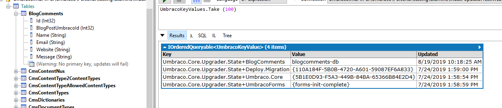

# Getting started with Entity Framework

## Introduction

Using the Entity Framework Core (EFCore), it is possible to add custom database tables to your site. These tables will store additional data that should not be stored as normal content nodes.

In this tutorial, we will show you can use the Entity Framework to create custom tables.

When done with the tutorial the end result will look like this:



And you can now work with this data through the Entity framework.

The following tutorial will show how this is done using a composer and a notification handler.

With this pattern you create and run a similar migration but trigger it in response to a [notification handler](../fundamentals/code/subscribing-to-notifications.md).

### Step 1: Create BlogComment Class

First, create a `BlogComment` class and add the following code to the class:

```csharp
namespace Umbraco.Demo;

public class BlogComment
{
    public int Id { get; set; }

    public Guid BlogPostUmbracoKey { get; set; }

    public required string Name { get; set; }

    public required string Email { get; set; }

    public required string Website { get; set; }

    public string Message { get; set; } = string.Empty;
}
```

### Step 2: Create DBContext class

Now that we have the model, create a `DbContext` class so we can interact with the database, we'll call this `BlogContext`:

```csharp
using Microsoft.EntityFrameworkCore;

namespace Umbraco.Demo;

public class BlogContext : DbContext
{
    public BlogContext(DbContextOptions<BlogContext> options)
        : base(options)
    {
    }

    public required DbSet<BlogComment> BlogComments { get; set; }

    protected override void OnModelCreating(ModelBuilder modelBuilder) =>
        modelBuilder.Entity<BlogComment>(entity =>
        {
            entity.ToTable("blogComment");
            entity.HasKey(e => e.Id);
            entity.Property(e => e.Id).HasColumnName("id");
            entity.Property(e => e.BlogPostUmbracoId).HasColumnName("blogPostUmbracoKey");
            entity.Property(e => e.Message).HasColumnName("message");
            entity.Property(e => e.Website).HasColumnName("website");
            entity.Property(e => e.Email).HasColumnName("email");
        });
}
```

### Step 3: Register the DbContext

We need to register this DbContext to use it, in Umbraco because we need to register a few other things to have Scopes working. To do this we have a helpful extension method you can use: `services.AddUmbracoEFCoreContext<BlogContext>("{YOUR CONNECTIONSTRING HERE}", "{YOUR PROVIDER NAME HERE}");`

Now that we can access the database via the `BlogContext`, we need to first migrate the database to add our tables. With EFCore, you can autogenerate the migrations via the console, so lets open up a terminal and do it!

1. Open your terminal and navigate to your project folder - If you do not have the EFCore CLI tool installed, run `dotnet tool install --global dotnet-ef` to install it
2. Generate the migration by running `dotnet ef migrations add InitialCreate --context BlogContext`


This example named the migration `InitialCreate` but you can choose whatever name you like! Our DbContext class was named `BlogContext`, but if you have renamed yours, remember to also change that in the command!


You should now have a `Migrations` folder in your project, containing the `InitialCreate` migration (or whatever name you chose).


This might be confusing at first, as when working with EFCore you would usually inject your `Context` class. While you can still do that, it is however not the recommended approach in Umbraco. In Umbraco we use a concept called `Scope` which is our implementation of the `Unit of work` pattern. This ensures that we start a transaction when using the database. If the scope is not completed (for example when exceptions are thrown) it will roll it back.


### Step 4: Create the notification handler

Next, let's create the notification handler that will handle our migrations. We need to create a new class called `RunBlogCommentsMigration` and add the following code to the class:

```csharp
using Umbraco.Cms.Core;
using Umbraco.Cms.Core.Events;
using Umbraco.Cms.Core.Migrations;
using Umbraco.Cms.Core.Notifications;
using Umbraco.Cms.Core.Scoping;
using Umbraco.Cms.Core.Services;
using Umbraco.Cms.Infrastructure.Migrations;
using Umbraco.Cms.Infrastructure.Migrations.Upgrade;

namespace Umbraco.Demo;

public class RunBlogCommentsMigration : INotificationHandler<UmbracoApplicationStartedNotification>
{
    private readonly IEFCoreScopeProvider<BlogContext> _efCoreScopeProvider;

    public RunBlogCommentsMigration(IEFCoreScopeProvider<BlogContext> efCoreScopeProvider)
    {
        _efCoreScopeProvider = efCoreScopeProvider;
    }

    public void Handle(UmbracoApplicationStartedNotification notification)
    {
        using IEfCoreScope<BlogContext> scope = _efCoreScopeProvider.CreateScope();
        await scope.ExecuteWithContextAsync<Task>(async db =>
        {
            IEnumerable<string> pendingMigrations = await db.Database.GetPendingMigrationsAsync();

            if (pendingMigrations.Any())
            {
                await db.Database.MigrateAsync();
            }

            scope.Complete();
        });
    }
}
```

### Step 5: Register the notification handler

Lastly, we have to register the notification handler, we'll do this with an `IComposer` class. We will call it `BlogCommentsComposer` and add the following code:

```csharp
using Umbraco.Cms.Core.Composing;
using Umbraco.Cms.Core.Notifications;

namespace Umbraco.Demo;

public class BlogCommentsComposer : IComposer
{
    public void Compose(IUmbracoBuilder builder) => builder.AddNotificationHandler<UmbracoApplicationStartedNotification, RunBlogCommentsMigration>();
}
```

## Data stored in Custom Database Tables

When storing data in custom database tables, this is by default not manageable by Umbraco at all. This can be great for many purposes such as storing massive amounts of data that you do not need to edit from the backoffice. Decoupling part of your data from being managed by Umbraco as content can be a way of achieving better performance for your site. It will no longer take up space in indexes and caches, and the Umbraco database.

This also means that if you do need to edit or display this data, you need to implement the underlying functionality to support this. The same is the case if you need this data to be transferred or kept synchronized between multiple sites or environments. Data stored in custom tables are not supported by default by add-ons such as Umbraco Deploy and will not be deployable by default.

Figuring out how to manage data across multiple environments can be different between individual sites and there is not one solution that fits all. Some sites may have automated database synchronization set up to ensure specific tables in multiple databases are always kept in sync. Other sites may be better off with scripts moving data around manually on demand.

## Working with data in Custom Database Tables

To create, read, update, or delete data from your custom database tables, use the `IEFCoreScopeProvider<T>` (T is your `DbContext` class) to access the EFCore context.

The example below creates an `UmbracoApiController` to be able to fetch and insert blog comments.


This example uses the `BlogComment` class, which is a database model. The recommended approach here would be to map these over to a ViewModel instead, that way your database & UI layers are not coupled. Also, be aware that things like error handling and data validation have been omitted for brevity.


```csharp
using Microsoft.AspNetCore.Mvc;
using Umbraco.Cms.Persistence.EFCore.Scoping;
using Umbraco.Cms.Web.Common.Controllers;

namespace Umbraco.Demo
{
    public class BlogCommentsController : UmbracoApiController
    {
        private readonly IEFCoreScopeProvider<BlogContext> _efCoreScopeProvider;

        public BlogCommentsController(IEFCoreScopeProvider<BlogContext> efCoreScopeProvider) => _efCoreScopeProvider = efCoreScopeProvider;

        [HttpGet]
        public async Task<IActionResult> All()
        {
            using IEfCoreScope<BlogContext> scope = _efCoreScopeProvider.CreateScope();
            IEnumerable<BlogComment> comments = await scope.ExecuteWithContextAsync(async db => db.BlogComments.ToArray());
            scope.Complete();
            return Ok(comments);
        }

        [HttpGet]
        public async Task<IActionResult> GetComments(int umbracoNodeId)
        {
            using IEfCoreScope<BlogContext> scope = _efCoreScopeProvider.CreateScope();
            IEnumerable<BlogComment> comments = await scope.ExecuteWithContextAsync(async db =>
            {
                return db.BlogComments.Where(x => x.BlogPostUmbracoId == umbracoNodeId);
            });
            scope.Complete();
            return Ok(comments);
        }

        [HttpPost]
        public async Task InsertComment(BlogComment comment)
        {
            using IEfCoreScope<BlogContext> scope = _efCoreScopeProvider.CreateScope();

            await scope.ExecuteWithContextAsync<Task>(async db =>
            {
                db.BlogComments.Add(comment);
                await db.SaveChangesAsync();
            });

            scope.Complete();
        }
    }
}

```
