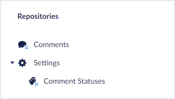

# Trees

A tree is a hierarchical structure that helps organize a section into logical sub-sections. A tree is accessed in the main side panel of the Umbraco interface. In Umbraco UI Builder, a section may only have a single tree definition. However, you can use folder nodes to help organize the tree structure as you need it.



## Configuring a Umbraco UI Builder section tree

The tree configuration for Umbraco UI Builder sections is a sub-configuration of a [`Section`](sections.md) config builder instance and is accessed via its `Tree` method.

### **Tree(Lambda treeConfig = null) : TreeConfigBuilder**

Accesses the tree config of the given section.

````csharp
// Example
sectionConfig.Tree(treeConfig => {
    ...
});
````

## Adding a tree to an existing section

The tree configuration for existing sections is a sub-configuration of a [`WithSection`](sections.md#extending-an-existing-section) config builder instance and is accessed via one of its `AddTree` methods.

### **AddTree(string name, string icon, Lambda treeConfig = null) : TreeConfigBuilder**

Adds a tree to the current section.

````csharp
// Example
withSectionConfig.AddTree("My Tree", "icon-folder", treeConfig => {
    ...
});
````

### **AddTree(string groupName, string name, string icon, Lambda treeConfig = null) : TreeConfigBuilder**

Adds a tree to the current section in a group with the given name.

````csharp
// Example
withSectionConfig.AddTree("My Group", "My Tree", "icon-folder", treeConfig => {
    ...
});
````

### **AddTreeBefore(string treeAlias, string name, string icon, Lambda treeConfig = null) : TreeConfigBuilder**

Adds a tree to the current section **before** the tree with the given alias.

````csharp
// Example
withSectionConfig.AddTreeBefore("member", "My Tree", "icon-folder", treeConfig => {
    ...
});
````

### **AddTreeAfter(string treeAlias, string name, string icon, Lambda treeConfig = null) : TreeConfigBuilder**

Adds a tree to the current section **after** the tree with the given alias.

````csharp
// Example
withSectionConfig.AddTreeAfter("member", "My Tree", "icon-folder", treeConfig => {
    ...
});
````

## Changing the tree icon color

### **SetIconColor(string color) : TreeConfigBuilder**

Sets the trees icon color to the given color.  The options that are possible are `black`, `green`, `yellow`, `orange`, `blue` or `red`.


Only trees added to existing sections have an icon. Trees added to Umbraco UI Builder sections don't show a tree icon instead they go straight into displaying the tree contents.


````csharp
// Example
collectionConfig.SetIconColor("blue");
````

## Adding a group to a tree

### **AddGroup(string name, Lambda groupConfig = null) : GroupConfigBuilder**

Adds a group to the current tree with the given name.


Only Umbraco UI Builder section trees can configure groups, where trees added to existing sections cannot.


```csharp
// Example
treeConfig.AddGroup("Settings", groupConfig => {
    ...
});
```

## Adding a folder to a tree/group

### **AddFolder(string name, Lambda folderConfig = null) : FolderConfigBuilder**

Adds a folder to the current tree/group with the given name and a default folder icon. For more information check the [Folders documentation](folders.md).

```csharp
// Example
treeConfig.AddFolder("Settings", folderConfig => {
    ...
});
```

### **AddFolder(string name, string icon, Lambda folderConfig = null) : FolderConfigBuilder**

Adds a folder to the current tree/group with the given name + icon. For more information check the [Folders documentation](folders.md).

```csharp
// Example
treeConfig.AddFolder("Settings", "icon-settings", folderConfig => {
    ...
});
```

## Adding a collection to a tree/group

### **AddCollection&lt;TEntityType&gt;(Lambda idFieldExpression, string nameSingular, string namePlural, string description, Lambda collectionConfig = null) : CollectionConfigBuilder&lt;TEntityType&gt;**

Adds a collection to the current tree/group with the given names, descriptions, and default icons. An ID property accessor expression is required so that Umbraco UI Builder knows which property is the ID property. For more information check the [Collections documentation](../collections/overview.md).

```csharp
// Example
treeConfig.AddCollection<Person>(p => p.Id, "Person", "People", "A collection of people", collectionConfig => {
    ...
});
```

#### **AddCollection&lt;TEntityType&gt;(Lambda idFieldExpression, string nameSingular, string namePlural, string description, string iconSingular, string iconPlural, Lambda collectionConfig = null) : CollectionConfigBuilder&lt;TEntityType&gt;**

Adds a collection to the current tree/group with the given names, description and icons. An ID property accessor expression is required so that Umbraco UI Builder knows which property is the ID property. For more information check the [Collections documentation](../collections/overview.md).

```csharp
// Example
treeConfig.AddCollection<Person>(p => p.Id, "Person", "People", "A collection of people", "icon-umb-users", "icon-umb-users", collectionConfig => {
    ...
});
```

## Extending an existing tree

You can extend existing trees adding Umbraco UI Builder context apps and virtual sub trees by calling the `WithTree` method of a [`WithSectionConfigBuilder`](sections.md#extending-an-existing-section) instance.

### **WithTree(string alias, Lambda treeConfig = null) : WithTreeConfigBuilder**

Starts a sub-configuration for the existing Umbraco tree with the given alias.

```csharp
// Example
sectionConfig.WithTree("content", withTreeConfig => {
    ...
});
```

## Adding a context app to an existing tree

### **AddContextApp(string name, Lambda contextAppConfig = null) : ContextAppConfigBuilder**

Adds a context app with the given name and default icon. For more information check the [Context App documentation](context-apps.md).

```csharp
// Example
withTreeConfig.AddContextApp("Comments", contextAppConfig => {
    ...
});
```

### **AddContextApp(string name, string icon, Lambda contextAppConfig = null) : ContextAppConfigBuilder**

Adds a context app to the Umbraco menu with the given name and icon. For more information check the [Context App documentation](context-apps.md).

```csharp
// Example
withTreeConfig.AddContextApp("Comments", "icon-chat", contextAppConfig => {
    ...
});
```

### **AddContextAppBefore(string beforeAlias, string name, Lambda contextAppConfig = null) : ContextAppConfigBuilder**

Adds a context app with the given name and default icon **before** the context app with the given alias. For more information check the [Context App documentation](context-apps.md).

```csharp
// Example
withTreeConfig.AddContextAppBefore("umbContent", "Comments", contextAppConfig => {
    ...
});
```

### **AddContextAppBefore(string beforeAlias, string name, string icon, Lambda contextAppConfig = null) : ContextAppConfigBuilder**

Adds a context app to the Umbraco menu with the given name and icon **before** the context app with the given alias. For more information check the [Context App documentation](context-apps.md).

```csharp
// Example
withTreeConfig.AddContextAppBefore("umbContent", "Comments", "icon-chat", contextAppConfig => {
    ...
});
```

### **AddContextAppAfter(string afterAlias, string name, Lambda contextAppConfig = null) : ContextAppConfigBuilder**

Adds a context app with the given name and default icon **after** the context app with the given alias. For more information check the [Context App documentation](context-apps.md).

```csharp
// Example
withTreeConfig.AddContextAppAfter("umbContent", "Comments", contextAppConfig => {
    ...
});
```

### **AddContextAppAfter(string afterAlias, string name, string icon, Lambda contextAppConfig = null) : ContextAppConfigBuilder**

Adds a context app to the Umbraco menu with the given name and icon **after** the context app with the given alias. For more information check the [Context App documentation](context-apps.md).

```csharp
// Example
withTreeConfig.AddContextAppAfter("umbContent", "Comments", "icon-chat", contextAppConfig => {
    ...
});
```
