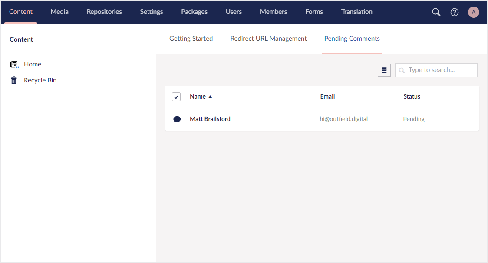

# Dashboards

A dashboard is a view that is displayed at the root of a section and contains welcome information. It also includes useful tools relevant to the given section. When there are multiple dashboards to display in a section these are presented in a tabbed layout to allow you to switch between the dashboards.



## Defining a dashboard

You can define a dashboard by calling one of the `AddDashboard` methods on either a [`SectionConfigBuilder`](sections.md) or a [`WithSectionConfigBuilder`](sections.md#extending-an-existing-section) instance.

### **AddDashboard(string name, Lambda dashboardConfig = null) : DashboardConfigBuilder**

Adds a dashboard with the given name.

```csharp
// Example
sectionConfig.AddDashboard("Team", dashboardConfig => {
    ...
});
```

### **AddDashboardBefore(string beforeAlias, string name, Lambda dashboardConfig = null) : DashboardConfigBuilder**

Adds a dashboard with the given name **before** the dashboard with the given alias.

```csharp
// Example
sectionConfig.AddDashboardBefore("contentIntro", "Team", dashboardConfig => {
    ...
});
```

### **AddDashboardAfter(string afterAlias, string name, Lambda dashboardConfig = null) : DashboardConfigBuilder**

Adds a dashboard with the given name **after** the dashboard with the given alias.

```csharp
// Example
sectionConfig.AddDashboardAfter("contentIntro", "Team", dashboardConfig => {
    ...
});
```

## Changing a dashboard alias

### **SetAlias(string alias) : DashboardConfigBuilder**

Sets the alias of the dashboard.

**Optional:** When adding a new dashboard, an alias is automatically generated from the supplied name for you. However, if you need a specific alias you can use the `SetAlias` method to override this.

```csharp
// Example
dashboardConfig.SetAlias("team");
```

## Changing when a dashboard should display

Changing when a dashboard is displayed is controlled via an inner config. Options on the inner config are `ShowForUserGroup` and `HideForUserGroup` to control the visibility of the dashboard for given user groups. You can call these config methods multiple times to add multiple role configurations.

By default,  will pre-filter dashboards to display only on the section it is defined in. This will be combined with the `SetVisibility` config to decide when to display the dashboard.

### **SetVisibility(Lambda visibilityConfig) : DashboardConfigBuilder**

Sets the dashboard visibility config.

````csharp
// Example
dashboardConfig.SetVisibility(visibilityConfig => visibilityConfig
    .ShowForUserGroup("admin")
    .HideForUserGroup("translator")
);
````

## Setting the collection of a dashboard

Dashboards are only able to display a single collection. If you need to display multiple collections, then you need to configure multiple dashboards.

### **SetCollection&lt;TEntityType&gt;(Lambda idFieldExpression, string nameSingular, string namePlural, string description, Lambda collectionConfig = null) : ContextAppConfigBuilder**

Sets the collection of the current dashboard with the given names, descriptions, and default icons. An ID property accessor expression is required so that Umbraco UI Builder knows which property is the ID property. For more information check the [Collections documentation](../collections/overview.md).

```csharp
// Example
dashboardConfig.SetCollection<Comment>(p => p.Id, p=> "Team Member", "Team Members", "A collection of team members", collectionConfig => {
    ...
});
```

### **SetCollection&lt;TEntityType&gt;(Lambda idFieldExpression, Lambda fkFieldExpression, string nameSingular, string namePlural, string description, string iconSingular, string iconPlural, Lambda collectionConfig = null) : ContextAppConfigBuilder**

Sets the collection of the current dashboard with the given names, description and icons. An ID property accessor expression is required so that Umbraco UI Builder knows which property is the ID property. For more information check the [Collections documentation](../collections/overview.md).

```csharp
// Example
dashboardConfig.SetCollection<Comment>(p => p.Id, "Team Member", "Team Members", "A collection of team members", "icon-umm-user", "icon-umb-user", collectionConfig => {
    ...
});
```
