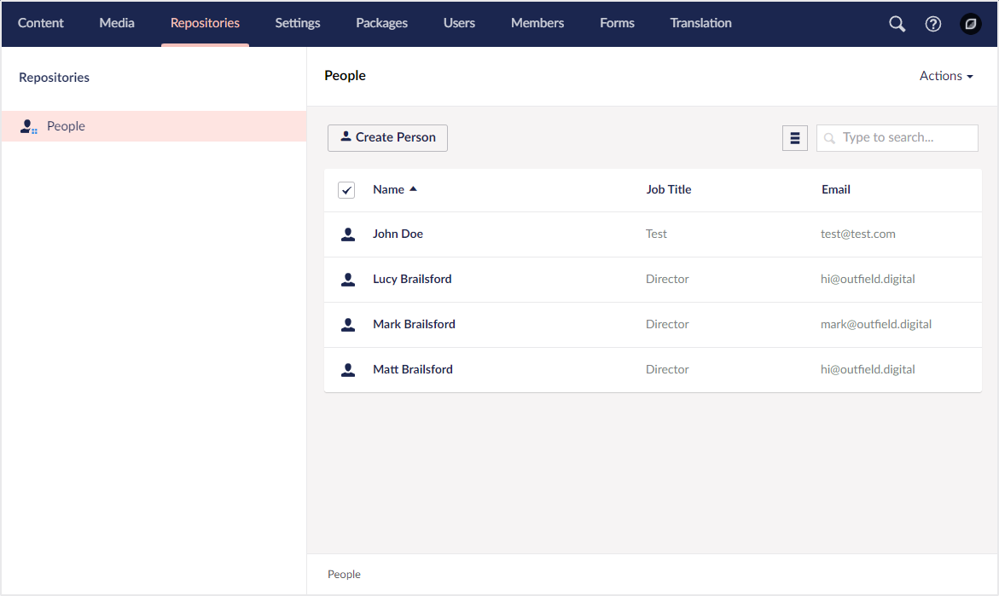

# Creating your first integration

In this guide, you can find the necessary steps needed for a basic implementation using Umbraco UI Builder to manage a single custom database table.

## Set up the database

Out of the box, Umbraco UI Builder works using PetaPoco as the persistence layer as this is what ships with Umbraco. If you prefer, it is possible to use a custom [Repository](../advanced/repositories.md). However, for getting started, it is expected that you are using this default strategy.

Start by setting up a database table for your model (you might want to populate it with some dummy data as well while learning). We’ll use the following as an example:

```sql
CREATE TABLE [Person] (
    [Id] int IDENTITY (1,1) NOT NULL, 
    [Name] nvarchar(255) NOT NULL, 
    [JobTitle] nvarchar(255) NOT NULL, 
    [Email] nvarchar(255) NOT NULL, 
    [Telephone] nvarchar(255) NOT NULL, 
    [Age] int NOT NULL, 
    [Avatar] nvarchar(255) NOT NULL
);
```

## Set up your model

With the database table setup, we then need to create the associated Poco model in our project.

```csharp
[TableName("Person")]
[PrimaryKey("Id")]
public class Person
{
    [PrimaryKeyColumn]
    public int Id { get; set; }
    public string Name { get; set; }
    public string JobTitle { get; set; }
    public string Email { get; set; }
    public string Telephone { get; set; }
    public int Age { get; set; }
    public string Avatar { get; set; }
}
```

## Configure Umbraco UI Builder

With the database and model setup, we can now start to configure Umbraco UI Builder itself. The entry point for the Umbraco UI Builder configuration is via the `AddUIBuilder` extension method. On this method, we call on the `IUmbracoBuilder` instance within the `ConfigureServices` method of the `Startup` class.

```csharp
public class Startup
{
    ...
    public void ConfigureServices(IServiceCollection services)
    {
        services.AddUmbraco(_env, _config)
            .AddBackOffice()
            .AddWebsite()
            .AddUIBuilder(cfg => {
                // Apply your configuration here
            })
            .AddComposers()
            .Build();
    }
    ...
}
```

For our example, we will use the following configuration:

```csharp
...
.AddUIBuilder(cfg => {
    
    cfg.AddSectionAfter("media", "Repositories", sectionConfig => sectionConfig
        .Tree(treeConfig => treeConfig
            .AddCollection<Person>(x => x.Id, "Person", "People", "A person entity", "icon-umb-users", "icon-umb-users", collectionConfig => collectionConfig
                .SetNameProperty(p => p.Name)
                .ListView(listViewConfig => listViewConfig
                    .AddField(p => p.JobTitle).SetHeading("Job Title")
                    .AddField(p => p.Email)
                ) 
                .Editor(editorConfig => editorConfig
                    .AddTab("General", tabConfig => tabConfig
                        .AddFieldset("General", fieldsetConfig => fieldsetConfig
                            .AddField(p => p.JobTitle).MakeRequired()
                            .AddField(p => p.Age)
                            .AddField(p => p.Email).SetValidationRegex("[a-zA-Z0-9_.+-]+@[a-zA-Z0-9-]+.[a-zA-Z0-9-.]+")
                            .AddField(p => p.Telephone).SetDescription("inc area code")
                        )
                        .AddFieldset("Media", fieldsetConfig => fieldsetConfig
                            .AddField(p => p.Avatar).SetDataType("Upload File")
                        )
                    )
                )
            )
        )
    );

})
...
```

## Access your UI

With your configuration defined and your project compiled, there is one last step to perform before you can access your UI. And that is to give your backoffice user account permission to access the newly defined section. To do this you'll need to login to the backoffice, head to the user's section, and update the user group. There you will need to make sure that your user belongs to the allowed access.


With the permissions set, you can refresh your browser and you should now see your new section available in the site navigation.

  


## Summary

As you can see, with little code you can start to create powerful interfaces for your custom data structures.
