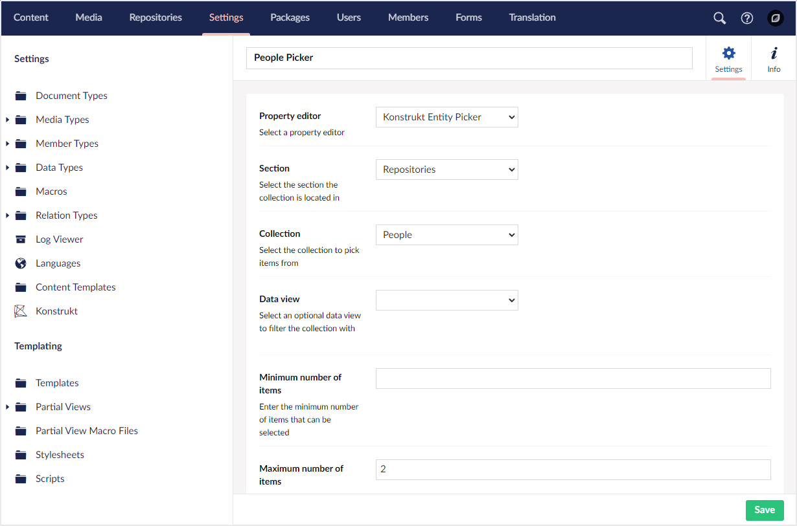
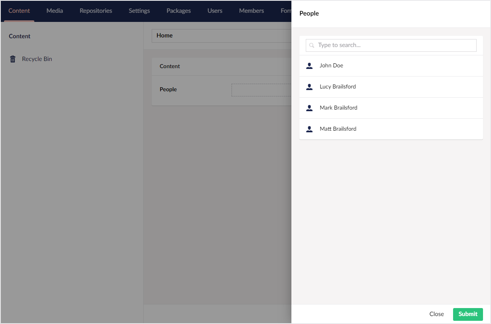

# Entity Picker

The Entity Picker property editor is an Umbraco property editor that lets you select one or more entities from an Umbraco UI Builder collection.

## Configuring an entity picker

To configure an entity picker you need to create a Data Type in the Umbraco backoffice. From the property editor dropdown choose 'Umbraco UI Builder Entity Picker'.



From there choose 'Section' and 'Collection' you wish to pick entities from. You can also choose an optional list view 'Data View' if there are any configured.

You can also set a minimum and maximum number of items to be able to pick if required.

With an entity picker Data Type defined, finish off the configuration by adding it to the desired Document Type definition.


## Using an entity picker

Using the entity picker should be pretty familiar as it aims to mimic the content picker as closely as possible.

To pick an entity click the 'Add' link to launch the picker dialog. The dialog should present a paginated list of entities to pick from. If any searchable fields were configured for the entity type, you can perform a search by typing a search term in the search input field.



To pick your items click on the entity names and then click 'Select' in the bottom right-hand corner.

The picker should display a summary of the selected entities which can be sorted by dragging the selected entities into the desired order.


To save the value either **save** or **save and publish** the current document.

## Getting the value of an entity picker
 
The entity picker property editor comes with a built-in [value converter](https://docs.umbraco.com/umbraco-cms/extending/property-editors/property-value-converters/). This means that whenever you retrieve the property value from Umbraco it will return the actual selected entities, even converting them to the relevant type.

````csharp
// Example
foreach(var p in Model.People){
    ...
}
````
