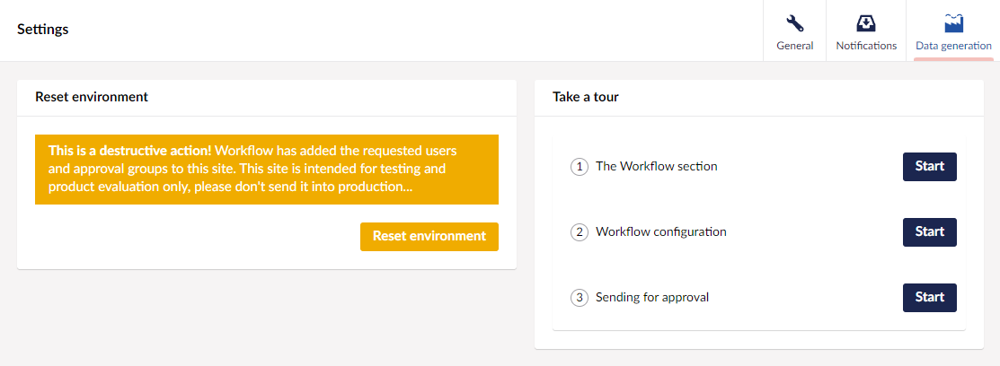

# Data Generator

The Umbraco Workflow DataGenerator tool is an extension package for quickly generating Umbraco users and Workflow approval groups and permissions.

The generator gets you up and running for testing or product evaluation without having to manually create any Workflow configuration.

## Installation


The package must only be installed into an empty Umbraco application.


To install the Umbraco Workflow DataGenerator package (Umbraco.Workflow.DataGenerator), follow these steps:
1. Update appSettings.development.json to enable the Workflow test license. This removes limits on group creation, and enables all features:

```
{
  ...
  "Umbraco": {
    "Workflow": {
        "EnableTestLicense": true
    }
  }
}
```

2. Run the following command to add the required package references to your Umbraco project:

```
dotnet add package Umbraco.Workflow // if not already installed
dotnet add package Umbraco.Workflow.DataGenerator
```

3. Restart the web application using the following command:

```
dotnet run
```

When the application restarts, it will automatically install [The Starter Kit](https://docs.umbraco.com/umbraco-cms/tutorials/starter-kit).

## Getting started

The package adds an additional view in the Workflow settings, which provides controls for the data generation task.

<figure><figcaption></figcaption></figure>

The available settings are explained below.

* **Number of approval groups** - determines how many Workflow approval groups will be created. Defaults to two.
* **Number of users** - determines how many Umbraco users will be created. Defaults to two.
* **Number of groups per workflow** - determines how the created groups are allocated into the generated workflows. Defaults to 0, which allocates a random number of groups to each workflow.
* **Number of users per group** - determines how the created users are allocated into the generated workflow approval groups. Defaults to 0, which allocates a random number of users to each approval group.

When the generator task completes, you will be prompted to take a Workflow tour. The tours can be resumed at any time from the Data generation view.

Groups and users are created with arbitrary names, feel free to rename these to suit.

### Reset

Once Workflow configuration has been updated, the environment must be reset before regenerating. Resetting cancels all active workflows and deletes all workflow configuration. Umbraco users are not deleted, but will be reused in future data generation actions.

<figure><figcaption></figcaption></figure>
