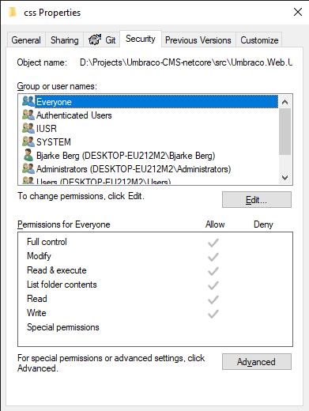

# Folder & File Permissions

_Checks that the web server folder and file permissions are set correctly for Umbraco to run._

## How to fix this health check

This health check can be fixed by ensuring that the process running Umbraco also has write access to the listed folders and files.

### Updating the file permissions on Windows

Here's an example of how to adjust permissions for a folder. This process works the same way for files.

First we see an example of an error from the health check

To fix this, we find the specified folder, from the report and choose `Properties` and the `Security` tab.

 

From here you can edit the permissions for a specific user or user group.


For security reasons we recommend only giving write access to the required users or groups.

