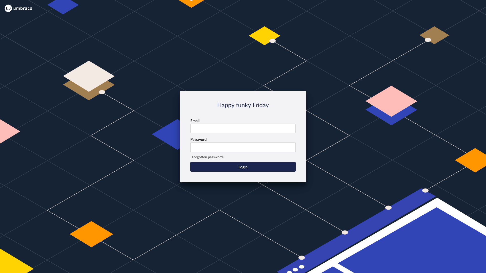

# Login

To access the backoffice, you will need to login. You can do this by adding `/umbraco` at the end of your website URL, for example http://mywebsite.com/umbraco.

You will be presented with a login form similar to this:



The **login** screen contains a **Greeting**, **Email**, **Password** field and optionally a **Forgotten password** link

Below, you will find instructions on how to customize the login screen.

## Greeting

The login screen features a greeting which you can personalize by overriding the existing language translation keys. To do this, create a 'user' translation file for the default language of your Umbraco site, (usually en-US) to override the greetings. For en-US, you'd create a file called: `en_us.user.xml` in the directory `~/config/lang/`. Then take the relevant keys (listed below) and add them to your `~/config/lang/en_us.user.xml` file, and update the greetings as necessary.

**Note:** the `config` directory needs to be in the root of your project (_not_ the `wwwroot`).

```xml
<?xml version="1.0" encoding="utf-8" standalone="yes" ?>
<language culture="en-US">
	<area alias="login">
		<key alias="greeting0">Happy super Sunday</key>
		<key alias="greeting1">Happy manic Monday</key>
		<key alias="greeting2">Happy tubular Tuesday</key>
		<key alias="greeting3">Happy wonderful Wednesday</key>
		<key alias="greeting4">Happy thunderous Thursday</key>
		<key alias="greeting5">Happy funky Friday</key>
		<key alias="greeting6">Happy Caturday</key>
	</area>
</language>
```

* Before the changes takes place you will need to restart the site.

You can customize other text on the login screen as well. First, grab the default values and keys from the [en_us.xml](https://github.com/umbraco/Umbraco-CMS/blob/5ba40c65fc45f0effb0153bb69ac435e40ed605c/src/Umbraco.Core/EmbeddedResources/Lang/en_us.xml) in the Umbraco CMS GitHub repository. Thereafter, copy the ones you want to translate into the `~/config/lang/en_us.user.xml` file.

## Password reset

The **Forgotten password?** link allows your backoffice users to reset their password. To use this feature, you will need to add the following key to the `Umbraco.Cms.Security` section in the `appsettings.json` file:

```json
"Umbraco": {
    "CMS": {
      "Security": {
        "AllowPasswordReset": true
      }
   }
}
```

Set it to `true` to enable the password reset feature, and `false` to disable the feature.

You will also need to configure a Simple Mail Transfer Protocol (SMTP) server in your `appsettings.json` file. When you get a successful result on the SMTP configuration when running a health check in the backoffice, you are good to go!

An example:

```json
"Umbraco": {
    "CMS": {
      "Global": {
        "Id": "xxxxxxxx-xxxx-xxxx-xxxx-xxxxxxxxxxxx",
        "Smtp": {
          "From": "noreply@test.com",
          "Host": "127.0.0.1",
          "Username": "username",
          "Password": "password"
        }
      }
    }
}
```

## Custom background image and logo

It is possible to customize the background image and the logo for the backoffice login screen by adding the `"Content"` section in the `appsettings.json` file:

```json
"Umbraco": {
    "CMS": {
      "Content": {
        "LoginBackgroundImage": "../myImagesFolder/myLogin.jpg",
        "LoginLogoImage": "../myImagesFolder/myLogo.svg",
        "LoginLogoImageAlternative": "../myImagesFolder/myLogo.svg"
      }
   }
}
```

The `LoginBackgroundImage`, `LoginLogoImage`, and `LoginLogoImageAlternative` are referenced from the `/wwwroot/umbraco/` folder.

The `LoginLogoImage` is displayed on top of the `LoginBackgroundImage` and the `LoginLogoImageAlternative` is displayed when the `LoginLogoImage` is not available, for example on small resolutions.

## Custom CSS

You can also customize the login screen by adding a custom CSS file. To do this, you will need to add a new file inside the `~/App_Plugins` folder, for example `~/App_Plugins/MyCustomLoginScreen/my-custom-login-screen.css`.

You can then add your custom CSS to the file:

```css
:root {
    --umb-login-curves-color: rgba(0, 0, 0, 0.1);
}
```

This will change the color of the SVG graphics (curves) shown on the login screen. You can also hide the curves by adding the following CSS:

```css
:root {
    --umb-login-curves-display: none;
}
```

### Load the custom CSS file

To tell Umbraco about your custom CSS file, you will need to add a `package.manifest` file. The `package.manifest` file should look like this:

```json
{
  "css": [
    "~/App_Plugins/MyCustomLoginScreen/my-custom-login-screen.css"
  ],
  "bundleOptions": "None"
}
```

### Custom CSS properties reference

The following CSS properties are available for customization:

| CSS Property                             | Description                                    | Default Value                                                                              |
| ---------------------------------------- | ---------------------------------------------- | ------------------------------------------------------------------------------------------ |
| `--umb-login-background`                 | The background of the layout                   | `#f4f4f4`                                                                                  |
| `--umb-login-primary-color`              | The color of the headline                      | `#283a97`                                                                                  |
| `--umb-login-text-color`                 | The color of the text                          | `#000`                                                                                     |
| `--umb-login-header-font-size`           | The font-size of the headline                  | `3rem`                                                                                     |
| `--umb-login-header-font-size-large`     | The font-size of the headline on large screens | `4rem`                                                                                     |
| `--umb-login-header-secondary-font-size` | The font-size of the secondary headline        | `2.4rem`                                                                                   |
| `--umb-login-image`                      | The background of the image wrapper            | The value of the [LoginBackgroundImage](login.md#custom-background-image-and-logo) setting |
| `--umb-login-image-display`              | The display of the image wrapper               | `flex`                                                                                     |
| `--umb-login-image-border-radius`        | The border-radius of the image wrapper         | `38px`                                                                                     |
| `--umb-login-content-background`         | The background of the content wrapper          | `none`                                                                                     |
| `--umb-login-content-display`            | The display of the content wrapper             | `flex`                                                                                     |
| `--umb-login-content-width`              | The width of the content wrapper               | `100%`                                                                                     |
| `--umb-login-content-height`             | The height of the content wrapper              | `100%`                                                                                     |
| `--umb-login-content-border-radius`      | The border-radius of the content wrapper       | `0`                                                                                        |
| `--umb-login-align-items`                | The align-items of the main wrapper            | `unset`                                                                                    |
| `--umb-login-button-border-radius`       | The border-radius of the buttons               | `45px`                                                                                     |
| `--umb-login-curves-color`               | The color of the curves                        | `#f5c1bc`                                                                                  |
| `--umb-login-curves-display`             | The display of the curves                      | `inline`                                                                                   |

The CSS custom properties may change in future versions of Umbraco. You can always find the latest values in the [login layout element](https://github.com/umbraco/Umbraco-CMS/blob/v13/dev/src/Umbraco.Web.UI.Login/src/components/layouts/auth-layout.element.ts) in the Umbraco CMS GitHub repository.
