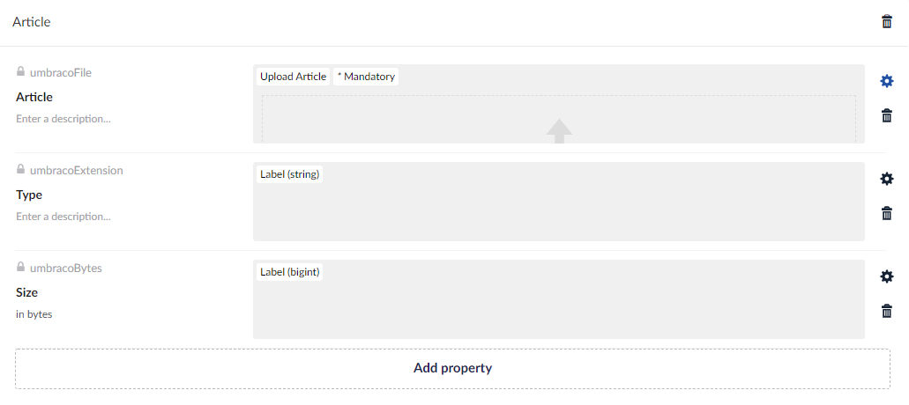
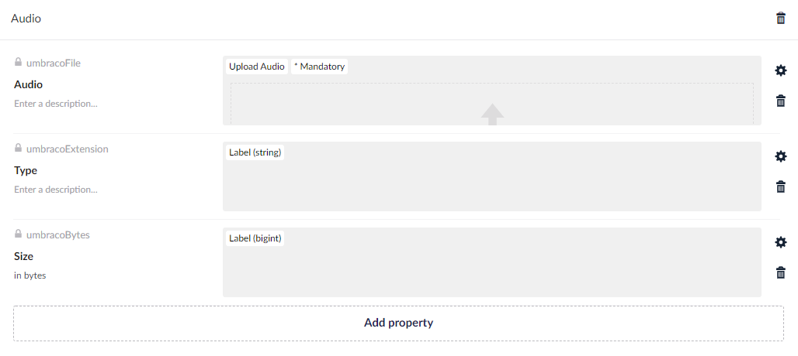
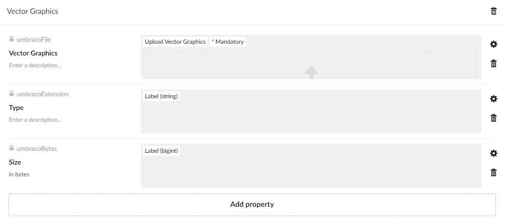
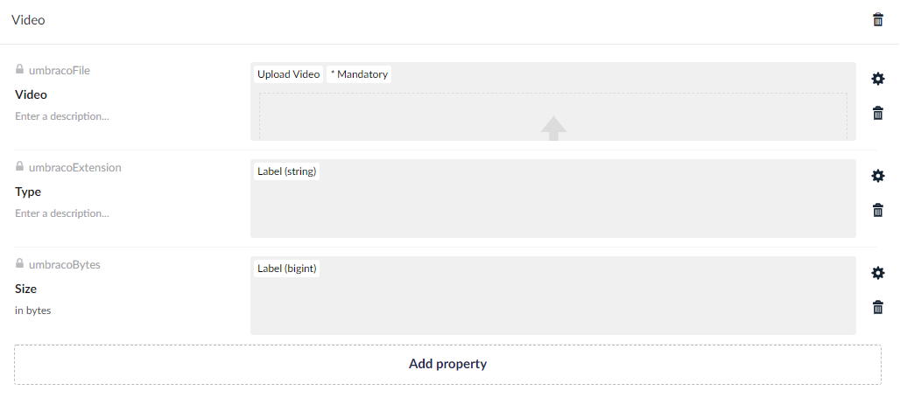

# Default Data/Media Types

On this page you will find the media types and Data Types in Umbraco. These types are not created automatically after an upgrade. If you want to use the new types, you can create them yourself.


After upgrading, the default media types are not created automatically. If you create them manually, make sure to:
* Set the permission for each of the media types to **Allow at root**.
* Ensure that the **Folder** media type allows the new media types as children.


## Data Types

### UploadArticle

The `UploadArticle` Data Type has the following configuration:

* Property editor: `FileUpload`
* Accepted file extensions: `pdf`, `docx`, `doc`

### UploadAudio

The `UploadAudio` Data Type has the following configuration:

* Property editor: `FileUpload`
* Accepted file extensions: `mp3`, `weba`, `oga`, `opus`

### UploadVectorGraphics

The `UploadVectorGraphics` Data Type has the following configuration:

* Property editor: `FileUpload`
* Accepted file extensions: `svg`

### UploadVideo

The `UploadVideo` Data Type has the following configuration:

* Property editor: `FileUpload`
* Accepted file extensions: `mp4`, `webm`, `ogv`

## Media Types

### UmbracoMediaArticle

The `UmbracoMediaArticle` media type has the following properties:

* `umbracoFile` - Upload File
* `umbracoExtension` - Label (string)
* `umbracoBytes` - Label (bigint)

### UmbracoMediaAudio

The `UmbracoMediaAudio` media type has the following properties:

* `umbracoFile` Upload Audio
* `umbracoExtension` Label (string)
* `umbracoBytes` Label (bigint)

### UmbracoMediaVectorGraphics

The `UmbracoMediaVectorGraphics` media type has the following properties:

* `umbracoFile` - Upload Vector Graphics
* `umbracoExtension` Label (string)
* `umbracoBytes` Label (bigint)

### UmbracoMediaVideo

The `UmbracoMediaVideo` media type has the following properties:

* `umbracoFile` - Upload Video
* `umbracoExtension` - Label (string)
* `umbracoBytes` - Label (bigint)


You can also create localization files for Media Types. You can read more about this in the [Document Type Localization](../defining-content/document-type-localization.md) article.

