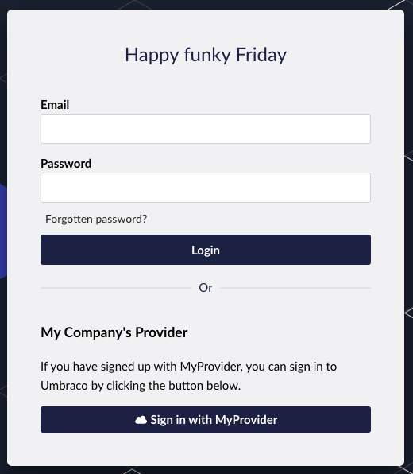

# External login providers

Both the Umbraco backoffice users and website members support external login providers (OAuth) for performing authentication. This could be any OpenIDConnect provider such as Entra ID/Azure Active Directory, Identity Server, Google, or Facebook.


Unlike previous major releases of Umbraco the use of the Identity Extensions package is no longer required.


Install an appropriate Nuget package for the provider you wish to use. Some popular ones found in Nuget include:

* [Google](https://www.nuget.org/packages/Microsoft.AspNetCore.Authentication.Google)
* [Facebook](https://www.nuget.org/packages/Microsoft.AspNetCore.Authentication.Facebook)
* [Microsoft](https://www.nuget.org/packages/Microsoft.AspNetCore.Authentication.MicrosoftAccount/)
* [Twitter](https://www.nuget.org/packages/Microsoft.AspNetCore.Authentication.Twitter/3.0.0)
* [Open ID Connect](https://www.nuget.org/packages/Microsoft.AspNetCore.Authentication.OpenIdConnect)
* [Others](https://docs.microsoft.com/en-us/aspnet/core/security/authentication/social/other-logins?view=aspnetcore-5.0)

## Try it out


[configuration](../../tutorials/add-microsoft-entra-id-authentication.md)



[configuration](../../tutorials/add-google-authentication.md)


<details>

<summary>Umbraco OpenIdConnect Example [Community-made]</summary>

This community-created package with a complete Umbraco solution incl. an SQLite database demonstrates how OpenID Connect can be used: [Umbraco OpenIdConnect Example](https://github.com/jbreuer/Umbraco-OpenIdConnect-Example).

It is great for testing and for trying out the implementation before building it into your own project.

**This project is not managed or maintained by Umbraco HQ.**

</details>

<details>

<summary>Umbraco Entra ID (Azure AD) Example [Community-made]</summary>

This community-created package will allow you to automatically create Umbraco user accounts for users in your directory. This will then associate the Umbraco users with groups based on their AD group: [Umbraco.Community.AzureSSO](https://github.com/Gibe/Umbraco.Community.AzureSSO).

**This project is not managed or maintained by Umbraco HQ.**

</details>

## Extend core functionality

When you are implementing your own custom authentication on Users and/or Members on your Umbraco CMS website, you are effectively extending existing features.

The process requires adding a couple of new classes (`.cs` files) to your Umbraco project:

* **Custom-named configuration** to add additional configuration for handling different options related to the authentication. [See a generic example of the configuration class to learn more.](#custom-named-configuration)
* A **static extention class** to extend on the default authentication implementation in Umbraco CMS for either Users or Members. [See a generic example of the static extension class to learn more.](#static-extension-class)

To register these two classes in Umbraco CMS you need to add them to the `Program.cs` file.


It is also possible to register the configuration class directly into the extension class. See examples of how this is done in the [generic examples for the static extension class](#static-extension-class).


## Auto-linking

Traditionally, a backoffice User or frontend Member will need to exist in Umbraco first. Once they exist there, they can link their user account to an external login provider.

In many cases, however, the external login provider you install will be the source of truth for all of your users and members.

In this case, you will want to provide a Single Sign On (SSO) approach to logging in. This would enable the creating of user accounts on the external login provider and then automatically give them access to Umbraco. This is called **auto-Linking**.

### Local logins

When have auto-linking configured, then any auto-linked user or member will have an empty password assigned. This means that they will not be able to log in locally (via username and password). In order to log in locally, they will have to assign a password to their account in the backoffice or the edit profile page.

For users specifically, if the `DenyLocalLogin` option is enabled, all password-changing functionality in the backoffice is disabled and local login is not possible.

### Transferring Claims from External identities

In some cases, you may want to flow a Claim returned in your external login provider to the Umbraco backoffice identity's Claims. This could be the authentication cookie. Flowing Claims between the two can be done during the `OnAutoLinking` and `OnExternalLogin`.

The reason for wanted to flow a Claim could be to store the external login provider user ID into the backoffice identity cookie. It can then be retrieved on each request to look up data in another system needing the current user ID from the external login provider.


Do not flow large amounts of data into the backoffice identity. This information is stored in the backoffice authentication cookie and cookie limits will apply. Data like Json Web Tokens (JWT) needs to be [persisted](#storing-external-login-provider-data) somewhere to be looked up and not stored within the backoffice identity itself.


#### Example

This is a simplistic example of brevity including no null checks, etc.

```csharp
OnAutoLinking = (user, loginInfo) => {
    // You can customize the user before it's linked.
    // i.e. Modify the user's groups based on the Claims returned
    // in the externalLogin info
    var extClaim = externalLogin
        .Principal
        .FindFirst("MyClaim");
    user.Claims.Add(new IdentityUserClaim<string>
    {
        ClaimType = extClaim.Type,
        ClaimValue = extClaim.Value,
        UserId = user.Id
    });
},
OnExternalLogin = (user, loginInfo) => {
    // You can customize the user before it's saved whenever they have
    // logged in with the external provider.
    // i.e. Sync the user's name based on the Claims returned
    // in the externalLogin info
    var extClaim = externalLogin
        .Principal
        .FindFirst("MyClaim");
    user.Claims.Add(new IdentityUserClaim<string>
    {
        ClaimType = extClaim.Type,
        ClaimValue = extClaim.Value,
        UserId = user.Id
    });
    return true;
}
```

### Storing external login provider data

In some cases, you may need to persist data from your external login provider like Access Tokens, etc.

You can persist this data to the affiliated user's external login data via the `IExternalLoginWithKeyService`. The `void Save(Guid userOrMemberKey,IEnumerable<IExternalLoginToken> tokens)` overload takes a new model of type `IEnumerable<IExternalLogin>`.

`IExternalLogin` contains a property called `UserData`. This is a blob text column which can store any arbitrary data for the external login provider.



Be aware that the local Umbraco user must already exist and be linked to the external login provider before data can be stored here. In cases where auto-linking occurs and the user isn't yet created, you need to store the data in memory first during auto-linking. Then you can persist the data to the service once the user is linked and created.



### Auto-linking on backoffice authentication

For some providers, it does not make sense to use auto-linking. This is especially true for public providers such as Google or Facebook.

In those cases, it would mean that anyone who has a Google or Facebook account can log into your site.

If auto-linking for public providers such as these was needed you would need to limit the access. This can be done by domain or other information provided in the claims using the options/callbacks specified in those provider's authentication options.

### Auto-linking on Member authentication

Auto-linking on Member authentication only makes sense if you have a public member registration already or the provider does not have public account creation.

## Generic examples

The following section presents a series of generic examples.

"*Provider*" is used to replace place of the names of actual external login providers. When you implement your own custom authentication, you will need to use the correct method names for the chosen provider.

### Custom-named configuration

The configuration file is used to configure a handful of different options for the authentication setup. A generic example of such file is shown below.





In earlier versions of Umbraco up to version 12, the options included only a "ButtonStyle" property to style the button. In version 13+ the default button is now rendered using the Umbraco UI library. This means that the "ButtonStyle" property has been deprecated and should not be used. You can override the default styling of the button by using the "ButtonColor" and "ButtonLook" properties. We recommend leaving these properties empty to use the default styling. The default styling will give your users an optimal login experience.



```csharp
using Microsoft.Extensions.Options;
using Umbraco.Cms.Core;
using Umbraco.Cms.Web.BackOffice.Security;

namespace MyUmbracoProject.CustomAuthentication;

public class ProviderBackOfficeExternalLoginProviderOptions : IConfigureNamedOptions<BackOfficeExternalLoginProviderOptions>
{
    public const string SchemeName = "OpenIdConnect";
    public void Configure(string name, BackOfficeExternalLoginProviderOptions options)
    {
        if (name != Constants.Security.BackOfficeExternalAuthenticationTypePrefix + SchemeName)
        {
            return;
        }

        Configure(options);
    }

    public void Configure(BackOfficeExternalLoginProviderOptions options)
    {
        // Customize the login button
        options.Icon = "icon-cloud";

        // The following options are relevant if you
        // want to configure auto-linking on the authentication.
        options.AutoLinkOptions = new ExternalSignInAutoLinkOptions(

            // Set to true to enable auto-linking
            autoLinkExternalAccount: true,

            // [OPTIONAL]
            // Default: "Editor"
            // Specify User Group.
            defaultUserGroups: new[] { Constants.Security.EditorGroupAlias },

            // [OPTIONAL]
            // Default: The culture specified in appsettings.json.
            // Specify the default culture to create the User as.
            // It can be dynamically assigned in the OnAutoLinking callback.
            defaultCulture: null,

            // [OPTIONAL]
            // Disable the ability to link/unlink manually from within
            // the Umbraco backoffice.
            // Set this to false if you don't want the user to unlink
            // from this external provider.
            allowManualLinking: false
        )
        {
            // [OPTIONAL] Callback
            OnAutoLinking = (autoLinkUser, loginInfo) =>
            {
                // Customize the user before it's linked.
                // Modify the User's groups based on the Claims returned
                // in the external login info.
            },

            // [OPTIONAL] Callback
            OnExternalLogin = (user, loginInfo) =>
            {
                // Customize the User before it is saved whenever they have
                // logged in with the external provider.
                // Sync the Users name based on the Claims returned
                // in the external login info

                // Returns a boolean indicating if sign-in should continue or not.
                return true;
            }
        };

        // [OPTIONAL]
        // Disable the ability for users to login with a username/password.
        // If set to true, it will disable username/password login
        // even if there are other external login providers installed.
        options.DenyLocalLogin = false;

        // [OPTIONAL]
        // Choose to automatically redirect to the external login provider
        // effectively removing the login button.
        options.AutoRedirectLoginToExternalProvider = false;

        // [OPTIONAL]
        // Set the button color and look.
        options.ButtonColor = UuiButtonColor.Positive;
        options.ButtonLook = UuiButtonLook.Primary;
    }
}
```


**Icons**

If you want to use a custom icon for the login button, you need to add the icon to the Umbraco backoffice. You can do this by adding the icon to the `~/App_Plugins/MyPlugin/BackOffice/Icons` folder. The icon should be an SVG file. The icon should be named the same as the icon name you specify in the `options.Icon` property.


You can use the [Umbraco Icon Picker](../../fundamentals/data/defining-content/README.md#adding-icons-to-the-document-type) to see available icons.







```csharp
using Microsoft.Extensions.Options;
using Umbraco.Cms.Core;
using Umbraco.Cms.Web.Common.Security;

namespace MyUmbracoProject.CustomAuthentication;

public class ProviderMembersExternalLoginProviderOptions : IConfigureNamedOptions<MemberExternalLoginProviderOptions>
{
    public const string SchemeName = "OpenIdConnect";
    public void Configure(string? name, MemberExternalLoginProviderOptions options)
    {
        if (name != Constants.Security.MemberExternalAuthenticationTypePrefix + SchemeName)
        {
            return;
        }

        Configure(options);
    }

    public void Configure(MemberExternalLoginProviderOptions options)
    {
        // The following options are relevant if you
        // want to configure auto-linking on the authentication.
        options.AutoLinkOptions = new MemberExternalSignInAutoLinkOptions(

            // Set to true to enable auto-linking
            autoLinkExternalAccount: true,

            // [OPTIONAL]
            // Default: The culture specified in appsettings.json.
            // Specify the default culture to create the Member as.
            // It can be dynamically assigned in the OnAutoLinking callback.
            defaultCulture: null,

            // [OPTIONAL]
            // Specify the default "IsApproved" status.
            // Must be true for auto-linking.
            defaultIsApproved: true,

            // [OPTIONAL]
            // Default: "Member"
            // Specify the Member Type alias.
            defaultMemberTypeAlias: Constants.Security.DefaultMemberTypeAlias
        )
        {
            // [OPTIONAL] Callback
            OnAutoLinking = (autoLinkUser, loginInfo) =>
            {
                // Customize the Member before it's linked.
                // Modify the Members groups based on the Claims returned
                // in the external ogin info.
            },
            OnExternalLogin = (user, loginInfo) =>
            {
                // Customize the Member before it is saved whenever they have
                // logged in with the external provider.
                // Sync the Members name based on the Claims returned
                // in the external login info

                // Returns a boolean indicating if sign-in should continue or not.
                return true;
            }
        };
    }
}
```





### Advanced properties

Additionally, more advanced custom properties can be added to the `BackOfficeExternalLoginProviderOptions`.

#### BackOfficeExternalLoginProviderOptions.CustomBackOfficeView


In earlier versions of Umbraco up to version 12, this property had to define an AngularJS HTML view. This is no longer the case. You can now define a JavaScript module to render a Custom Element instead of the default external login button.

It is still supported to load an HTML file as a view. However, Umbraco no longer supports AngularJS and the HTML file will be loaded into the DOM as-is. You will have to implement all the logic yourself.


The `CustomBackofficeView` allows for specifying a JavaScript module to render a [Custom Element](https://developer.mozilla.org/en-US/docs/Web/API/Web_components/Using_custom_elements) instead default external login button. Use this in case you want to change the UI or one of the following:

* You want to display something different where external login providers are listed: in the login screen vs the backoffice panel vs on the logged-out screen. This same view will render in all of these cases but you can use the current route parameters to customize what is shown.
* You want to change how the button interacts with the external login provider. For example, instead of having the site redirect on button-click, you want to open a popup window to load the external login provider.

The path to the custom view is a virtual path, like this example: `"/App_Plugins/MyPlugin/BackOffice/my-external-login.js"`.

When a custom view is specified it is 100% up to this module to perform all required logic.

The module should define a Custom Element and export it as default. The Custom Element can optionally declare a number of properties to be passed to it. These properties are:

* `providerName`: The name of the provider. This is the same name as the provider's scheme name.
* `displayName`: The display name of the provider. This is the same display name as the provider's display name.
* `externalLoginUrl`: The URL to redirect to when the button is clicked.
* `userViewState`: The current view state of the user. This can be one of the following values:
  * `loggingIn`: The user is on the login screen.
  * `loggedIn`: The user is on the backoffice panel.
  * `loggedOut`: The user clicks the logout button and is on the logged-out screen.
  * `timedOut`: The user's session has timed out and they are on the timed-out screen.

**TypeScript**

If you use TypeScript, you can use this interface to define the properties:


```typescript
type UserViewState = 'loggingIn' | 'loggedIn' | 'loggedOut' | 'timedOut';

interface IExternalLoginCustomViewElement {
  displayName?: string;
  providerName?: string;
  externalLoginUrl?: string;
  userViewState?: UserViewState;
};
```


**Examples**

The Custom Element can be implemented in several ways with many different libraries or frameworks. The following examples show how to make a button appear and redirect to the external login provider. You will learn how to use the `externalLoginUrl` property to redirect to the external login provider. The login form should look like this when you open Umbraco:



When you click the button, the form will submit a POST request to the `externalLoginUrl` property. The external login provider will then redirect back to the Umbraco site with the user logged in.


You have access to the [Umbraco UI Library](../../extending/ui-library.md) in the custom element. You can use the components directly in your custom element.






We have to define a template first and then the custom element itself. The template is a small HTML form with a button. The button will submit the form to the `externalLoginUrl` property. The custom element will then render the template and attach it to the shadow DOM and wire up the `externalLoginUrl` property in the `connectedCallback` method.


```javascript
const template = document.createElement('template');
template.innerHTML = `
  <style>
    :host {
      display: block;
      width: 100%;
    }
    #button {
      width: 100%;
    }
  </style>
  <form method="post" action="/404">
    <input type="hidden" name="provider" value="" />
    <h3>My Company's Provider</h3>
    <p>If you have signed up with MyProvider, you can sign in to Umbraco by clicking the button below.</p>
    <uui-button type="submit" id="button" look="primary">
      <uui-icon name="icon-cloud"></uui-icon>
      Sign in with MyProvider
    </uui-button>
  </form>
`;

export class MyCustomView extends HTMLElement {
  externalLoginUrl;

  constructor() {
    super();
    this.attachShadow({ mode: 'open' });
    this.shadowRoot.appendChild(template.content.cloneNode(true));
  }

  connectedCallback() {
    this.shadowRoot.querySelector('form').setAttribute('action', this.externalLoginUrl);
    this.shadowRoot.querySelector('input[name="provider"]').setAttribute('value', this.providerName);
  }
}

customElements.define('my-custom-view', MyCustomView);

export default MyCustomView;

```





It is also possible to use a library like [Lit](https://lit.dev/) to render the custom element. The following example shows how to use Lit to render the custom element. The custom element will render a form with a button. The button will submit the form to the `externalLoginUrl` property. We do not have to perform any logic in the `connectedCallback` method because Lit will automatically update the `action` attribute on the form when the `externalLoginUrl` property changes. We can even include other properties like `displayName` and `providerName` in the template without having to react to changes in those properties. Styling is also handled by Lit in the `static styles` property.

We are using Lit version 3 in this example imported directly from a JavaScript delivery network to keep the example slim. You can also use a bundler like [Vite](https://vitejs.dev) to bundle the Lit library with your custom element.


```javascript
import {LitElement, css, html} from 'https://cdn.jsdelivr.net/gh/lit/dist@3/core/lit-core.min.js';

class MyLitView extends LitElement {
  static get properties() {
    return {
      providerName: { type: String },
      displayName: { type: String },
      externalLoginUrl: { type: String },
      userViewState: { type: String, state: true }
    };
  }

  render() {
    return html`
      <form method="post" action=${this.externalLoginUrl}>
        <h3>My Company's Provider</h3>
        <p>If you have signed up with ${this.displayName}, you can sign in to Umbraco by clicking the button below.</p>
        <uui-button type="submit" id="button" look="primary">
          <uui-icon name="icon-cloud"></uui-icon>
          Sign in with ${this.displayName}
        </uui-button>
      </form>
    `;
  }

  static styles = css`
    :host {
      display: block;
      width: 100%;
    }
    #button {
      width: 100%;
    }
  `;
}

customElements.define('my-lit-view', MyLitView);

export default MyLitView;
```





### Static extension class

The extension class is required to extend the default authentication implementation in Umbraco CMS. A generic example of such an extension class can be seen below.





```csharp
using Umbraco.Cms.Core.DependencyInjection;
using Umbraco.Extensions;
using Umbraco.Cms.Web.BackOffice.Security;
using Microsoft.Extensions.DependencyInjection;
using Microsoft.Extensions.Configuration;

namespace MyUmbracoProject.CustomAuthentication;

public static class ProviderBackofficeAuthenticationExtensions
{
    public static IUmbracoBuilder AddProviderBackofficeAuthentication(this IUmbracoBuilder builder)
    {
        // Register ProviderBackOfficeExternalLoginProviderOptions here rather than require it in startup
        builder.Services.ConfigureOptions<ProviderBackOfficeExternalLoginProviderOptions>();

        builder.AddBackOfficeExternalLogins(logins =>
        {
            logins.AddBackOfficeLogin(
                backOfficeAuthenticationBuilder =>
                {
                    // The scheme must be set with this method to work for the back office
                    var schemeName =
                        backOfficeAuthenticationBuilder.SchemeForBackOffice(GoogleBackOfficeExternalLoginProviderOptions
                            .SchemeName);

                    ArgumentNullException.ThrowIfNull(schemeName);

                    backOfficeAuthenticationBuilder.AddProvider(
                        schemeName,
                        options =>
                        {
                            // Callback path: Represents the URL to which the browser should be redirected to.
                            // The default value is '/signin-provider'.
                            // The value here should match what you have configured in you external login provider.
                            // The value needs to be unique.
                            options.CallbackPath = "/umbraco-provider-signin";
                            options.ClientId = "YOURCLIENTID"; // Replace with your client id generated while creating OAuth client ID
                            options.ClientSecret = "YOURCLIENTSECRET"; // Replace with your client secret generated while creating OAuth client ID

                            // Example: Map Claims
                            // Relevant when using auto-linking.
                            options.GetClaimsFromUserInfoEndpoint = true;
                            options.TokenValidationParameters.NameClaimType = "name";

                            // Example: Add scopes
                            options.Scope.Add("email");
                        });
                });
        });
        return builder;
    }
}
```







```csharp
using Microsoft.Extensions.DependencyInjection;
using Umbraco.Cms.Core.DependencyInjection;
using Umbraco.Extensions;

namespace MyUmbracoProject.CustomAuthentication;

public static class ProviderMemberAuthenticationExtensions
{
    public static IUmbracoBuilder AddProviderMemberAuthentication(this IUmbracoBuilder builder)
    {
        // [OPTIONAL]
        // Register ProviderMembersExternalLoginProviderOptions here rather than require it in startup
        builder.Services.ConfigureOptions<ProviderMembersExternalLoginProviderOptions>();

        builder.AddMemberExternalLogins(logins =>
        {
            logins.AddMemberLogin(
                memberAuthenticationBuilder =>
                {
                    memberAuthenticationBuilder.AddProvider(
                        // The scheme must be set with this method to work for the back office
                        memberAuthenticationBuilder.SchemeForMembers(ProviderMembersExternalLoginProviderOptions.SchemeName),
                        options =>
                        {
                            // Callback path: Represents the URL to which the browser should be redirected to.
                            // The default value is `/signin-oidc`.
                            // The value here should match what you have configured in your external login provider.
                            // The value needs to be unique.
                            options.CallbackPath = "/umbraco-provider-signin";

                            options.ClientId = "YOURCLIENTID";
                            options.ClientSecret = "YOURCLIENTSECRET";

                                // Example: Save login tokens
                            options.SaveTokens = true;

                        });
                });
        });
        return builder;
    }
}
```





For a more in-depth article on how to set up OAuth providers in .NET refer to the [Microsoft Documentation](https://learn.microsoft.com/en-us/aspnet/core/security/authentication/social/?view=aspnetcore-8.0&tabs=visual-studio).
