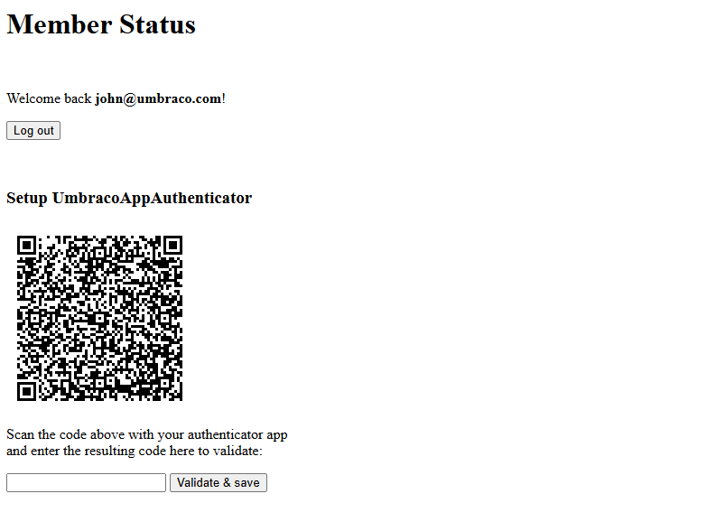
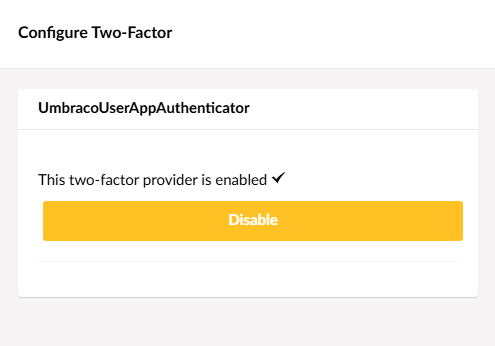
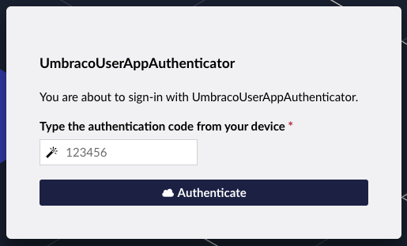

# Two-factor Authentication

This article includes guides for implementing two-factor authentication options for both backoffice users and website members:

* [Two-Factor Authentication for Members](#two-factor-authentication-for-members)
* [Two-Factor Authentication for Users](#two-factor-authentication-for-users)

Two-factor authentication (2FA) for Umbraco Users and Members is activated by implementing an `ITwoFactorProvider` interface and registering the implementation. The implementation can use third-party packages to support authentication apps like the Microsoft- or Google Authentication Apps.



If you are using [Umbraco Cloud](https://umbraco.com/products/umbraco-cloud/), you can enable multi-factor authentication in Umbraco ID. For more information, see the [Multi-Factor Authentication](https://docs.umbraco.com/umbraco-cloud/set-up/multi-factor-authentication-on-cloud) article.



## Two-factor authentication for Members

The following guide will take you through implementing an option for your website members to enable two-factor authentication.


A setup for members needs to be implemented on your website in order for you to follow this guide. This setup should include:

* Login and logout options.
* Public access restriction configured on at least 1 content item.

[Learn more about setting up a members section in Umbraco.](../../tutorials/members-registration-and-login.md)


As an example, the guide will use the [GoogleAuthenticator NuGet Package](https://www.nuget.org/packages/GoogleAuthenticator/). This package works for both Google and Microsoft authenticator apps. It can be used to generate the QR code needed to activate the app for the website.

1. Install the GoogleAuthenticator Nuget Package on your project.
2. Create a new file in your project: `QrCodeSetupData.cs`.
3. Update the file with the following code snippet.



```csharp
using System;
using System.Threading.Tasks;
using Google.Authenticator;
using Umbraco.Cms.Core.Security;
using Umbraco.Cms.Core.Services;

namespace My.Website;

/// <summary>
/// Model with the required data to setup the authentication app.
/// </summary>
public class QrCodeSetupData
{
    /// <summary>
    /// The secret unique code for the user and this ITwoFactorProvider.
    /// </summary>
    public string? Secret { get; init; }

    /// <summary>
    /// The SetupCode from the GoogleAuthenticator code.
    /// </summary>
    public SetupCode? SetupCode { get; init; }
}

/// <summary>
/// App Authenticator implementation of the ITwoFactorProvider
/// </summary>
public class UmbracoAppAuthenticator : ITwoFactorProvider
{
    /// <summary>
    /// The unique name of the ITwoFactorProvider. This is saved in a constant for reusability.
    /// </summary>
    public const string Name = "UmbracoAppAuthenticator";

    private readonly IMemberService _memberService;

    /// <summary>
    /// Initializes a new instance of the <see cref="UmbracoAppAuthenticator"/> class.
    /// </summary>
    public UmbracoAppAuthenticator(IMemberService memberService)
    {
        _memberService = memberService;
    }

    /// <summary>
    /// The unique provider name of ITwoFactorProvider implementation.
    /// </summary>
    /// <remarks>
    /// This value will be saved in the database to connect the member with this  ITwoFactorProvider.
    /// </remarks>
    public string ProviderName => Name;

    /// <summary>
    /// Returns the required data to setup this specific ITwoFactorProvider implementation. In this case it will contain the url to the QR-Code and the secret.
    /// </summary>
    /// <param name="userOrMemberKey">The key of the user or member</param>
    /// <param name="secret">The secret that ensures only this user can connect to the authenticator app</param>
    /// <returns>The required data to setup the authenticator app</returns>
    public Task<object> GetSetupDataAsync(Guid userOrMemberKey, string secret)
    {
        var member = _memberService.GetByKey(userOrMemberKey);

        var applicationName = "My Application Name";
        var twoFactorAuthenticator = new TwoFactorAuthenticator();
        SetupCode setupInfo = twoFactorAuthenticator.GenerateSetupCode(applicationName, member.Username, secret, false);
        return Task.FromResult<object>(new QrCodeSetupData()
        {
            SetupCode = setupInfo,
            Secret = secret
        });
    }

    /// <summary>
    /// Validated the code and the secret of the user.
    /// </summary>
    public bool ValidateTwoFactorPIN(string secret, string code)
    {
        var twoFactorAuthenticator = new TwoFactorAuthenticator();
        return twoFactorAuthenticator.ValidateTwoFactorPIN(secret, code);
    }

    /// <summary>
    /// Validated the two factor setup
    /// </summary>
    /// <remarks>Called to confirm the setup of two factor on the user. In this case we confirm in the same way as we login by validating the PIN.</remarks>
    public bool ValidateTwoFactorSetup(string secret, string token) => ValidateTwoFactorPIN(secret, token);
}
```



4. Update `namespace` on line 7 to match your project.
5. Customize the `applicationName` variable on line 63.
6. Create a Composer and register the `UmbracoAppAuthenticator` implementation as shown below.



```csharp
using Umbraco.Cms.Core.Composing;
using Umbraco.Cms.Core.Security;

namespace My.Website;

public class UmbracoAppAuthenticatorComposer : IComposer
{
    public void Compose(IUmbracoBuilder builder)
    {
        var identityBuilder = new MemberIdentityBuilder(builder.Services);
        identityBuilder.AddTwoFactorProvider<UmbracoAppAuthenticator>(UmbracoAppAuthenticator.Name);
    }
}
```



At this point, the 2FA is active, but no members have set up 2FA yet. The setup of 2FA depends on the type. In the case of App Authenticator, we will add the following to our view showing the edit profile of the member.

7. Add or choose a members-only page that should have the two-factor authentication setup.
    * The page needs to be behind the public access.
    * The page should not be using strongly types models.
8. Open the view file for the selected page.
9. Add the following code:



```csharp
@using Umbraco.Cms.Core.Services
@using Umbraco.Cms.Web.Website.Controllers
@using Umbraco.Cms.Web.Website.Models
@using My.Website  @* Or whatever your namespace with the QrCodeSetupData model is *@
@inject MemberModelBuilderFactory memberModelBuilderFactory
@inject ITwoFactorLoginService twoFactorLoginService
@{
    // Build a profile model to edit, by fetching the member's unique key.
    var profileModel = await memberModelBuilderFactory
        .CreateProfileModel()
        .BuildForCurrentMemberAsync();

    // Show all two factor providers
    var providerNames = twoFactorLoginService.GetAllProviderNames();
    if (providerNames.Any())
    {
        <div asp-validation-summary="All" class="text-danger"></div>

        foreach (var providerName in providerNames)
        {
            var setupData = await twoFactorLoginService.GetSetupInfoAsync(profileModel.Key, providerName);

            // If the `setupData` is `null` for the specified `providerName` it means the provider is already set up.
            // In this case, a button to disable the authentication is shown.
            if (setupData is null)
            {
                @using (Html.BeginUmbracoForm<UmbTwoFactorLoginController>(nameof(UmbTwoFactorLoginController.Disable)))
                {
                    <input type="hidden" name="providerName" value="@providerName"/>
                    <button type="submit">Disable @providerName</button>
                }
            }
            // If `setupData` is not `null` the type is checked and the UI for how to set up the App Authenticator is shown.
            else if(setupData is QrCodeSetupData qrCodeSetupData)
            {
                @using (Html.BeginUmbracoForm<UmbTwoFactorLoginController>(nameof(UmbTwoFactorLoginController.ValidateAndSaveSetup)))
                {
                    <h3>Setup @providerName</h3>
                    
                    <p>Scan the code above with your authenticator app <br /> and enter the resulting code here to validate:</p>
                    <input type="hidden" name="providerName" value="@providerName"  />
                    <input type="hidden" name="secret" value="@qrCodeSetupData.Secret"  />
                    <input type="text" name="code"  />
                    <button type="submit">Validate & save</button>
                }
            }
        }
    }
}
```



10. [Optional] Customize the text fields and buttons to match your websites tone of voice.



### Test the set up for Members

1. Login to the website using a test member.
2. Navigate to the page where the QR code was added.
3. Scan the QR code and add the verification code.
4. Logout of the website.
5. Login and verify that it asks for the two factor authentication.

You can also check that the **Two-factor Authentication** option is checked on the member in the Umbraco backoffice.


### Notification when 2FA is requested for a member

When a 2FA login is requested for a member, the `MemberTwoFactorRequestedNotification` is published. This notification can also be used to send the member a one-time password via e-mail or phone. Even though these 2FA types are [not considered secure](https://docs.microsoft.com/en-us/aspnet/core/security/authentication/mfa?view=aspnetcore-6.0#mfa-sms) as App Authentication, it is still a massive improvement compared to no 2FA.

## Two-factor authentication for Users

The following guide will take you through implementing an option for backoffice users to enable two-factor authentication.

This guide will not cover setting up the UI for user login and edits as this is handled elsewhere in the CMS.

### Example implementation for Authenticator Apps for Users

As an example, the guide will use the [GoogleAuthenticator NuGet Package](https://www.nuget.org/packages/GoogleAuthenticator/). This package works for both Google and Microsoft authenticator apps. It can be used to generate the QR code needed to activate the app for the website.

1. Install the GoogleAuthenticator Nuget Package on your project.
2. Create a new file in your project: `TwoFactorAuthInfo.cs`.
3. Update the file with the following code snippet.



```csharp
using System.Runtime.Serialization;
using Google.Authenticator;
using Umbraco.Cms.Core.Models.Membership;
using Umbraco.Cms.Core.Security;
using Umbraco.Cms.Core.Services;

namespace My.Website;

/// <summary>
/// Create a model with the information required to set up the 2FA provider
/// </summary>
[DataContract]
public class TwoFactorAuthInfo
{
    [DataMember(Name = "qrCodeSetupImageUrl")]
    public string? QrCodeSetupImageUrl { get; set; }

    [DataMember(Name = "secret")]
    public string? Secret { get; set; }
}

/// <summary>
/// Implement the `ITwoFactorProvider` with the use of the `TwoFactorAuthenticator` from the GoogleAuthenticator NuGet package
/// </summary>
public class UmbracoUserAppAuthenticator : ITwoFactorProvider
{
    private readonly IUserService _userService;

    /// <summary>
    /// The unique name of the ITwoFactorProvider. This is saved in a constant for reusability.
    /// </summary>
    public const string Name = "UmbracoUserAppAuthenticator";

    /// <summary>
    /// Initializes a new instance of the <see cref="UmbracoUserAppAuthenticator"/> class.
    /// </summary>
    public UmbracoUserAppAuthenticator(IUserService userService)
    {
        _userService = userService;
    }

    /// <summary>
    /// The unique provider name of ITwoFactorProvider implementation.
    /// </summary>
    /// <remarks>
    /// This value will be saved in the database to connect the member with this  ITwoFactorProvider.
    /// </remarks>
    public string ProviderName => Name;

    /// <summary>
    /// Returns the required data to setup this specific ITwoFactorProvider implementation. In this case it will contain the url to the QR-Code and the secret.
    /// </summary>
    /// <param name="userOrMemberKey">The key of the user or member</param>
    /// <param name="secret">The secret that ensures only this user can connect to the authenticator app</param>
    /// <returns>The required data to setup the authenticator app</returns>
    public Task<object> GetSetupDataAsync(Guid userOrMemberKey, string secret)
    {
        IUser? user = _userService.GetByKey(userOrMemberKey);

        ArgumentNullException.ThrowIfNull(user);

        var applicationName = "My application name";
        var twoFactorAuthenticator = new TwoFactorAuthenticator();
        SetupCode setupInfo = twoFactorAuthenticator.GenerateSetupCode(applicationName, user.Username, secret, false);
        return Task.FromResult<object>(new TwoFactorAuthInfo()
        {
            QrCodeSetupImageUrl = setupInfo.QrCodeSetupImageUrl,
            Secret = secret
        });
    }

    /// <summary>
    /// Validated the code and the secret of the user.
    /// </summary>
    public bool ValidateTwoFactorPIN(string secret, string code)
    {
        var twoFactorAuthenticator = new TwoFactorAuthenticator();
        return twoFactorAuthenticator.ValidateTwoFactorPIN(secret, code);
    }

    /// <summary>
    /// Validated the two factor setup
    /// </summary>
    /// <remarks>Called to confirm the setup of two factor on the user. In this case we confirm in the same way as we login by validating the PIN.</remarks>
    public bool ValidateTwoFactorSetup(string secret, string token) => ValidateTwoFactorPIN(secret, token);
}
```



4. Update `namespace` on line 7 to match your project.
5. Customize the `applicationName` variable on line 59.
6. Create a new file in your project: `UmbracoAppAuthenticatorComposer.cs`.
7. Implement a new composer and register the `UmbracoAppAuthenticator` implementation as shown below.



```csharp
using Umbraco.Cms.Core.Composing;
using Umbraco.Cms.Core.Security;
using Umbraco.Cms.Web.BackOffice.Security;

namespace My.Website;

public class UmbracoAppAuthenticatorComposer : IComposer
{
    public void Compose(IUmbracoBuilder builder)
    {
        var identityBuilder = new BackOfficeIdentityBuilder(builder.Services);

        identityBuilder.AddTwoFactorProvider<UmbracoUserAppAuthenticator>(UmbracoUserAppAuthenticator.Name);

        builder.Services.Configure<TwoFactorLoginViewOptions>(UmbracoUserAppAuthenticator.Name, options =>
        {
            options.SetupViewPath = "..\\App_Plugins\\TwoFactorProviders\\twoFactorProviderGoogleAuthenticator.html";
        });
    }
}
```



8. Update the `namespace` on line 5 to match your project.

In the composer above, a view for the two-factor authentication is configured. This view needs to be created.

9. Open the project directory.
10. Locate or create the path as defined in the composer above: `App_Plugins\TwoFactorProviders`.
11. Create a new file: `twoFactorProviderGoogleAuthenticator.html`.
12. Open the file and add the following markup:



```html
<div ng-controller="CustomCode.TwoFactorProviderGoogleAuthenticator as vm">

  <umb-editor-view ng-cloak>

    <form name="vm.authForm" method="POST" ng-submit="vm.validateAndSave()">

      <umb-editor-header name="vm.title" name-locked="true" hide-alias="true" hide-icon="true" hide-description="true">
      </umb-editor-header>

      <umb-editor-container>

        <umb-box>

          <umb-box-header title="Setup information"></umb-box-header>

          <umb-box-content>

            <div class="control-group text-center">
              
            </div>

            <umb-control-group label-for="token" alias="2facode"
              label="Scan with your authenticator app and enter the code:" required="true">

              <input umb-auto-focus id="2facode" class="-full-width-input input-xlarge" type="text" name="token"
                inputmode="numeric" autocomplete="one-time-code" ng-model="vm.code" localize="placeholder"
                placeholder="@login_2faCodeInputHelp" aria-required="true" required />

              <div ng-messages="vm.authForm.token.$error" role="alert">
                <span class="umb-validation-label" ng-message="token">
                  <localize key="login_2faInvalidCode">Invalid code entered</localize>
                </span>
              </div>

            </umb-control-group>

          </umb-box-content>

        </umb-box>

      </umb-editor-container>

      <umb-editor-footer>

        <umb-editor-footer-content-right>

          <umb-button type="button" button-style="link" label-key="general_close" shortcut="esc" action="vm.close()">
          </umb-button>

          <umb-button state="vm.buttonState" button-style="success" label-key="buttons_save" type="submit"
            disabled="vm.code.length === 0">
          </umb-button>

        </umb-editor-footer-content-right>

      </umb-editor-footer>

    </form>

  </umb-editor-view>

</div>
```



The view above uses an Angular controller, which needs to be created and configured in a `package.manifest` file.

13. Create a new file: `App_Plugins/TwoFactorProviders/twoFactorProviderGoogleAuthenticator.controller.js`.
14. Add the following code:



```javascript
!(function () {
  "use strict";

  const googleTwoFactorProviderCtrl = [
    '$scope', 'twoFactorLoginResource', 'notificationsService',
    function ($scope, twoFactorLoginResource, notificationsService) {
      const vm = this;

      vm.title = "Setup Google Authenticator on " + $scope.model?.user?.name;
      vm.providerName = $scope.model?.providerName;
      vm.qrCodeImageUrl = "";
      vm.secret = "";
      vm.code = "";
      vm.authForm = {};
      vm.buttonState = "init";

      vm.close = close;
      vm.validateAndSave = validateAndSave;

      function init() {
        vm.buttonState = "init";
        twoFactorLoginResource.setupInfo(vm.providerName)
          .then(function (response) {
            // This response is the model I defined to be returned from ITwoFactorProvider.GetSetupDataAsync
            vm.qrCodeImageUrl = response.qrCodeSetupImageUrl;
            vm.secret = response.secret;
          })
          .catch(function () {
            notificationsService.error("Could not fetch login info");
          });
      }

      function validateAndSave() {
        vm.authForm.token.$setValidity("token", true);
        vm.buttonState = "busy";

        twoFactorLoginResource.validateAndSave(vm.providerName, vm.secret, vm.code)
          .then(function (successful) {

            if (successful) {
              notificationsService.success("Two-factor authentication has successfully been enabled");
              vm.buttonState = "success";
              close();
            } else {
              vm.authForm.token.$setValidity("token", false);
              vm.buttonState = "error";
            }

          })
          .catch(function (error) {
            notificationsService.error(error);
            vm.buttonState = "error";
          });
      }

      function close() {
        if ($scope.model.close) {
          $scope.model.close();
        }
      }

      init();
    }
  ];

  angular.module("umbraco").controller("CustomCode.TwoFactorProviderGoogleAuthenticator", googleTwoFactorProviderCtrl);
})();
```



15. Create a new file: `App_Plugins\TwoFactorProviders\package.manifest`.
16. Point to the path of the Angular controller created above:



```json
{
  "javascript": [
    "~/App_Plugins/TwoFactorProviders/twoFactorProviderGoogleAuthenticator.controller.js"
  ]
}
```



At this point, the 2FA is active, but no users have set it up.

### Test the set up for Users

Each user can now enable the configured 2fa providers on their user.

1. Access the Umbraco backoffice.
2. Click the user avatar in the top-right corner.


3. Select `Configure Two-Factor` button to open a new panel listing all enabled two-factor providers.


4. Select `Enable` to show the configured view.


5. Follow the instructions to configure 2FA.

When the authenticator is enabled correctly, a disable button is shown instead.



To disable the two-factor authentication on your user, it is required to enter the verification code.

### Notification when 2FA is requested for a user

When a 2FA login is requested for a user, the `UserTwoFactorRequestedNotification` is published. This notification can also be used to send the user a one-time password via e-mail or phone. Even though these 2FA types are [not considered secure](https://docs.microsoft.com/en-us/aspnet/core/security/authentication/mfa?view=aspnetcore-6.0#mfa-sms) as App Authentication, it is still a massive improvement compared to no 2FA.

### Login with 2FA enabled

When a user with 2FA enabled logs in, they will be presented with a screen to enter the verification code:

While the 2FA is enabled, the user will be presented with this screen after entering the username and password.


If the code is correct, the user will be logged in. If the code is incorrect, the user will be presented with an error message.

This screen is set up to work well with 2FA providers that require a one-time code to be entered. The code field follows best practices for accessibility in terms of labeling and autocompletion.


A user can have more than one 2FA provider activated simultaneously. In this case, the user will be presented with a dropdown to choose which provider to use before entering a code.


### Customizing the login screen

The 2FA login screen can be customized. This should be done if you have a 2FA provider that does not require a one-time code to be entered.

You should only customize the 2FA login screen in certain cases, for example:

- If you have a provider that requires a non-numeric field or additional info.
- If you have a provider that requires the user to scan a QR code, you should additionally show the QR code.
- If you need to authenticate the user in a different way than the default [AuthenticationController](https://apidocs.umbraco.com/v13/csharp/api/Umbraco.Cms.Web.BackOffice.Controllers.AuthenticationController.html#Umbraco_Cms_Web_BackOffice_Controllers_AuthenticationController_PostVerify2FACode_Verify2FACodeModel_) in Umbraco.

You need to create a JavaScript module that exports a default custom element to be used in the login screen. This module should be placed in the `App_Plugins` folder. The module should be registered using a composer.


In earlier versions of Umbraco up to version 12, you had to define an AngularJS HTML view. This is no longer the case. You can now define a JavaScript module to render a Custom Element instead of the default two-factor login screen.

It is still supported to load an HTML file as a view. However, Umbraco no longer supports AngularJS and the HTML file will be loaded into the DOM as-is. You will have to implement all the logic yourself.


You can use the following code as a starting point. This will give you a view looking like this, where the user can enter a code and click a button to verify the code. This is similar to the built-in view in Umbraco. In a real world scenario, you would probably want to authenticate the user in a different way.







The following code is an example of a custom 2FA login screen using [Lit](https://lit.dev/). This is the recommended way of creating a custom 2FA login screen. Lit is a light-weight library that augments the [Custom Elements API](https://developer.mozilla.org/en-US/docs/Web/API/Web_components/Using_custom_elements) to provide a declarative, performant, and interoperable way to create web components.

The element registers two properties: providers and returnPath. These properties are used to render the view. The providers property is an array of strings, where each string is the name of a 2FA provider. The returnPath is the path to redirect to after a successful login. Both supplied by the login screen automatically.



```javascript
import {LitElement, css, html} from 'https://cdn.jsdelivr.net/gh/lit/dist@3/core/lit-core.min.js';

class My2faView extends LitElement {
  static get properties() {
    return {
      providers: { type: Array },
      returnPath: { type: String },
      buttonState: { type: String, state: true, attribute: false }
    };
  }

  /**
   * Get the code input field
   */
  get codeField() {
    return this.shadowRoot.querySelector('#code');
  }

  onSubmit(provider) {
    return async (e) => {
      e.preventDefault();
      const form = e.target;

      this.codeField.error = false;

      const isValid = form.checkValidity();
      if (!isValid) {
        return;
      }

      this.buttonState = 'loading';
      const formData = new FormData(form);
      const code = formData.get('code');

      const result = await fetch('backoffice/UmbracoApi/Authentication/PostVerify2faCode', {
        method: 'POST',
        body: JSON.stringify({
          provider,
          code
        }),
        headers: {
          'Content-Type': 'application/json',
        },
      });

      if (!result.ok) {
        this.codeField.error = true;
        this.codeField.errorMessage = 'Invalid code';
        this.codeField.focus();
        this.buttonState = 'failed';
        return;
      }

      let text = await result.text();
      text = text.split('\n')[1];
      const user = JSON.parse(text);

      this.buttonState = 'success';

      this.dispatchEvent(new CustomEvent('umb-login-success', { bubbles: true, composed: true, detail: user }));

      if (this.returnPath) {
        window.location.href = this.returnPath;
      }
    };
  }

  renderProvider(provider) {
    return html`
      <uui-form>
        <form method="post" @submit=${this.onSubmit(provider)}>
          <h3>${provider}</h3>
          <p>You are about to sign-in with ${provider}.</p>
          <uui-form-layout-item>
            <uui-label for="code" slot="label" required>Type the authentication code from your device</uui-label>
            <uui-input id="code" type="text" name="code" autocomplete="one-time-code" inputmode="numeric" placeholder="123456" required>
              <div slot="prepend">
                <uui-icon name="wand"></uui-icon>
              </div>
            </uui-input>
          </uui-form-layout-item>

          <div>
            <uui-button type="submit" id="button" look="primary" .state=${this.buttonState}>
              <uui-icon name="icon-cloud"></uui-icon>
              Authenticate
            </uui-button>
          </div>

          <div id="error">
            ${this.errorMessage}
          </div>
        </form>
      </uui-form>
    `;
  }

  render() {
    return html`
      ${this.providers.map(provider => this.renderProvider(provider))}
    `;
  }

  static styles = css`
    :host {
      display: block;
      width: 100%;
    }
    #button {
      width: 100%;
    }
    #error {
      color: red;
    }
  `;
}

customElements.define('my-2fa-view', My2faView);

export default My2faView;
```







We need to register the custom view using a composer. This can be done on the `IUmbracoBuilder` in your startup or a composer. In this case, we will add a composer to your project. This composer will overwrite the `IBackOfficeTwoFactorOptions` to use the custom view.



```csharp
using Umbraco.Cms.Core.Composing;
using Umbraco.Cms.Web.BackOffice.Security;

namespace My.Website;

/// <inheritdoc />
public class TwoFactorConfiguration : IBackOfficeTwoFactorOptions
{
    /// <inheritdoc />
    public string GetTwoFactorView(string username) => "/App_Plugins/TwoFactorProviders/Custom2faLogin.js";
}

public class TwoFactorConfigurationComposer : IComposer
{
    public void Compose(IUmbracoBuilder builder)
    {
        builder.Services.AddSingleton<IBackOfficeTwoFactorOptions, TwoFactorConfiguration>();
    }
}

```






