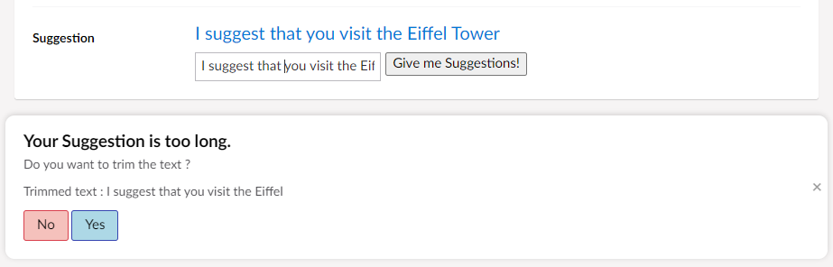

# Integrating services with a property editor

## Overview

This is step 3 in the Property Editor tutorial. In this part, we will integrate one of the built-in Umbraco Services. For this sample, we will use the `notificationsService` to show a dialog with a custom view when you click in a textbox. The dialog will appear if the content is longer than 35 characters.

## Injecting the service

First up, we need to get access to the service. This is done in the `suggestion.controller.js`, where we add it as a parameter:

```javascript
angular.module("umbraco")
    .controller("SuggestionPluginController",
    // inject Umbraco's assetsService and editor service
    function ($scope, notificationsService) { ... }
```

## Hooking into Textbox

To hook the service with the textbox, we will use the `add` method of the notificationsService. This will be used to render our own view by setting the view property. We will also pass an `args` object which contains the Property Value and a callback function that we are going to call from our notification.

```javascript
// function to show custom notification
$scope.showNotification = function () {
        if ($scope.model.value.length > 35) {
            notificationsService.add({
                // the path of our custom notification view
                view: "/App_Plugins/Suggestions/notification.html",
                // arguments object we want to pass to our custom notification
                args: {
                    value: $scope.model.value,
                    callback: $scope.TrimText
                }
            });
        }
    };
```

The callback is used to return data to the editor.

Now that we have access to the editor events, we will trim the text to a length of 35.

```javascript
   $scope.TrimText = function () {
        $scope.model.value = $scope.model.value.substring(0, 35);
    };
   
```

Now let's edit the `getSuggestion` method to call `showNotification`  on clicking `Get Suggestions` button.

```javascript
    $scope.getSuggestion = function () {
    
        // The getSuggestion method reads a random value from an array and provides a Suggestion. 
        $scope.model.value = $scope.aSuggestions[$scope.aSuggestions.length * Math.random() | 0];
        $scope.showNotification();
    }
```

At this point your controller should look like this:

```javascript
angular.module("umbraco")
    .controller("SuggestionPluginController",
        // Scope object is the main object which is used to pass information from the controller to the view.
        function ($scope, notificationsService) {

            if ($scope.model.value === null || $scope.model.value === "") {
                $scope.model.value = $scope.model.config.defaultValue;
            }

            // SuggestionPluginController assigns the suggestions list to the aSuggestions property of the scope
            $scope.aSuggestions = ["You should take a break", "I suggest that you visit the Eiffel Tower", "How about starting a book club today or this week?", "Are you hungry?"];

            // The controller assigns the behavior to scope as defined by the getSuggestion method, which is invoked when the user clicks on the 'Give me Suggestions!' button.
            $scope.getSuggestion = function () {

                // The getSuggestion method reads a random value from an array and provides a Suggestion. 
                $scope.model.value = $scope.aSuggestions[$scope.aSuggestions.length * Math.random() | 0];
                $scope.showNotification();
            }
         
            // The controller assigns the behavior to scope as defined by the getState method, which is invoked when the user toggles the enable button in the data type settings.
            $scope.getState = function () {

                //If the data type is enabled in the Settings the 'Give me Suggestions!' button is enabled
                 if (Boolean(Number($scope.model.config.isEnabled))) {
                    return false;
                }
                return true;
            }

            //// function to show custom notification
            $scope.showNotification = function () {
                if ($scope.model.value.length > 35) {
                    notificationsService.add({
                        // the path of our custom notification view
                        view: "/App_Plugins/Suggestions/notification.html",
                        // arguments object we want to pass to our custom notification
                        args: {
                            value: $scope.model.value,
                            callback: $scope.TrimText
                        }
                    });
                }
            };

            // function to trim the text to a length of 35.
            $scope.TrimText = function () {
                $scope.model.value = $scope.model.value.substring(0, 35);
            };

        });
```

### Add the directive in the `suggestion.html`

```html
    <input type="text" ng-model="model.value" ng-click="showNotification()" />
```

### Add the JavaScript file in `package.manifest`

```json
{
 "javascript": [
        "/App_Plugins/Suggestions/suggestion.controller.js",
        "/App_Plugins/Suggestions/notification.controller.js"
    ]
}
```

## Creating custom Notification View and Controller

We will add 2 files to the `/App_Plugins/Suggestions/` folder:

* `notification.html`
* `notification.controller.js`

In the `notification.html`, we'll add:

```html
<div ng-controller="NotificationController">
    <h4>Your Suggestion is too long.</h4>
    <p>Do you want to trim the text ?</p>
    <p>Trimmed text : {{trimmedtext}}</p>
    <button class="btn umb-alert--warning" ng-click="cancel(notification)">No</button>
    <button class="btn umb-alert--info" ng-click="trim(notification)">Yes</button>
</div>
```

In the `notification.controller.js` we will add:

```javascript
angular.module('umbraco')
 .controller('NotificationController', function ($scope, notificationsService) {

      // the notification is set on scope by umbraco, so we can access our args object passed in
   $scope.trimmedtext = $scope.notification.args.value.substring(0, 35);

   $scope.trim = function (not) {
    // call our callback function set on the args object in our property editor controller
    not.args.callback();
    notificationsService.remove(not);
   };

   $scope.cancel = function (not) {
    notificationsService.remove(not);
   };
  });
```

Restart the application and either enter a suggestion longer than 35 characters or click on the `Get Suggestions` button. When you do so and click in the textarea, you will be presented with a notification like this:



The notification object contains the `args` object that we passed to the view in our `suggestion.controller.js`. When we click the `Yes` button in the notification, we use the callback function from the Suggestions controller. This function is executed in the scope of our Suggestions Property Editor.

## Wrap up

Over the 3 previous steps, we have:

* Created a plugin.
* Defined an editor.
* Registered the Data Type in Umbraco.
* Added a `$scope` object to pass information from the controller to the view.
* Added configuration to the Property Editor.
* Connected the editor with the Notification Service.
* Looked at the notification dialog in action.
