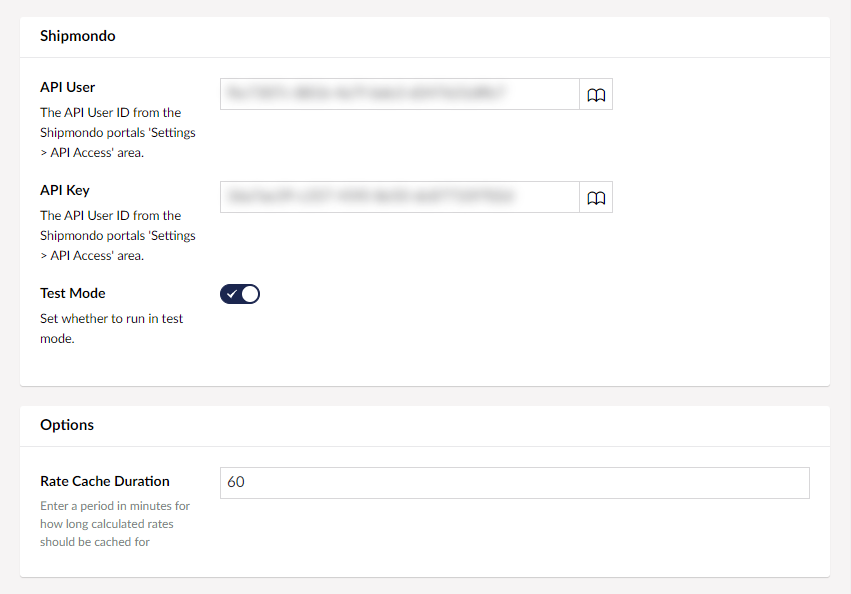

# Realtime Rate Shipping

Realtime rate shipping in Umbraco Commerce allows you to connect to third party shipping operators to fetch realtime shipping rate estimates. This is the most accurate shipping calculation option, but does require you to have accounts setup at the relevant shipping operators site. Additionally, relevant Shipping Provider implementation for that operator must be available and installed.

## Configuration

* Go to `Settings > Commerce > Stores > {Your Store} > Shipping Methods`

* Click `Create Shipping Method`
* Choose the shipping provider you wish to use

* Chose the `Realtime` calculation mode option

* Populate the shipping method name, alias, sku and optional image and tax rate

* Populate any shipping provider settings required to connect to the shipping operator
* Define a cache duration for retrieved rate values

* Configure the countries this shipping method should be allowed in

