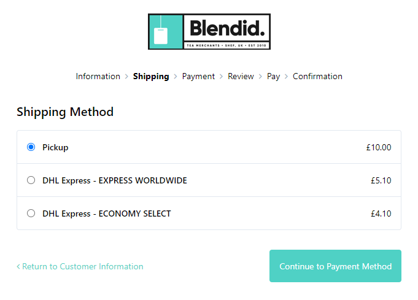

# v13.1.0-RC

Umbraco Commerce v13.1.0-RC introduces two new exciting strategies for shipping calculation. With these new calculation strategies, calculating shipping costs has become ever more flexible allowing you to have fine grained control over your shipping rates.

## Key Takeaways

* Added [dynamic shipping rates](v13.1.0-rc.md#dynamic-shipping-rates) feature for range based rates calculaton.
* Added [realtime shipping rates](v13.1.0-rc.md#realtime-shipping-rates) feature for up to the minute, shipping operator shipping quotes.
* A number of [API updates](v13.1.0-rc.md#api-updates) to accomodate the new shipping features.
* [Add-on updates](v13.1.0-rc.md#add-on-updates) are also neccesarry for this release.

## Dynamic Shipping Rates

With the new dynamic shipping rates feature, it is now possible to define range-based shipping rates configurations. This allows you to adjust shipping costs based on the state of your customer's order. No longer are you tied to a single inflexible fixed rate. Want to charge an excess for bulky/heavy items? no problem. Want to offer cheaper rates for small orders? we got you.

With dynamic shipping rates, you are in full control over every aspect of your rates calculation process.

Be sure to checkout the [Dynamic Shipping Rates](../reference/shipping/dynamic-rate-shipping.md) documentation for how to get started with them.

### Range / Rate Providers

With dynamic shipping rates, you aren't only tied to the ranges and rate options we provide out of the box. As with much of the Umbraco Commerce API, we've made these fully pluggable to allow you to be able to define your own. With pluggable range/rate providers, you can truly make dynamic shipping rates tailored to your customer's needs.

Be sure to read the [Shipping Range & Rate Providers](../key-concepts/shipping-range-and-rate-providers.md) documentation for details on how to setup your own providers.

## Realtime Shipping Rates

With the new realtime shipping rates feature, it is now possible to fetch realtime, up to the minute shipping rates directly from your shipping operator. With realtime rates you can be sure that your shipping rates are as accurate as they can be with minimal configuration required.

Be sure to checkout the [Realtime Shipping Rates](../reference/shipping/realtime-rate-shipping.md) documentation for how to get started with them.

### Shipping Providers

The secret behind realtime rates is the new [Shipping Providers](../key-concepts/shipping-providers.md) API. Shipping Providers define a minimal API to encapsulate communication with shipping operators. As you might expect, these are fully pluggable allowing you to work with any shipper operator you and your customers require.

To help you get started, we are releasing three example shipping providers with this release:

* [DHL](https://github.com/umbraco/Umbraco.Commerce.ShippingProviders.Dhl)
* [Shipmondo](https://github.com/umbraco/Umbraco.Commerce.ShippingProviders.Shipmondo)
* [EasyPost](https://github.com/umbraco/Umbraco.Commerce.ShippingProviders.EasyPost)

All of these providers are fully open-source so you can see exactly how they work, and use them as a starting point for custom integrations.

## API Updates

The dynamic and realtime shipping features also required some updates to other areas of the Umbraco Commerce API. Details of these updates can be found below.

### Locations / Store Default Location

To allow shipments to have more dynamic calculations, it's now necessary to know where products are shipping from, not only where they are shipping to. The handle this, store entities now have a Locations child configuration area that allows you to define store locations.

We currently only support a store having a single location which is selected on the Store settings screen via the Default Location setting. We'll be looking in the future to support stores having multiple warehouse locations.

### Shipping Packing Factories

Another important aspect of shipping calculations is defining packages along with their dimensions and weight. Umbraco Commerce comes with an out-of-the-box package algorithm. However, with products being stackable in many different ways, we've made this pluggable too to allow you to create more specific packaging logic.

See the [Shipping Packing Factories](../key-concepts/shipping-package-factories.md) concept documentation for more details.

### Measurements Property Editor / Store Measurement System

With the shipping packing factories, it also becomes necessary to capture the physical dimensions and weight of the individual products. To help with this, Umbraco Commerce now comes with a Measurements property editor to allow you to define all the physical attributes of your products.

We've also made it so that you can configure your prefered measurement system (metric or imperial) via a setting on the Store node. This setting has a new Measurements property editor taking this into account.

### C# / Storefront API Updates

There is a fundamental change that arises with the new dynamic and real-time shipping rates. And that is that it's now no longer possible to retrieve a shipping rate from a shipping method, without a reference order. Additionally, many shipping operators offer different products and services. This means that shipping methods are now able to return multiple rate values for a given rate request.

To accommodate this some APIs have been, such as the shipping method `CalculatePrices` method is being replaced with `TryCalculateRates` that accepts an order, and can return multiple rates. In addition, we've also updated the `SetShippingMethod` API on the order to support passing in a `ShippingOption` to identify which rate option from the shipping operator is being selected.

These changes have also been made to the Storefront API with some older endpoints becoming deprecated, and new ones being created for these new approaches.

To maintain backward compatibility, the old APIs are still present, but these will only work with return fixed-rate shipping method definitions.

## Add-on Updates

In addition to the core Umbraco Commerce changes, updates to the following add-on packages will also be made:

* **Umbraco.Commerce.Deploy** - Supports the store and shipping method updates as well as the new locations model.
* **Umbraco.Commerce.Checkout** - Adds support for displaying/selecting shipping rates on the front end.
